<style>
.book .book-body .page-inner section.normal h1 {
  font-size: 16px;
}

.book .book-body .page-inner section.normal h2, 
.book .book-body .page-inner section.normal h3, 
.book .book-body .page-inner section.normal h4 {
  font-size: 14px;
}

.book .book-body .page-inner section.normal table  td {
   font-size: 12px;
}
.book .book-body .page-inner section.normal pre>code.r {
  font-size: 10px;
}
.book .book-body .page-inner section.normal pre {
  font-size: 10px
}

</style>

# Abstract
This vignette contains the [R](https://www.r-project.org)[@R] pipeline used for the computational analysis reported in the paper "Spatiotemporal proteomic profiling of the pro-inflammatory response to lipopolysaccharide in the THP-1 human leukemia cell line" by Mulvey, Breckels et al [@Mulvey:2021].

# Introduction
In this vignette we work with the data at the PSM and protein level which which are freely and openly available as part of the [Bioconductor pRolocdata package](https://bioconductor.org/packages/release/data/experiment/html/pRolocdata.html) (≥v1.27.3) [@pRoloc:2014] and in the supplementary information as disseminated with the accompanying manuscript [@Mulvey:2021].

All analysis in the manuscript is done in the R programming language, unless otherwise stated, using the suite of mass spectrometry spatial proteomics packages [`MSnbase`](https://www.bioconductor.org/packages/release/bioc/html/MSnbase.html)[@MSnbase:2012], [`pRoloc`](https://www.bioconductor.org/packages/release/bioc/html/pRoloc.html)[@pRoloc:2014], [`pRolocGUI`](https://www.bioconductor.org/packages/release/bioc/html/pRolocGUI.html) and [`pRolocdata`](https://bioconductor.org/packages/release/data/experiment/html/pRolocdata.html).

All raw mass spectrometry proteomics data from this study have been deposited to the [ProteomeXchange](http://proteomecentral.proteomexchange.org/cgi/GetDataset) Consortium via the PRIDE partner repository [@pride:2019], with the dataset identifier PXD023509.

## Before you start {#start}
To run through the code in this vignette please download the [THP LOPIT Github repository](https://github.com/CambridgeCentreForProteomics/thp-lopit-2021), the [`R` programming language](https://www.r-project.org) and we also recommend you download [`RStudio` IDE](https://www.rstudio.com/products/rstudio/download/) which is a great interface to R.

Please open RStudio and navigate to the `thp-lopit-2021` directory you have just saved and downloaded. To do this go to menu 

Session -> Set Working Directory -> Choose Directory ...

If you type `getwd` into the R console. You should see the directory name in your path. For more information on how to use RStudio please see [RStudio education website](https://education.rstudio.com) for some nice introductory tutorials. 


## Accessing the data in R
The `pRolocdata` package is a R [Bioconductor](http://bioconductor.org/) [experiment package](http://bioconductor.org/packages/release/BiocViews.html#___ExperimentData) that collects mass spectrometry-based spatial/organelle and protein-complex datasets from published experiments. Each data is stored in a container called a `MSnSet` instance (see the [`MSnbase`](http://www.bioconductor.org/packages/release/bioc/html/MSnbase.html) for details) which allows users to work seamlessly with the R [`pRoloc`](http://bioconductor.org/packages/release/data/experiment/html/pRolocdata.html) and [`pRolocGUI`](http://bioconductor.org/packages/devel/bioc/html/pRolocGUI.html) software for spatial proteomics data analysis and visualisation. 

The first step is to install the `pRoloc` and `pRolocdata` packages from Bioconductor
```{r getpkgs, eval=FALSE}
if (!requireNamespace("BiocManager", quietly = TRUE))
    install.packages("BiocManager")
BiocManager::install("pRoloc", "pRolocdata")

## we also use the knitr and VennDiagram, ggplot2 packages in this 
## vignette so please  install if you do not have them 
BiocManager::install(c("knitr", "VennDiagram", "ggplot2", "dplyr", "kableExtra", 
                       "coda", "reshape2", "circlize", "ggalluvial", "tidyr", 
                       "Rmisc", "gridExtra", "gplots", "scico", "plotrix",
                       "RColorBrewer"))
```

Note: To access the widest selection on proteomics datasets we advise users to install the latest version `pRolocdata` package from Bioconductor. The THP data is in version >=1.29.1 

Now we can load the packages by calling `library` function in R
```{r loadpkgs, eval=TRUE, warning=FALSE, message=FALSE}
library("pRoloc")
library("pRolocdata")
```

and subsequently we can now access all the datasets in `pRolocdata`. To list all available datasets we use the `data` function. 

```{r loadthp}
data(package = "pRolocdata")
```

We see there are 27 datasets (including the PSM and protein level data) associated with the manuscript [1], 20 from the hyperLOPIT data anlysis and 7 from the LPS timecourse [@Mulvey:2021]. For more information on these datasets, we can type

```{r helpdata}
?thpLOPIT_lps_mulvey2021
?lpsTimecourse_mulvey2021
```


```{r ssfig1, echo=FALSE, fig.cap="Screenshot of the documentation files in R for the THP LOPIT and LPS timecourse datasets", fig.show='hold',fig.align='center'}
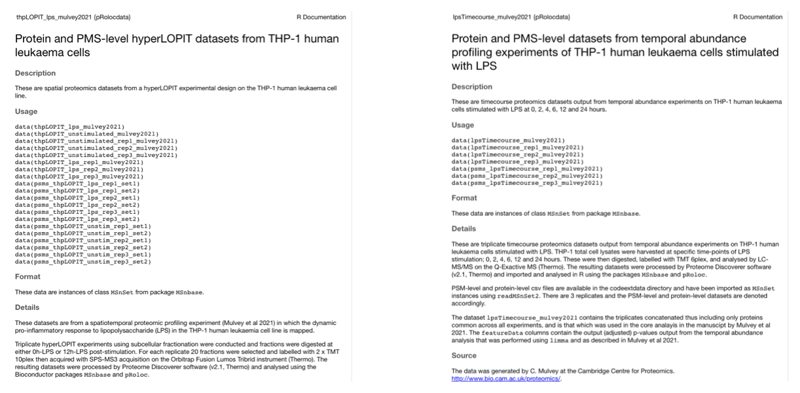
```

Each dataset can be loaded using the `data` function. For example, to load the final protein level LOPIT datasets for the unstimulated and 12 hour LPS stimulated datasets,

```{r loadadataset, results = "hide"}
data("thpLOPIT_unstimulated_mulvey2021")
thpLOPIT_unstimulated_mulvey2021

data("thpLOPIT_lps_mulvey2021")
thpLOPIT_lps_mulvey2021
```

In the next sections we introduce the data, experimental design and brief overview of the experimental protocol before walking users through the downstream analysis which was used to generate the datasets available in `pRolocdata` and the manuscript Mulvey et al 2021 [@Mulvey:2021].

## Source code
All the core packages that we use for data analysis, namely MSnbase, pRolocdata, pRolocdata and pRolocGUI are all freely and openly available on R/Bioconductor and Github. Specific code and functions used that have been used throughout this workflow for analysis and generating figures can be found in the `r` directory of this repo.

# Temporal proteomics data analysis

## Summary
We assessed the global proteomic landscape of the THP-1 monocytic leukaemic cell line using a shotgun proteomics time course. Total (unfractionated) cell lysates were collected at 0, 2, 4, 6, 12, and 24 hour time-points following LPS stimulation and processed for quantitative, MS-based proteomics analysis. We reproducibly quantified 4,292 proteins across 3 biological replicate experiments, at all time-points. In total 311 proteins were found to be altered in abundance during the time course of LPS stimulation, with statistical significance (adjusted p-value < 0.01, log_2 fold-change > 0.6). The results are reported in full in Mulvey et al. 2021 [@Mulvey:2021].

## PSM level data processing
The 3 PSM level datasets were imported into R and missing values were carefully assessed. 

We can load the PSM and protein level data from the `pRolocdata` package by using the data function.
```{r psmdata_tc}
## Unstimulated data
data("psms_lpsTimecourse_rep1_mulvey2021")
data("psms_lpsTimecourse_rep2_mulvey2021")
data("psms_lpsTimecourse_rep3_mulvey2021")

psms_lpsTimecourse_rep1_mulvey2021
dim(psms_lpsTimecourse_rep1_mulvey2021)

psms_lpsTimecourse_rep2_mulvey2021
dim(psms_lpsTimecourse_rep2_mulvey2021)

psms_lpsTimecourse_rep3_mulvey2021
dim(psms_lpsTimecourse_rep3_mulvey2021)
```

The summary above tells us that 34640, 49806 and 41853 PSMs were detected in replicates 1, 2 and 3, respectively.

In the below code chunk we put the replicates into a `MSnSetList` for ease of data processing.
```{r makealistofpsms}
psms <- MSnSetList(list(psms_lpsTimecourse_rep1_mulvey2021,
                        psms_lpsTimecourse_rep2_mulvey2021,
                        psms_lpsTimecourse_rep3_mulvey2021))
```

### Missing values assessent
It is important to examine any missing values, whether they are biological or technical. In MS proteomics experiments that use isobaric labelling, such as we have here, we find very few missing values and it is easy to examine them on case-by-case basis.  In the below code chunks we indeed see that there are very few PSMs with missing values after filtering. There are 19 missing values in rep 1, 7 in rep2, and 16 in rep3. 

As we have such few missing values we begin by assessing if we have any other PSMs corresponding to the same protein group available for quantitation. The below code chunk counts the number of PSMs available for a protein group, for those protein groups which have missing values.

```{r countpsms_quant}
## Display number of PSMs for each protein with a MV
xx <- lapply(psms, function(z) which(apply(exprs(z), 1, anyNA)))
(numpsms <- sapply(seq(psms), function(y)
  {sapply(fData(psms[[y]])$Master.Protein.Accessions[xx[[y]]],
       function(z) length(which(fData(psms[[y]])$Master.Protein.Accessions 
                                == z)))}))

sapply(xx, length)
```


We find that there is only one singleton PSM (one protein group with one only PSM for quantitation) in rep 1 (P06307). The below code chunk plots the PSM quantitation profiles of every protein group that has a missing PSM. Red triangles highlight the missing value. 

```{r exmainpsmsplot, eval=FALSE, results = 'hide'}
## plot reps
plotMV <- function(r) {
  tochk <- unique(names(numpsms[[r]]))
  for (i in 1:length(tochk)) {
  mm <- exprs(psms[[r]])[which(fData(psms[[r]])$Master.Protein.Accessions == tochk[i]), , drop = FALSE]
  matplot(t(mm), type = "l", xlab = "", ylab = "m/z", lwd = 2, 
          main = tochk[i], col = "grey", axes = FALSE)
  axis(2)
  axis(1, at = 1:ncol(mm), labels = colnames(mm), las = 2)
  if (any(is.na(mm))) {
    ycoord <- sapply(1:ncol(mm), function(z) which(is.na(mm[, z])))
  .l <- sapply(ycoord, length)
  .xi <- which(.l > 0)
  xcoord <- unlist(lapply(1:length(.xi), function(z) rep(.xi[z], .l[.xi[z]])))
  ycoord <- unlist(ycoord)
  points(x = xcoord, y = ycoord, bg = "red", col = "black", pch = 24, cex = 1.5)}
  }
}

par(mfrow = c(4, 4))
plotMV(r = 1)

par(mfrow = c(2, 4))
plotMV(r = 2)

par(mfrow = c(3, 4))
plotMV(r = 3)
```

```{r mvplot1, echo=FALSE, fig.cap="", fig.show='hold',fig.align='center'}
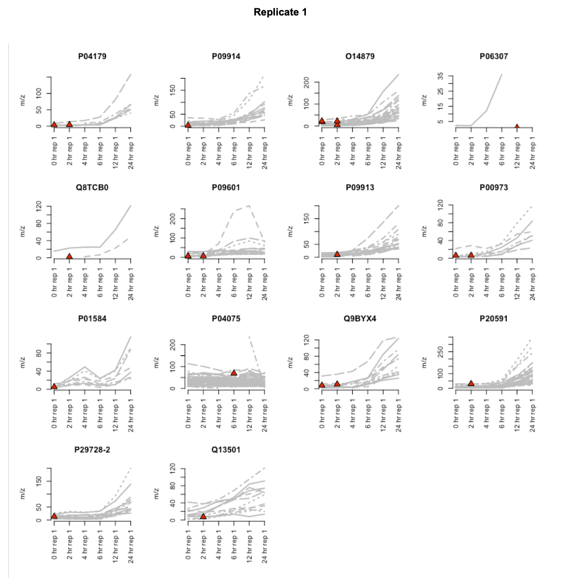
```
```{r mvplot2, echo=FALSE, fig.cap="", fig.show='hold',fig.align='center'}
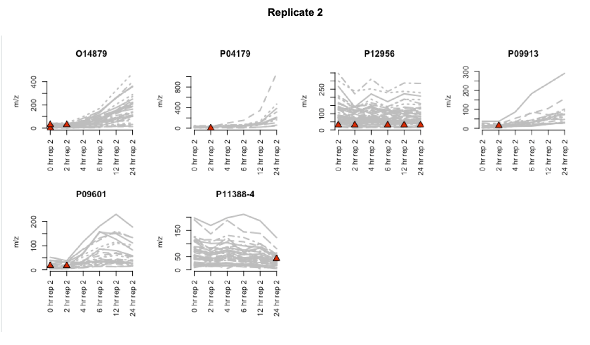
```
```{r mvplot3, echo=FALSE, fig.cap="PSM quantitation profile plots are shown for protein groups which contained a PSM with a missing value. The red triangles show the location of the missing values in the timecourse", fig.show='hold',fig.align='center'}
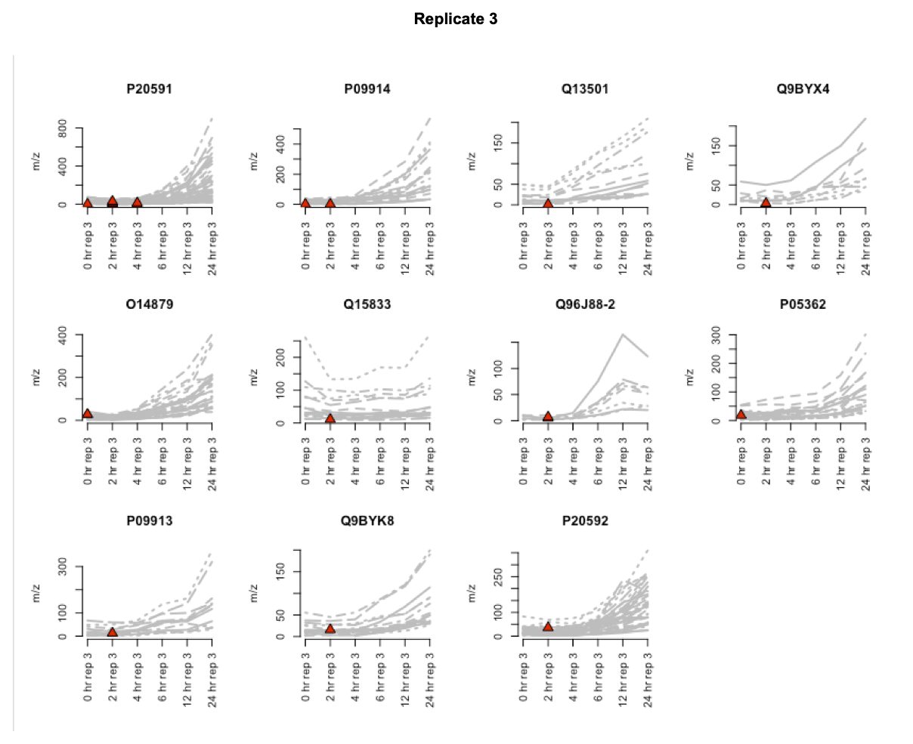
```

Looking at the above plots we see for the PSMs that are missing there are two general trends (1) they occur at the lower end/start of the time course, (2) missing PSMs tend to appear at the beginning of the time-course and show the same trend over time (a few exceptions listed below)

Given these two observations we decide for the majority of PSMs to use a left-censored imputation approach. It wouldn't be appropriate for a few cases and these are P06307, P04075 in rep 1, P113388-4, P12956 in rep 2 and so for these PSMs we will use k-nearest neighbour (k-NN), and thus we use a mixed imputation strategy. We remove the PSM at row 31435 for the protein group P12956 as it has 5 missing values out of 6, and there are many other PSMs available for protein quantitation. 

Type `?impute` in your R console for more information on missing values imputation methods available in the `MSnbase` and `pRoloc` pipeline. 

Imputation is done using the `impute` function in `MSnbase`

```{r imputepsms, message=FALSE, warning=FALSE}
## Split the data by replicate
psms_rep1 <- psms[[1]]
psms_rep2 <- psms[[2]]
psms_rep3 <- psms[[3]]

## define psms which are missing at random - see ?impute
fData(psms_rep1)$randna <- FALSE
fData(psms_rep1)$randna[11237] <- TRUE      # P06307
fData(psms_rep1)$randna[26194] <- TRUE      # P04075

# remove missing this PSM for protein P12956 as it has 5 missing values out of the 6 timepoints
# remove PSM 48162 for protein P113388-4 as 42 other PSMs available and it has no clear trend
psms_rep2 <- psms_rep2[-c(31435, 48162), ]

## replicate 1 imputation
psms_rep1 <- impute(psms_rep1, "mixed", 
                    randna = fData(psms_rep1)$randna, 
                    mar = "knn",
                    mnar = "MinDet")

## replicate 2 imputation                
psms_rep2 <- impute(psms_rep2, "MinDet")

## replicate 3 imputation
psms_rep3 <- impute(psms_rep3, "MinDet")

## Re-create MSnSetList of the data
psms <- MSnSetList(list(rep1 = psms_rep1, rep2 = psms_rep2, rep3 = psms_rep3))
```

We can check these look sensible by re-plotting them again.
```{r replotchk, eval=FALSE, results = 'hide'}
## Display number of PSMs for each protein with a MV
numpsms <- sapply(seq(psms), function(y)
  {sapply(fData(psms[[y]])$Master.Protein.Accessions[xx[[y]]],
       function(z) length(which(fData(psms[[y]])$Master.Protein.Accessions 
                                == z)))})

par(mfrow = c(4, 4))
plotMV(r = 1)

par(mfrow = c(2, 4))
plotMV(r = 2)

par(mfrow = c(3, 4))
plotMV(r = 3)
```

### Data normalisation

The data was visually assessed by examining pairwise scatter plots and `MAplots` of the data and then normalised using `vsn` followed by `diff.median`.  

```{r normalise, message=FALSE, warning=FALSE, fig.show="hide", results = 'hide'}
## make all PSMs uppercase so that PSMs with different PTMs are not
## considered as different sequences
for (i in seq(psms)) 
  fData(psms@x[[i]])$Annotated.Sequence <- toupper(fData(psms@x[[i]])$Annotated.Sequence)


## combine the data and normalise
cmb <- MSnbase::combine(psms[[1]], psms[[2]])
cmb <- MSnbase::combine(cmb, psms[[3]])
dim(cmb)

## Let's have a look at the intensities
boxplot(log(exprs(cmb)))

## Try a few different normalisation approaches
cmb.vsn <- normalise(cmb, "vsn")
cmb.median <- normalise(cmb, "diff.median")
cmb.vsn.median <- normalise(cmb.vsn, "diff.median")
cmb.quantiles <- normalise(cmb, "quantiles")

## Plot the data
par(mfrow = c(2, 3), las = 2, oma = c(6, 1, 1, 1))
boxplot(log(exprs(cmb)), main = "method = untransformed", ylab = "log intensity")
boxplot(log(exprs(cmb.median)), main = "method = diff.median", ylab = "log intensity")
boxplot(exprs(cmb.vsn), main = "method = vsn", ylab = "log intensity")    # NOTE: VSN internally logs the data 
boxplot(log(exprs(cmb.vsn.median)), main = "method = vsn + diff.median", ylab = "log intensity")
boxplot(log(exprs(cmb.quantiles)), main = "method = quantiles", ylab = "log intensity")

## We decide to go with 'vsn' followed by 'diff.median'
cmb <- cmb.vsn.median
```

### Aggregation to protein

We use the `combineFeatures` function from `MSnbase` to aggregate to protein level.

```{r aggtoprot}
psms1 <- filterNA(cmb[, 1:6])
psms2 <- filterNA(cmb[, 7:12])
psms3 <- filterNA(cmb[, 13:18])
psms <- MSnSetList(list(psms1, psms2, psms3))

## Aggregate to protein using median PSM per protein group
prots <- lapply(seq(psms), function(z)
               combineFeatures(psms[[z]], 
                               groupBy = fData(psms[[z]])$Master.Protein.Accession,
                               method = "median", verbose = FALSE))


## Do data fusion - create concatenated complete dataset
prots[[1]] <- updateFvarLabels(prots[[1]])
prots[[2]] <- updateFvarLabels(prots[[2]])
prots[[3]] <- updateFvarLabels(prots[[3]])
cmbprots <- MSnbase::combine(prots[[1]], prots[[2]])
cmbprots <- MSnbase::combine(cmbprots, prots[[3]])
cmbprots <- MSnbase::filterNA(cmbprots)
dim(cmbprots)
```
We identify 5221, 5812 and 5210 proteins in replicates 1, 2 and 3, respectively, and a total of 4292 common across all channels and timepoints in all samples.
 
## Protein level data processing
We load the individual protein level datasets from `pRolocdata` using the `data` function.

```{r loadprotdata}
data("lpsTimecourse_rep1_mulvey2021")
data("lpsTimecourse_rep2_mulvey2021")
data("lpsTimecourse_rep3_mulvey2021")

lpsTimecourse_rep1_mulvey2021
dim(lpsTimecourse_rep1_mulvey2021)

lpsTimecourse_rep2_mulvey2021
dim(lpsTimecourse_rep2_mulvey2021)

lpsTimecourse_rep3_mulvey2021
dim(lpsTimecourse_rep3_mulvey2021)
```

We see we have 5221, 5812 and 5210 proteins for replicates 1, 2 and 3, respectively.

### Data fusion
Data is concatenated into one matrix using the `combine` function in `MSnbase` and then proteins not common across all replicates are removed by using the `filterNA` function.

```{r concatenate}
cmb <- MSnbase::combine(lpsTimecourse_rep1_mulvey2021, 
                        lpsTimecourse_rep2_mulvey2021)
cmb <- MSnbase::combine(cmb, lpsTimecourse_rep3_mulvey2021)
cmb <- filterNA(cmb)
dim(cmb)
```
We find 4292 proteins common across all timepoints in all replicates.

```{r addgn}
## Function to add Gene Names to the data for adding Gene Name labels when we plot the results
source("r/getGN.R")
cmb <- addGeneName(cmb, fcol = "Protein.Descriptions.rep1", col.name = "GN")
```

Note: the combined dataset is also available directly from `pRolocdata` type `data("lpsTimecourse_mulvey2021")` 

We use the `venn.diagram` function from the `VennDiagram` package to draw venns of the data.

```{r venntc, eval=FALSE}
library("VennDiagram")
## lps timecourse
venn.diagram(
  x = list(featureNames(lpsTimecourse_rep1_mulvey2021), 
           featureNames(lpsTimecourse_rep2_mulvey2021), 
           featureNames(lpsTimecourse_rep3_mulvey2021)),
  category.names = c("Replicate 1" , "Replicate 2 " , "Replicate 3"),
  filename = "figures/venn_TC_replicates.png",
  main = "LPS timecourse: 0-24h",
  col=c("#440154ff", '#21908dff', '#D6BA0D'),
  fill = c(alpha("#440154ff",0.3), alpha('#21908dff',0.3), alpha('#D6BA0D',0.3)),
  fontfamily = "sans",
  cat.fontfamily = "sans",
  main.fontfamily = "sans",
  cat.col = c("#440154ff", '#21908dff', '#D6BA0D'), 
  cat.cex = 1.2,
  main.cex = 1.6,
  cex = 1.7,
  cat.fontface = 2,
  cat.dist = c(0.07, 0.07, 0.03),
  sub = "",
  output = FALSE
)
```

```{r venntcplot, echo=FALSE, fig.cap="Proteins common across LPS timecourse replicates", fig.show='hold',fig.align='center', out.height = '320px'}
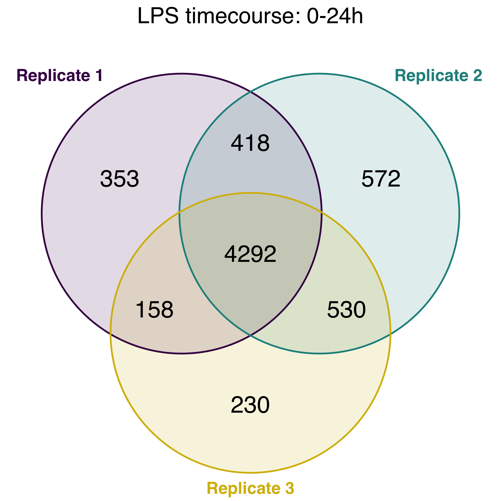
```


## Protein expression analysis

### Batch effects
Before we can have a look at changes in protein expression we first need to check if we see any batch effects. We plot the data by 'Tag' and 'Replicate' to see if this may be the case.

```{r checkbatch, fig.height=4, fig.cap="PCA plots showing of the effect of TMT tag and replicate on the intensities"}
par(mfrow = c(1, 2))
plot2D(t(cmb), fcol = "Tag", main = "PCA: TMT tag")
plot2D(t(cmb), fcol = "Replicate", main = "PCA: Replicates")
```


We see clearly from the PCA that the samples are confounded by replicate. We can correct for this by using `limma`. The `limma` package in Bioconductor provides a number of linear models that can accommodate complex experimental designs and account for experimental technicalities such as batch effects and confounding factors. To statistically analyse relative abundance we use `limma`'s empirical Bayes moderated t-test, a shrinkage method appropriate for small sample sizes (see Smyth's paper: [http://www.ncbi.nlm.nih.gov/pubmed/16646809](http://www.ncbi.nlm.nih.gov/pubmed/16646809)). A paired t-test is valid as experiments within each replicate use the same lysate.

### Differential protein expression analysis 
We use the classic `eBayes` method in the `limma` package using `lmFit` and add `Replicate` to the model matrix so we can account for this confounding factor 
i.e. `design <- model.matrix(~Replicate+Time)`. 

`limma` takes care of these potential batch effects.

In the next sections we perform differential expression analysis using the `limma` package [@Ritchie2015]. We first load some code for generating volcano plots.

```{r sourceVolcano}
source("r/ggVolcano.R")
```

#### 24 hour timepoint

The below results of the differential analysis at each time point are written to the `csv` directory of this repo, Supplementary Table 1 of Mulvey et al 2021 and are also stored in the `fData` of the `lpsTimecourse_mulvey2021` dataset found in `pRolocdata` for easy access.

```{r dolimmat24, message=FALSE, warning=FALSE, fig.cap="Histogram of raw p-values from differential analysis at 24 h post LPS"}
library("limma")
## 0hr and 24hr
i <- grep("X0.hr", sampleNames(cmb))
j <- grep("X24.hr", sampleNames(cmb))
eset <- cmb[, c(i, j)]
data <- exprs(eset)
rownames(data) <- fData(cmb)[["GN"]]
head(data)

## Create a model matrix
Time <- as.factor(pData(eset)$Time)
Replicate <- as.factor(pData(eset)$Replicate)
(design <- model.matrix(~Replicate+Time))

## Perform the fit
fit <- lmFit(data, design)
fit <- eBayes(fit)

## Get the results
res_t24 <- topTable(fit, coef = "Time24", 
                 adjust.method="BH", number = Inf)
res_t24 <- addPlottingInfo(res_t24)
msnset_t24 <- addLimmaInfo(cmb, res_t24)

## Look at p-value distribution
hist(res_t24[, "P.Value"], breaks = 50, 
     main = "Histogram of p-values for 0/24hr LPS \n(limma's paired moderated t-test)", 
     xlab = "p-value")

## save data as a TSV/CSV
write.csv(res_t24, file = "csv/limma_t24.csv")
write.exprs(msnset_t24, fDataCols = 131:138,  sep = "\t", 
            file = "csv/timecourse_t24.tsv")
```

It's always a good idea to check the distribution of your raw uncorrected p-values. The easiest way to do this is to make a histogram of your p-values as per the above code chunk. [This is a great post](http://varianceexplained.org/statistics/interpreting-pvalue-histogram/) on how to interpret your p-values. We find we have a nice anti-conservative distribution. 

The object `res_24` is a `data.frame` containing the output from running `topTable` which is a function to extract a table of the top-ranked genes/proteins from the limma linear model fit. 

We can now take this output and append it to our `MSnSet` and then plot the results. The classic way to present gene/protein expression data is a volcano plot.

The `ggVolcano` function plots the results on a volcano plot. 

```{r plotVolcanot24, message=FALSE, warning=FALSE, fig.show="hide"}
library("ggplot2")
library("dplyr")
library("ggrepel")
ggVolcano(res_t24, "24 hours", N = 20, lfc = 0.6, p = 0.01, 
          addLegend = TRUE, text.size = 12, base.text.size = 12, 
          legend.text.size = 12, geom.point.size = 2, 
          label.text.size = 4)
```


```{r fig4vol, echo=FALSE, fig.cap="Volcano plot showing up/downregulated proteins at 24 hours post LPS", fig.show='hold',fig.align='center'}
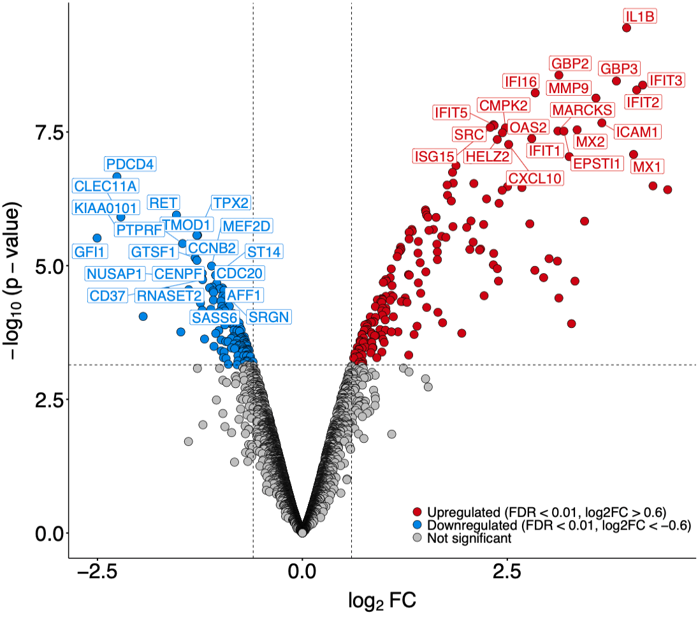
```

#### 12 hour timepoint

We repeat the analysis at each time point and look to see if we find any proteins that are significantly up- or downregulated.

```{r dolimmat12, message=FALSE, warning=FALSE, fig.cap="Histogram of raw p-values from differential analysis at 12 h post LPS"}
## 0hr and 12hr
i <- grep("X0.hr", sampleNames(cmb))
j <- grep("X12.hr", sampleNames(cmb))
eset <- cmb[, c(i, j)]
data <- exprs(eset)
rownames(data) <- fData(cmb)[["GN"]]
head(data)

## Create a model matrix
Time <- as.factor(pData(eset)$Time)
Replicate <- as.factor(pData(eset)$Replicate)
design <- model.matrix(~Replicate+Time)

## Perform the fit
fit <- lmFit(data, design)
fit <- eBayes(fit)

## Get the results
res_t12 <- topTable(fit, coef = "Time12", 
                 adjust.method="BH", number = Inf)
res_t12 <- addPlottingInfo(res_t12)
msnset_t12 <- addLimmaInfo(cmb, res_t12)

## Look at p-value distribution
hist(res_t12[, "P.Value"], breaks = 50, 
     main = "Histogram of p-values for 0/12hr LPS \n(limma's paired moderated t-test)", 
     xlab = "p-value")

## save data as a TSV/CSV
write.csv(res_t12, file = "csv/limma_t12.csv")
write.exprs(msnset_t12, fDataCols = 131:138,  sep = "\t", 
            file = "csv/timecourse_t12.tsv")
```
```{r plotvolcano12, eval=FALSE, warning=FALSE, message=FALSE}
## plot volcanos
ggVolcano(res_t12, "12 hours", N = 20, lfc = 0.6, 
          p = 0.01, addLegend = FALSE,
          text.size = 12, base.text.size = 12, 
          legend.text.size = 12, geom.point.size = 2, 
          label.text.size = 4)
```

```{r fig8vol, echo=FALSE, fig.cap="Volcano plot showing up/downregulated proteins at 12 hours post LPS", fig.show='hold',fig.align='center'}
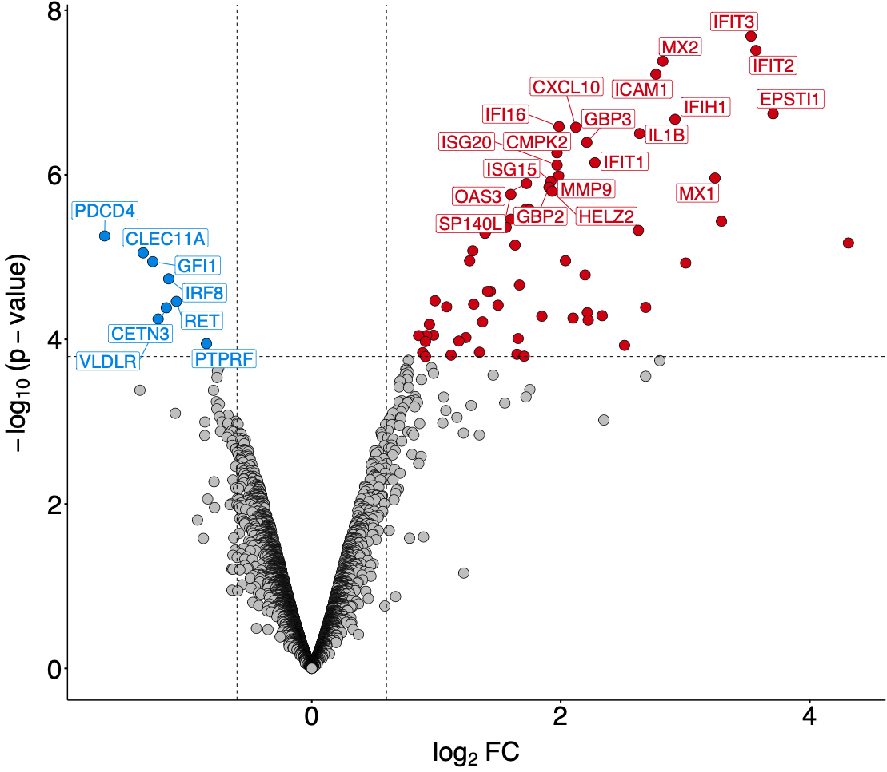
```

#### 6 hour timepoint
```{r dolimma_t6, warning=FALSE, message=FALSE, fig.cap="Histogram of raw p-values from differential analysis at 6 h post LPS"}
## 0hr and 6r
i <- grep("X0.hr", sampleNames(cmb))
j <- grep("X6.hr", sampleNames(cmb))
eset <- cmb[, c(i, j)]
data <- exprs(eset)
rownames(data) <- fData(cmb)[["GN"]]
head(data)

## Create a model matrix
Time <- as.factor(pData(eset)$Time)
Replicate <- as.factor(pData(eset)$Replicate)
design <- model.matrix(~Replicate+Time)

## Perform the fit
fit <- lmFit(data, design)
fit <- eBayes(fit)

## Get the results
res_t6 <- topTable(fit, coef = "Time6", 
                 adjust.method="BH", number = Inf)
res_t6 <- addPlottingInfo(res_t6)
msnset_t6 <- addLimmaInfo(cmb, res_t6)

## Look at p-value distribution
hist(res_t6[, "P.Value"], breaks = 50, 
     main = "Histogram of p-values for 0/6hr LPS \n(limma's paired moderated t-test)", 
     xlab = "p-value")

## save data as a TSV/CSV
write.csv(res_t6, file = "csv/limma_t6.csv")
write.exprs(msnset_t6, fDataCols = 131:138,  sep = "\t", 
            file = "csv/timecourse_t6.tsv")
```
```{r volcano6, eval=FALSE, warning=FALSE, message=FALSE}
## plot volcanos
ggVolcano(res_t6, "6 hours", N = 20, lfc = 0.6, 
          p = 0.01, addLegend = FALSE,
          text.size = 12, base.text.size = 12, 
          legend.text.size = 12, geom.point.size = 2, 
          label.text.size = 4)
```

```{r fig10vol, echo=FALSE, fig.cap="Volcano plot showing up/downregulated proteins at 6 hours post LPS", fig.show='hold',fig.align='center'}
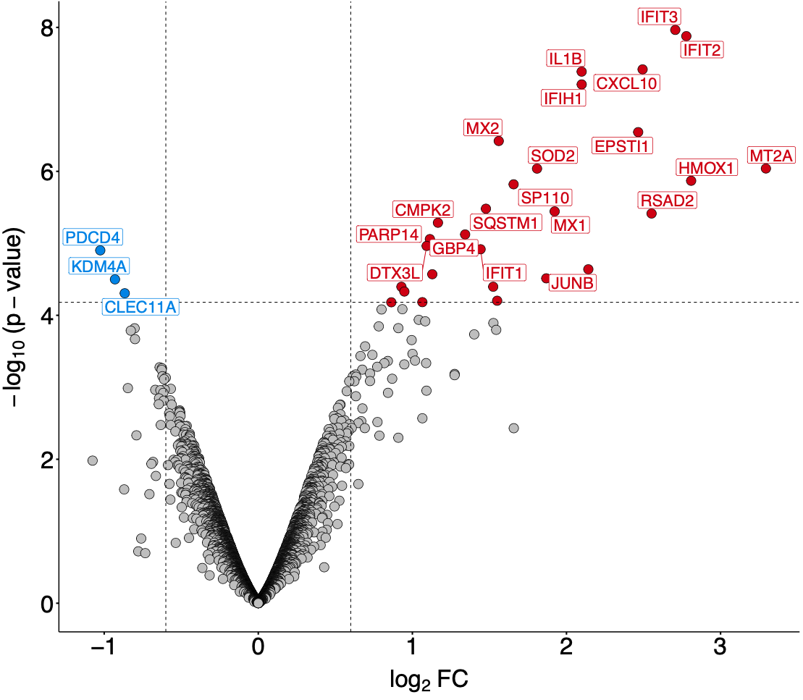
```

#### 4 hour timepoint
```{r dolimma_t4, warning=FALSE, message=FALSE, fig.cap="Histogram of raw p-values from differential analysis at 4 h post LPS"}
## 0hr and 4hr
i <- grep("X0.hr", sampleNames(cmb))
j <- grep("X4.hr", sampleNames(cmb))
eset <- cmb[, c(i, j)]
data <- exprs(eset)
rownames(data) <- fData(cmb)[["GN"]]
head(data)

## Create a model matrix
Time <- as.factor(pData(eset)$Time)
Replicate <- as.factor(pData(eset)$Replicate)
design <- model.matrix(~Replicate+Time)

## Perform the fit
fit <- lmFit(data, design)
fit <- eBayes(fit)

## Get the results
res_t4 <- topTable(fit, coef = "Time4", 
                 adjust.method="BH", number = Inf)
res_t4 <- addPlottingInfo(res_t4)
msnset_t4 <- addLimmaInfo(cmb, res_t4)

## Look at p-value distribution
hist(res_t4[, "P.Value"], breaks = 50, 
     main = "Histogram of p-values for 0/4hr LPS \n(limma's paired moderated t-test)", 
     xlab = "p-value")

## save data as a TSV/CSV
write.csv(res_t4, file = "csv/limma_t4.csv")
write.exprs(msnset_t4, fDataCols = c(131:138),  sep = "\t", 
            file = "csv/timecourse_t4.tsv")
```

```{r plotvolcano4, eval=FALSE}
## plot volcanos
ggVolcano(res_t4, "4 hours", N = 20, lfc = 0.6, 
          p = 0.01, addLegend = FALSE,
          text.size = 12, base.text.size = 12, 
          legend.text.size = 12, geom.point.size = 2, 
          label.text.size = 4)
```

```{r fig12vol, echo=FALSE, fig.cap="Volcano plot showing up/downregulated proteins at 4 hours post LPS", fig.show='hold',fig.align='center'}
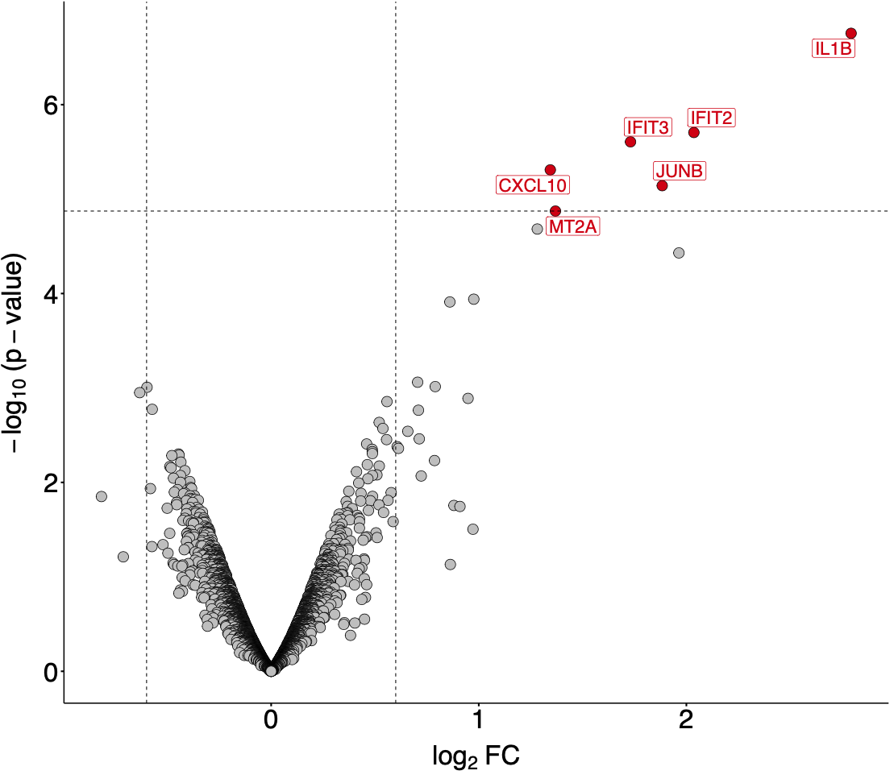
```

#### 2 hour timepoint
```{r dolimma_t2, warning=FALSE, message=FALSE, fig.cap="Histogram of raw p-values from differential analysis at 2 h post LPS"}
## 0hr and 2hr
i <- grep("X0.hr", sampleNames(cmb))
j <- grep("X2.hr", sampleNames(cmb))
eset <- cmb[, c(i, j)]
data <- exprs(eset)
rownames(data) <- fData(cmb)[["GN"]]
head(data)

## Create a model matrix
Time <- as.factor(pData(eset)$Time)
Replicate <- as.factor(pData(eset)$Replicate)
design <- model.matrix(~Replicate+Time)

## Perform the fit
fit <- lmFit(data, design)
fit <- eBayes(fit)

## Get the results
res_t2 <- topTable(fit, coef = "Time2", 
                 adjust.method="BH", number = Inf)
res_t2 <- addPlottingInfo(res_t2)
msnset_t2 <- addLimmaInfo(cmb, res_t2)

## Look at p-value distribution
hist(res_t2[, "P.Value"], breaks = 50, 
     main = "Histogram of p-values for 0/2hr LPS \n(limma's paired moderated t-test)", 
     xlab = "p-value")

## save data as a TSV/CSV
write.csv(res_t2, file = "csv/limma_t2.csv")
write.exprs(msnset_t4, fDataCols = c(131:138),  sep = "\t", 
            file = "csv/timecourse_t2.tsv")
```
```{r plotvolcano2, eval=FALSE}
## plot volcanos
ggVolcano(res_t2, "2 hours", N = 20, lfc = 0.6, 
          p = 0.05, addLegend = FALSE,
          text.size = 12, base.text.size = 12, 
          legend.text.size = 12, geom.point.size = 2, 
          label.text.size = 4)
```

```{r fig14vol, echo=FALSE, fig.cap="Volcano plot showing up/downregulated proteins at 2 hours post LPS", fig.show='hold',fig.align='center'}
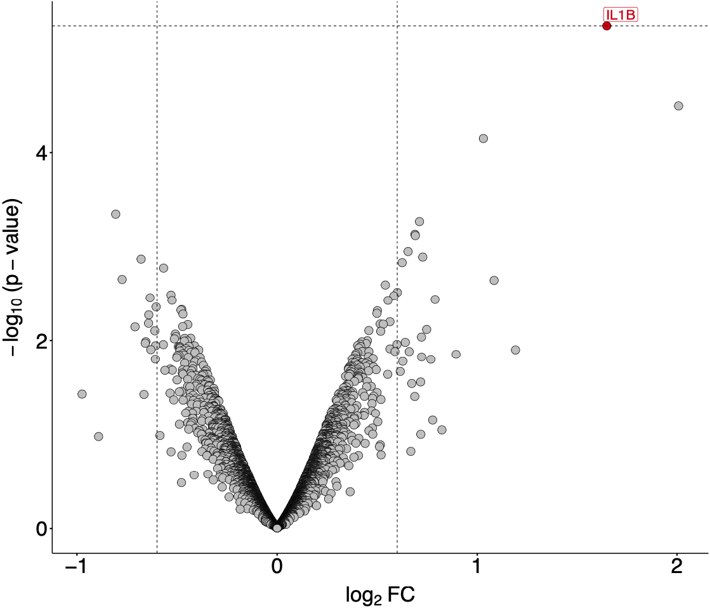
```

### Summary
A total of 311 proteins were found to be altered in abundance during the time course of LPS stimulation, with statistical significance (adjusted p-value < 0.01 and log2FC > 0.6) (Supplementary Table 1 of [@Mulvey:2021]). We do not discuss the functional effects of these changes in detail in this workflow and instead we refer readers to the Mulvey et al 2021.

## Bayesian temporal clustering

Bayesian correlated clustering was conducted on the shotgun proteomic time-course series to capture clusters of co-regulated proteins and temporal patterns of protein expression in response to LPS. Replicate experiments were combined using multiple dataset integration MDI [@Kirk2012] where the number of clusters were automatically inferred. 

Bayesian inference was performed using Markov-chain Monte Carlo (MCMC) as implemented in the MDI-GPU software [@Kirk2012]. Clusters were extracted only for proteins that were consistently allocated to the same clusterings (sampled from the posterior distribution) across replicates (the results can be found in Supplementary Table 3 of Mulvey et al. and also in the csv directory of this Git repo).

In the below code chunk we load the results from temporal clustering and plot 12 clusters of interest as discussed in Mulvey et al. (Figure 2 of [@Mulvey:2021])

```{r mdiclusteringup, message=FALSE, warning=FALSE, fig.height=12, fig.cap="Temporal abundance profiles 6 clusters output from the MDI clustering analysis that showed a pattern of upregulation over time."}
library("RColorBrewer")
source("r/plotRibbons.R")

## Read in MDI clustering results
mdi_rep1 <- read.csv("csv/mdi_clustering_lpsrep1.csv")
mdi_rep2 <- read.csv("csv/mdi_clustering_lpsrep2.csv")
mdi_rep3 <- read.csv("csv/mdi_clustering_lpsrep3.csv")
mdi <- read.csv("csv/mdi_clusters_output.csv")

# get median normalised intensity
dat_mat <- list(data.matrix(mdi_rep1[, -1]), 
                data.matrix(mdi_rep2[, -1]), 
                data.matrix(mdi_rep3[, -1]))
av_mat <- apply(simplify2array(dat_mat), c(1,2), median)
rownames(av_mat) <- mdi_rep1[,1]
colnames(av_mat) <- c(0, 2, 4, 6, 12, 24)
head(av_mat)

## plot clusters of interest
ids <- c(1:6, 9:11, 13, 14, 17)
mdi_profs <- sapply(ids, function(z) 
  av_mat[mdi$Protein.Accession[which(mdi$Cluster.Number == z)], ])
names(mdi_profs) <- paste0("cluster", ids)

## pick a good palette
ribbonCol <- c(brewer.pal(n = 9, "Oranges")[-c(1:3)],
           brewer.pal(n = 9, "GnBu")[-c(1:3)])

par(mfrow = c(3,2), mar = c(6, 5, 3, 3))
for (i in 1:6) {
  ribbonPlot(mdi_profs[[i]], col = ribbonCol[i], c(0.05, .95), 
             main = paste("Cluster", ids[i]), cex.main = 2, size = 2)
}
```
```{r mdiclusteringdown, message=FALSE, warning=FALSE, fig.height=12, fig.cap="Temporal abundance profiles 6 clusters output from the MDI clustering analysis that showed a pattern of downregulation over time."}
par(mfrow = c(3,2), mar = c(6, 5, 3, 3))
for (i in 7:12) {
  ribbonPlot(mdi_profs[[i]], col = ribbonCol[i], c(0.05, .95), 
             main = paste("Cluster", ids[i]), cex.main = 2, size = 2)
}
```

## Gene Ontology enrichment
Temporal clusters were functionally annotated by using the Gene Ontology (GO) [@Ashburner:2000]. For each cluster output from the Bayesian temporal clustering, in turn, an enrichment test for biological process (BP), cellular component (CC) and molecular function (MF) annotations, was carried out using the Database for Annotation, Visualisation and Integrated Discovery (DAVID v6.8; https://david.ncifcrf.gov/) where a cutoff of < 0.05 was applied according to the Benjamini-Hochberg procedure [@Benjamini1995]. The GO annotation enrichment results are found in Supplementary Table 4 of Mulvey et al 2021.

In the below code chunk some of the results from the GO enrichment (Figure 3 of Mulvey et al. 2021). GOCC, GOMF and GOBP annotation term enrichment for the the clusters are shown below where the -log10(adjusted p-value) is shown along the x-axis and most highly enriched term along the y-axis. The numbers within each barplot refer to the number of proteins associated with the term in each cluster.

```{r addGoAnnotationForMDIbp, fig.width=10, fig.cap="Gene Ontology molecular function enrichment results for 12 clusters of interest output from the MDI analysis. The numbers within each barchart refer to the number of proteins associated with the term in that cluster."}
## use custom code for bar plot figures
## https://github.com/CambridgeCentreForProteomics/thp-lopit-2021/blob/main/R/GObarplot.R
source("r/GObarplot.R")

GObarplots(filename = "csv/david_data_gobp.csv", cols = ribbonCol, N = 30) +
  ggtitle("GO Biological Process Terms")
```
```{r addGoAnnotationForMDIcc, fig.width=10, fig.cap="Gene Ontology cellular component enrichment results for 12 clusters of interest output from the MDI analysis. The numbers within each barchart refer to the number of proteins associated with the term in that cluster."}
GObarplots(filename = "csv/david_data_gocc.csv", cols = ribbonCol) +
  ggtitle("GO Cellular Component Terms")
```
```{r addGoAnnotationForMDImf, fig.width=10, fig.cap="Gene Ontology molecular function enrichment results for 12 clusters of interest output from the MDI analysis. The numbers within each barchart refer to the number of proteins associated with the term in that cluster."}
GObarplots(filename = "csv/david_data_gomf.csv", cols = ribbonCol, N = 15) +
  ggtitle("GO Molecular Function Terms")
```

The timecourse of LPS provides an insight into the protein expression of THP-1 proteome during the initial phases of a pro-inflammatory response. In order the gain a complete picture of protein relocalisation events we performed a series of hyperLOPIT experiments and 0 and 12 hour LPS time-points to give a deeper spaial understanding of the dynamic changes that occur in the proteome following stimulation.

# Spatial proteomics data analysis

## The hyperLOPIT workflow
Using the hyperLOPIT proteomics platform [@Christoforou:2016 @Mulvey:2017] we obtained spatial maps that capture the steady-state distribution of thousands of proteins in the THP-1 human leukaemia cell line. Experiments were conducted in triplicate and the samples were analysed and collected when cells were (1) unstimulated and then (2) at 12 hours following stimulation with LPS. 

The hyperLOPIT method combines biochemical cell fractionation with multiplexed high-resolution mass-spectrometry [@Christoforou:2016 @Mulvey:2017], the full protocol and experimental design can be found in [@Mulvey:2021]. Briefly, TMT labelling was conducted as described in [@Mulvey:2017] and 20 fractions including the cytosol-enriched fraction were labelled per gradient, by combining two TMT 10-plex experiments in an interleaved labelling design to capture as much subcellular diversity as possible. The experimental design for each dataset is stored in the `pData` slot of each dataset.

To access the full experimental design use the `pData` function

```{r showpdata}
## TMT experiment data for the unstimulated hyperLOPIT data
pData(thpLOPIT_unstimulated_mulvey2021)

## TMT labelling scheme for the LPS hyperLOPIT data
pData(thpLOPIT_lps_mulvey2021)
```

As described in [@Mulvey:2017 @Breckels:2016b @Christoforou:2016] the data was processed with Proteome Discoverer v2.1 (Thermo Fisher Scientific) and Mascot server v2.3.02 (Matrix Science) using the SwissProt sequence database for Homo sapiens (www.uniprot.org in November 2016) and the cRAP database (common Repository for Adventitious Proteins, https://www.thegpm.org/crap). Standard filtering of the raw data was conducted as per [@Mulvey:2017] to remove contaminants and low abundant PSMs. A maximum of two missing values per TMT experiment was allowed and the data was directly exported from Proteome Discoverer at the PSM level for downstream analysis in R.

The experiments were done in triplicate for each condition and each replicate contains 2 x TMT 10-plex sets (which we denote as "set 1" and "set 2"). Thus, in total we conducted a total of 12 experiments, 6 per condition wherein we had 2 sets per replicate containing a total of 20 fractions/channels per replicate. One TMT channel was removed (TMT tag 126 in replicate 2, set 2 in the unstimulated) due to erroneous labelling of insoluble material during the sample preparation for this specific tag. The “Average Reporter S/N” value was recalculated for the nine remaining channels in the corresponding 10plex set and PSMs with a value less than 9.0 were discarded (please see Data Processing in the Supplementary Information of [@Mulvey:2021]).

## PSM level data processing

### Missing values assessment
The 12 PSM level datasets were imported into R and missing values were carefully assessed. 

Load the PSM level unstimulated data,
```{r psmdata}
## Unstimulated data
data("psms_thpLOPIT_unstim_rep1_set1")
data("psms_thpLOPIT_unstim_rep1_set2")

data("psms_thpLOPIT_unstim_rep2_set1")
data("psms_thpLOPIT_unstim_rep2_set2")

data("psms_thpLOPIT_unstim_rep3_set1")
data("psms_thpLOPIT_unstim_rep3_set2")
```

Load the PSM level 12h-LPS stimulated data,
```{r psmstimulated}
## 12h post LPS-stimulated
data("psms_thpLOPIT_lps_rep1_set1")
data("psms_thpLOPIT_lps_rep1_set2")

data("psms_thpLOPIT_lps_rep2_set1")
data("psms_thpLOPIT_lps_rep2_set2")

data("psms_thpLOPIT_lps_rep3_set1")
data("psms_thpLOPIT_lps_rep3_set2")
```

For ease of coding we create a list of `MSnSets` for each condition
```{r list}
psms <- MSnSetList(
  list(
    psms_thpLOPIT_unstim_rep1_set1,
    psms_thpLOPIT_unstim_rep1_set2,
    psms_thpLOPIT_unstim_rep2_set1,
    psms_thpLOPIT_unstim_rep2_set2,
    psms_thpLOPIT_unstim_rep3_set1,
    psms_thpLOPIT_unstim_rep3_set2,
    psms_thpLOPIT_lps_rep1_set1,
    psms_thpLOPIT_lps_rep1_set2,
    psms_thpLOPIT_lps_rep2_set1,
    psms_thpLOPIT_lps_rep2_set2,
    psms_thpLOPIT_lps_rep3_set1,
    psms_thpLOPIT_lps_rep3_set2
  )
)

## add list names for each dataset
.nams <- paste0("Rep", rep(1:3, each = 2), "_set", rep(1:2, 3))
names(psms) <- c(paste0(.nams, "_unstim"), paste0(.nams, "_lps"))
```

We can view the number of PSMs per experiment,
```{r count_psms}
sapply(psms, nrow)
```

If we examine the corresponding protein group of each PSM with a missing value, we find that there are other PSMs available for quantitation for the majority of proteins. There are still several hundred cases where we only have 1 PSM for a given protein group, so we would lose several hundred proteins per replicate if we were to just remove these PSMs. We assess the missing values across all experiments using the `naPlot` function to see if there is a trend in where missing values occur. 

Generate `naPlots`,

```{r naplots, eval=FALSE}
for (i in seq(psms)) {
  par(las = 2, oma = c(10, 1, 1, 1))
  naplot(psms[[i]], col = "black", las = 2, reorderColumns = FALSE, 
         main = names(psms)[i], cex.axis = 2)
}
```


```{r fignaplotun, echo=FALSE, fig.show='hold',fig.align='center'}
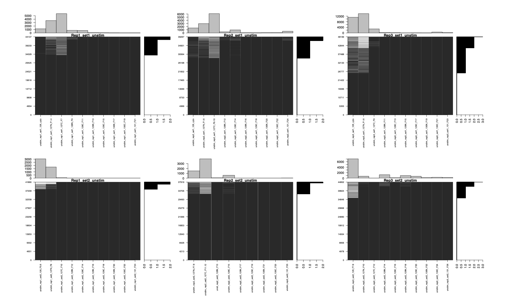
```


```{r fignaplotlps, echo=FALSE, fig.cap="Heatmaps showing missing value distributions per set and replciate", fig.show='hold',fig.align='center'}
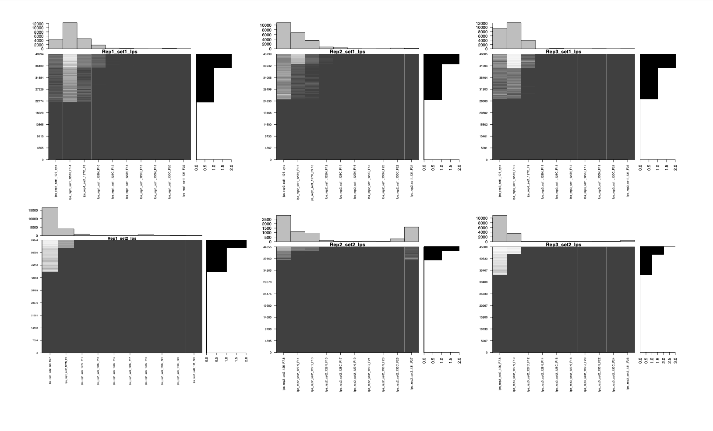
```

The above `naPlots` show that missing values tend to accumulate at the end of the gradient, and more specifically in the first few fractions of the gradient of each experiment, which classically reflect the gradient distribution e.g. PSMs that are often highly mitochondrial have a huge signal in the heavy channels but little elsewhere in the gradient and thus can result in missing values in the other channels. It is also common to find biologically relevant missing values such as those resulting from the absence of the low abundance of ions. As values do not appear to be missing at random we use a left-censored deterministic minimal value approach, `MinDet` in `MSnbase`.

```{r mindet, warning=FALSE, message=FALSE}
psms.imputed <- lapply(psms, function(z) impute(z, method = "MinDet"))
```

PSMs were quality controlled post-imputation and then combined to protein level by calculating the median of all PSM intensities corresponding to the leading Uniprot Accession number for each protein group.

### Data normalisation

Following the standard [pRoloc workflow](https://f1000research.com/articles/5-2926) [@Breckels:2016b] PSMs are scaled into the same intensity interval by dividing each intensity by the `sum` of the intensities for that quantitative feature. This transformation of the data assures cancellation of the effect of the absolute intensities of the quantitative features along the rows, and focuses subsequent analyses on the relative profiles along the sub-cellular channels. This is important for spatial proteomic experiments are proteins that co-localise in a cell are known to exhibit similar quantitative profiles across the gradient fractions employed [@Deduve:1981].

```{r norm}
psms.imputed.norm <- lapply(psms.imputed, function(z) normalise(z,  "sum"))
```

### Aggregation to protein

We use all available PSMs for quantification and aggregate PSMs to proteins using the `combineFeatures` function in `MSnbase` by calculating the median of all PSM intensities corresponding to the leading Uniprot Accession number for each protein group.

```{r aggregate}
prots <- lapply(psms.imputed.norm, function(z) 
  combineFeatures(z, method = "median",
                  groupBy = fData(z)[, "Master.Protein.Accessions"]))

## become combining all protein sets we tidy up the feature labels of the dataset
ll <- paste0(rep(c("unst", "lps"), 1, each = 6), ".r",
             rep(1:3, 1, each = 2), ".s", 1:2)
for (i in seq(prots)) {
  prots@x[[i]] <- updateFvarLabels(prots[[i]], label = ll[i], sep = "_")
}

## combine TMT sets and examine each replicate for each condition
unst_r1 <- filterNA(MSnbase::combine(prots[[1]], prots[[2]]))
unst_r2 <- filterNA(MSnbase::combine(prots[[3]], prots[[4]]))
unst_r3 <- filterNA(MSnbase::combine(prots[[5]], prots[[6]]))
lps_r1 <- filterNA(MSnbase::combine(prots[[7]], prots[[8]]))
lps_r2 <- filterNA(MSnbase::combine(prots[[9]], prots[[10]]))
lps_r3 <- filterNA(MSnbase::combine(prots[[11]], prots[[12]]))


tot_prots <- data.frame("Unstimulated" = c(`Replicate 1` = nrow(unst_r1), 
                                           `Replicate 2` = nrow(unst_r2), 
                                           `Replicate 3`= nrow(unst_r3)),
                        "LPS" = c(`Replicate 1` = nrow(lps_r1),
                                  `Replicate 2` = nrow(lps_r2),
                                  `Replicate 3` = nrow(lps_r3)))
           
                            
```

```{r kableoutput, warning=FALSE, message=FALSE}
library("knitr")
library("kableExtra")
kable(tot_prots, caption = "Number of quantified proteins per replicate per condition")
```

## Protein level data processing
As shown in the above section we quantify between ~4800-5800 proteins per replicate. The below Venn diagrams show the overlap between replicates within conditions. We find 3882 proteins common in the unstimulated hyperLOPIT experiment and 4067 in the 12h-LPS stimulated hyperLOPIT experiment.

We use the `VennDiagram` package.

```{r venns, warning=FALSE, message=FALSE, eval=FALSE}
## Load R packages required for generating Venn diagrams
library("VennDiagram")
library("scales")
library("ggplot2")

## HL unstimulated 
venn.diagram(
  x = list(featureNames(unst_r1), 
           featureNames(unst_r2), 
           featureNames(unst_r3)),
  category.names = c("Replicate 1" , "Replicate 2 " , "Replicate 3"),
  filename = "figures/venn_HL_unst_replicates.png",
  main = "hyperLOPIT: Untreated THP-1 cells",
  col=c("#440154ff", '#21908dff', '#D6BA0D'),
  fill = c(alpha("#440154ff",0.3), alpha('#21908dff',0.3), alpha('#D6BA0D',0.3)),
  fontfamily = "sans",
  cat.fontfamily = "sans",
  main.fontfamily = "sans",
  cat.col = c("#440154ff", '#21908dff', '#D6BA0D'), 
  cat.cex = 1.2,
  main.cex = 1.6,
  cex = 1.7,
  cat.fontface = 2,
  cat.dist = c(0.07, 0.07, 0.03),
  sub = "",
  output = FALSE
)

# HL LPS
venn.diagram(
  x = list(featureNames(lps_r1), 
           featureNames(lps_r2), 
           featureNames(lps_r3)),
  category.names = c("Replicate 1" , "Replicate 2 " , "Replicate 3"),
  filename = "figures/venn_HL_lps_replicates.png",
  main = "hyperLOPIT: 12h-LPS stimulated THP-1 cells",
  col=c("#440154ff", '#21908dff', '#D6BA0D'),
  fill = c(alpha("#440154ff",0.3), alpha('#21908dff',0.3), alpha('#D6BA0D',0.3)),
  fontfamily = "sans",
  cat.fontfamily = "sans",
  main.fontfamily = "sans",
  cat.col = c("#440154ff", '#21908dff', '#D6BA0D'), 
  cat.cex = 1.2,
  main.cex = 1.6,
  cex = 1.7,
  cat.fontface = 2,
  cat.dist = c(0.07, 0.07, 0.03),
  sub = "",
  output = FALSE
)
```

```{r venn1, echo=FALSE, fig.cap="Overlap of protein groups identified between replicated experiments", out.height = '320px', fig.show='hold',fig.align='center'}
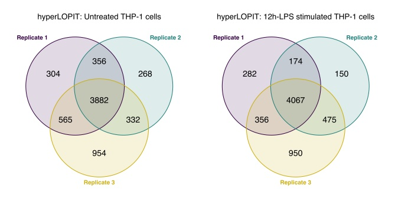
```

## Dataset concatenation
We use the `combine` function in `MSnbase` to perform data fusion (concatenation) within each condition to maximise subcellular resolution and thus the reliability in protein classification [as per the pRoloc pipeline [@Christoforou:2016 @Breckels:2016b @Mulvey:2017]. Trotter et al. [@Trotter:2010] have shown a significant improvement in classifier accuracy when combining replicated experiments in spatial proteomics. Specifically, we concatenate all gradient fractions across replicated experiments to give better discrimination between subcellular niches (as shown in [@Christoforou:2016]) which gives users the opportunity to resolve niches that may not have been discovered when examining replicates alone. 

We note (as explained in [@Breckels:2016b, @Mulvey:2017]) that direct comparisons of individual TMT channels in replicated experiments do not provide an adequate, goal-driven assessment of different experiments due to the nature of the gradient fraction collection, where quantitative channels do not correspond to identical selected fractions along the gradient. 

Concatenate replicates for each condition,
```{r combineall}
## combine replicates for each condition
unst_full <- filterNA(MSnbase::combine(unst_r1, unst_r2))
unst_full <- filterNA(MSnbase::combine(unst_full, unst_r3)) 

lps_full <- filterNA(MSnbase::combine(lps_r1, lps_r2))
lps_full <- filterNA(MSnbase::combine(lps_full, lps_r3)) 
```

```{r vennintersect, eval=FALSE}
# HL intersect
venn.diagram(
  x = list(featureNames(unst_full), 
           featureNames(lps_full)),
  rotation.degree	= 180,
  category.names = c("12h-LPS\nstimulated", "Untreated"),
  filename = "figures/venn_HL_conditions.png",
  main = "Subset for common proteins:\nhyperLOPIT conditions",
  col=c("#440154ff", '#21908dff'),
  fill = c(alpha("#440154ff",0.3), alpha('#21908dff',0.3)),
  fontfamily = "sans",
  cat.fontfamily = "sans",
  main.fontfamily = "sans",
  cat.col = c('#21908dff', "#440154ff"), 
  margin = 0.05,
  cat.pos = c(-130, 132),
  cat.dist = c(0.1, 0.09),
  cat.cex = 1.2,
  main.cex = 1.6,
  cex = 1.7,
  cat.fontface = 2,
  sub = "",
)
```

```{r venn2, echo=FALSE, out.width = '200px', fig.align='center', fig.cap="Overlap of protein groups identified in both conditions"}
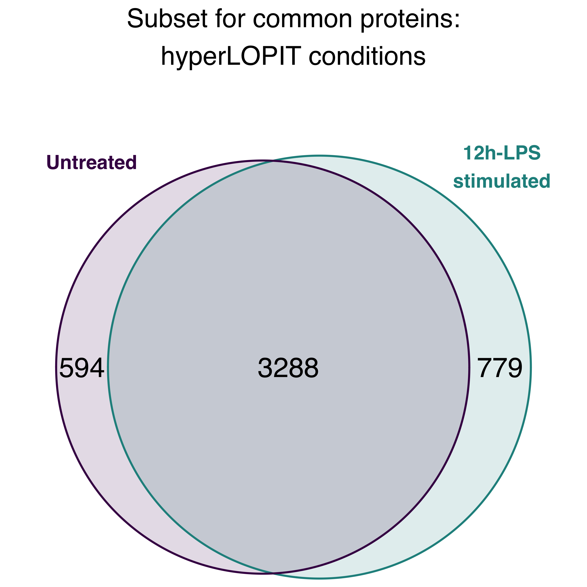
```

We find 3288 proteins common all 12 experiments. In the next code chunk we subset our data to keep only proteins common between all experiments. 

### Final hyperLOPIT datasets for downstream analysis
Subset for common proteins in all replicates and all conditions,
```{r commonall, eval=TRUE}
## keep only those in common between conditions
cmn <- intersect(featureNames(unst_full), featureNames(lps_full))
lps <- lps_full[cmn, ]
unst <- unst_full[cmn, ]
```

### Adding marker proteins
A list of 783 annotated, unambiguous resident organelle marker proteins from 11 subcellular niches: mitochondria, ER, Golgi apparatus, lysosome, peroxisome, PM, nucleus, nucleolus, chromatin, ribosome and cytosol, were curated from [The Uniprot database](https://www.uniprot.org), [Gene Ontology](https://www.ebi.ac.uk/QuickGO/)[@Ashburner:2000] and from careful mining of the literature. Only proteins known to localise to a single location were included as markers.

We use the `addMarkers` function in `pRoloc` to annotate our two datasets from this list of markers (found in the `csv` directory of this repository). The marker list can also be extracted from `pRolocdata` by using the `getMarkers` function with any of the THP datasets.

Adding markers,
```{r addmarkers, eval=TRUE}
lps <- addMarkers(lps, markers = "csv/markers_2019.28.01.csv")
unst <- addMarkers(unst, markers = "csv/markers_2019.28.01.csv")
```

### Visualising the data
We use t-Distributed Stochastic Neighbor Embedding (t-SNE) to project our 60 dimension data into two-dimensions to visualise organelle separation. 

In the below code chunk we plot the data and highlight the subcellular markers on each dataset (Figure 4 of [@Mulvey:2021]). Each point represents one protein. Markers are highlighted by different colours as denoted by the key and proteins for the subcellular location is unknown or undefined are grey.

```{r plotit1, fig.width=10, fig.height=10, warning=FALSE, message=FALSE, fig.cap="t-SNE plots of the (concatenated) LOPIT datasets for each condition (Figure 4 of Mulvey et al. 2021)"}
source("r/prettymap.R")
## set organelle colours
mycol <- c("#88CCEE", "#332288", "#53CAB7", "#0170b4", "#204f20", "#990000",
           "#E69F00", "#DDCC77", "#E18493", "#AA4499", "#D55E00")
setStockcol(mycol)
setUnknownpch(16)


## Generate the t-SNE coords (Figure 4 of [1])
set.seed(399)
tsne_unst <- plot2D(unst, method = "t-SNE", plot = FALSE)
set.seed(399)
tsne_lps <- plot2D(lps, method = "t-SNE", plot = FALSE)


## plot the data as t-SNE maps
par(mfrow = c(2, 2))        
oo = c(1:3, 10, 5, 4, 6:7, 9, 8, 11)
myleg <- c(getMarkerClasses(unst), "Unknown")

prettyTSNE(tsne_unst, unst, fcol = "markers", 
          main = "Subcellular markers\nunstimulated THP1-cells",
          orgOrder = oo, mainCol = mycol, outlineCol = darken(mycol))
prettyTSNE(tsne_lps, lps, 
          main = "Subcellular markers\n12h-LPS stimulated THP1-cells",
          orgOrder = oo, mainCol = mycol, outlineCol = darken(mycol))

## add a legend
plot(NULL, xaxt='n',yaxt='n',bty='n',ylab='',xlab='', xlim=0:1, ylim=0:1)
legend("topleft", legend = myleg, col = mycol, bty = "n",
       pch = 19, cex = 1.2, pt.cex = 1.6, ncol = 2)
```


## Classification using a Bayesian framework 
Proteins are assigned to one of the 11 subcellular marker classes using TAGM-MCMC [@tagm]. TAGM-MCMC is a semi-supervised Bayesian generative classifier based on a T-Augmented Gaussian Mixture model that uses Bayesian computation performed using Markov-chain Monte Carlo. It is one of the many supervised machine learning methods available in the `pRoloc` package, but currently the only Bayesian method that is available in the package for the prediction of subcellular location for spatial proteomics data. 

The advantage of using TAGM, and Bayesian methods in general, over classic supervised machine learning approaches is the ability for the algorithm to quantify the localisation uncertainty. The TAGM classifier models each annotated subcellular class using a Gaussian distribution and thus the full dataset can be modelled as a mixture of Gaussians. As described in [@tagm] an outlier component probability is also included in this model which is mathematically described as a multivariate student’s t-distribution which gives extra information regarding the 

Full details of the TAGM Bayesian methodology and mathematics are found in [@tagm] and a detailed Bioconductor workflow for Bayesian analysis of spatial proteomoics data can be found in [@Crook:2019]. We follow this workflow for the analysis used here. 

### Training
Following Crook et al [@Crook:2019] we take the concatenated datasets for each conditions and run the TAGM-MCMC workflow. A collapsed Gibbs sampler was run in parallel for 9 chains to sample from the posterior distributions of localisation probabilites, with each chain run for 25,000 iterations and the Gelman-Rubin’s diagnostic was used to assess the convergence of the 9 Markov-Chains and the 3 best chains were kept and pooled for data processing for each condition.

In the code chunk below we show how to run the `tagmMcmcTrain` function to generate the samples from the posterior distributions of each dataset (note: we do not run this dynamically as running is computationally intensive. We suggest you use a cluster or HPC if you have one available and scale according to the cores and `numChains` used)

```{r tagm, eval=FALSE}
## Load the coda library for calculating the Gelman  diagnostics
library("coda")

## Train TAGM-MCMC
p_lps <- tagmMcmcTrain(object = lps,
                       numIter = 25000,
                       burnin = 5000,
                       thin = 10,
                       numChains = 9)

p_unst <- tagmMcmcTrain(object = unst,
                        numIter = 25000,
                        burnin = 5000,
                        thin = 10,
                        numChains = 9)

## All chains look good and all oscillate around an average of 490 outliers
out_unst <- mcmc_get_outliers(p_unst)
out_lps <- mcmc_get_outliers(p_lps)

## Calculate Gelman's Diagnostic
gelman.diag(out_unst)   
gelman.diag(out_lps)

# check all pairs as per the f1000 vignette [10]
gelman.diag(out_unst[1:2])
gelman.diag(out_unst[1:3]) # etc...
```

Following the TAGM workflow [@Crook:2019] we examine the chains for convergence and indeed find all chains look good and oscillate around and average of 490 outliers. We calculate the Gelman and Rubin  Diagnostic [@Gelman:1992] for a more rigorous and unbiased analysis of convergence. This statistic is often referred to as R̂ or the potential scale reduction factor and Geman and Rubin suggest that chains with a R̂ < 1.2 are likely to have converged. We find all to be < 1.2. We pick the 5 best chains for each dataset which yields the lowest upper confidence interval (as per [@tagm]). These are then passed to `mcmc_pool_chains` and `tagmMcmcProcess` where the the summary slot of the `MCMCParams` object is populated with basic summaries of the `MCMCChains`, such as allocations and localisation probabilities. 

```{r populate, eval=FALSE}
mcmc_unst_pooled <- mcmc_pool_chains(mcmc_unst)
mcmc_lps_pooled <- mcmc_pool_chains(mcmc_lps)

mcmc_unst_pooled <- tagmMcmcProcess(mcmc_unst_pooled)
mcmc_lps_pooled <- tagmMcmcProcess(mcmc_lps_pooled)

summary(mcmc_unst_pooled@summary@posteriorEstimates)
summary(mcmc_unst_pooled@summary@tagm.joint)

summary(mcmc_lps_pooled@summary@posteriorEstimates)
summary(mcmc_lps_pooled@summary@tagm.joint)

mcmc_lps <- mcmc_lps_pooled
mcmc_unst <- mcmc_unst_pooled
```

### Prediction
Finally, we use the `tagmMcmcPredict` function to obtain the full probability distribution over all proteins. 

```{r predict, eval=FALSE}
unst <- tagmMcmcPredict(unst, params = mcmc_unst_pooled, probJoint = TRUE)
lps <- tagmMcmcPredict(lps, params = mcmc_lps_pooled, probJoint = TRUE)
```

The TAGM results are appended to the `fData` slot of the datasets. As the above chunk is not run dynamically here we can load the results from the `pRolocdata` package (and they can also be found in Supplementary Table 6 of [@Mulvey:2021]). We load the datasets called `thpLOPIT_unstimulated_mulvey2021` and `thpLOPIT_lps_mulvey2021` which contain all machine learning results (as per the above) from [@Mulvey:2021]. As per the above the analysis this was conducted on proteins common in all experiments.

The function `prettyTSNE` is a function specifically written to generate publication quality spatial maps. It calls the `plot2D` function in `pRoloc` and adds some customisation. We would recommend for general analysis you use the `plot2D` function in `pRoloc` which is called by typing `plot2D(thpLOPIT_lps_mulvey2021)` or [using the `pRolocGUI` package](https://bioconductor.org/packages/release/bioc/html/pRolocGUI.html).

```{r seeresults, fig.width=10, fig.height=10, warning=FALSE, message=FALSE, fig.cap="t-SNE plots of the TAGM output on the (concatenated) LOPIT datasets for each condition"}
## Load the data from pRolocdata
data("thpLOPIT_unstimulated_mulvey2021")
data("thpLOPIT_lps_mulvey2021")

## We subset for proteins common in all experiments
cmn <- commonFeatureNames(thpLOPIT_unstimulated_mulvey2021, 
                          thpLOPIT_lps_mulvey2021)
unst <- cmn[[1]]
lps <- cmn[[2]]


## Generate the t-SNE coords 
set.seed(399)
tsne_unst <- plot2D(unst, method = "t-SNE", plot = FALSE)
set.seed(399)
tsne_lps <- plot2D(lps, method = "t-SNE", plot = FALSE)

## plot TAGM assignments
par(mfrow = c(2, 2))
mycol <- paste0(getStockcol())
oo <- c(1:3, 10, 5, 4, 6:7, 9, 8, 11)
myleg <- c(getMarkerClasses(unst), "Unknown")

prettyTSNE(tsne_unst, unst, fcol = "tagm.mcmc.allocation", 
          main = "TAGM-MCMC allocation\nunstimulated THP1-cells",
          orgOrder = oo, mainCol = mycol, outlineCol = darken(mycol))
prettyTSNE(tsne_lps, lps, fcol = "tagm.mcmc.allocation",
          main = "TAGM-MCMC allocation\n12h-LPS stimulated THP1-cells",
          orgOrder = oo, mainCol = mycol, outlineCol = darken(mycol))

plot(NULL, xaxt='n',yaxt='n',bty='n',ylab='',xlab='', xlim=0:1, ylim=0:1)
legend("topleft", legend = myleg, col = mycol, bty = "n",
       pch = 19, cex = 1.2, pt.cex = 1.6, ncol = 2)
```


The results from the TAGM-MCMC method are appended to the `fData` of the `MSnSet` e.g. see `fData(thpLOPIT_unstimulated_mulvey2021)$tagm.mcmc.allocation` and `fvarLabels(thpLOPIT_unstimulated_mulvey2021)` to see all available slots.

Relevent to this analysis we examine the following output slots
- `tagm.mcmc.allocation`:  the TAGM-MCMC predictions for the most probable protein sub-cellular allocation.
- `tagm.mcmc.probability`: the *mean* posterior probability for the protein sub-cellular allocations
- `tagm.mcmc.outlier`: the posterior probability for the protein to belong to the outlier component.
- `tagm.mcmc.probability.lowerquantile` and `tagm.mcmc.probability.upperquantile` are the lower and upper boundaries to the equi-tailed 95% credible interval of tagm.mcmc.probability.


### Thresholding
As with all supervised learning algorithms the classifier is only able to predict a location to one of the classes that are found in the training set. Our training set contained 11 subcellular niches, as described above. It is common practice in supervised machine learning to set a specific score cutoff/threshold on which to define new assignments/allocations, below which classifications are left unassigned/unknown if we do not expect all examples (proteins) to fall into one of the categories in the discrete training set. Indeed, we do not expect the whole subcellular diversity to be represented by the 11 niches used here, we expect there to be many more, many of which will be multiply localised within the cell. It is important to allow for the possibility of proteins to fall reside in multiple locations (see [@tagm, @Crook:2019, @Breckels:2016b] for more details).

One advantage of using a Bayesian framework is the outputs of the classifier are probabilities. This not only allows us to look at the distribution of probabilities over all subcellular classes but also allows us to extract a probability score threshold from the product of the posterior and outlier probabilities, on which we can define new assignments, we call this our localisation probability. 

          localisation probability = posterior probability * outlier probability  

The localisation probability is calculated for all proteins in each dataset and appended to the `fData` slot of each dataset.

```{r calclocprob}
fData(unst)$localisation.prob <- fData(unst)$tagm.mcmc.probability * (1 - fData(unst)$tagm.mcmc.outlier)
fData(lps)$localisation.prob <- fData(lps)$tagm.mcmc.probability * (1 - fData(lps)$tagm.mcmc.outlier)
```

As described in the methods of [1] and as demonstrated in the code chunk below, we take a conservative approach, only assign proteins to a subcellular niche if the posterior probability was greater than 0.99 and if the outlier probability was very small < 1e-6, else proteins were left unassigned and labelled as proteins of “unknown location” in the data. 

Our assignment threshold which we apply to the localisation probability is therefore 0.99 * 1e-6 = 0.99. We use the `getPredictions` function on the calculated `localisation.prob` to extract these newly assigned proteins.

```{r extractlocs}
## Threshold = (posterior > 0.99) * 1 - (outlier < 1e-6)
t_loc <- 0.99 * (1 - 1e-6)
unst <- getPredictions(unst, 
                       fcol = "tagm.mcmc.allocation", 
                       scol = "localisation.prob", 
                       t = t_loc)
lps <- getPredictions(lps, 
                      fcol = "tagm.mcmc.allocation", 
                      scol = "localisation.prob", 
                      t = t_loc)
```

We can visualise these assignments on a t-SNE plot and also plot the quantitation profiles for each subcellular class.

```{r plotres, fig.width=10, fig.height=10, warning=FALSE, message=FALSE, fig.cap="t-SNE plots showing the final subcellular assignments of the (concatenated) LOPIT datasets for each condition (Figure 4 of Mulvey et al 2021)"}
## plot TAGM assignments
par(mfrow = c(2, 2))
mycol <- paste0(getStockcol())
oo = c(1:3, 10, 5, 4, 6:7, 9, 8, 11)
myleg <- c(getMarkerClasses(unst), "Unknown")

prettyTSNE(tsne_unst, unst, fcol = "tagm.mcmc.allocation.pred", 
          main = "TAGM-MCMC final assignment\nunstimulated THP1-cells",
          orgOrder = oo, mainCol = mycol, outlineCol = darken(mycol))
prettyTSNE(tsne_lps, lps, fcol = "tagm.mcmc.allocation.pred",
          main = "TAGM-MCMC final assignment\n12h-LPS stimulated THP1-cells",
          orgOrder = oo, mainCol = mycol, outlineCol = darken(mycol))

plot(NULL, xaxt='n',yaxt='n',bty='n',ylab='',xlab='', xlim=0:1, ylim=0:1)
legend("topleft", legend = myleg, col = mycol, bty = "n",
       pch = 19, cex = 1.2, pt.cex = 1.6, ncol = 2)
```

Not including the 783 marker proteins, after classification and thresholding we find 1717 and 1713 proteins to localise to one of the 11 subcellular niches in the data for the unstimulated and 12h-LPS stimulated datasets respectively.

We can examine the individual protein profiles for each protein class by using the `plotDist` function from `pRoloc`.

<center>**Class-specific protein (unstimulated THP1-cell experiments)**</center>
```{r plotdist_run, fig.width=10, fig.height=16, fig.cap="Protein quantitation profiles for proteins in the unstimulated experiments grouped by subcellular localisation"}
## Unstimulated protein profiles
par(mfrow = c(4, 3))
cl <- getMarkerClasses(unst)
data <- unst[, order(pData(unst)[["Replicate"]])]
for (i in seq(cl)) {
  par(mar = c(8, 4, 9, 2), las = 2)
  plotDist(data[fData(data)$markers == getMarkerClasses(data)[i], ], 
           pcol = paste0(getStockcol()[i], 90), xlab = "", ylim = c(0, .9))
  title(main = cl[i])
}
```

<center>**Class-specific protein profiles (12h-LPS stimulated THP1-cell experiments)**</center>
```{r plotdist2_run, fig.width=10, fig.height=16, fig.cap="FProtein quantitation profiles for proteins in the 12h-LPS stimulated experiments grouped by subcellular localisation and ordered along the x-axis by replciate and fraction"}
## LPS protein profiles
par(mfrow = c(4, 3))
cl <- getMarkerClasses(lps)
data <- unst[, order(pData(unst)[["Replicate"]])]
for (i in seq(cl)) {
  par(mar = c(8, 4, 8, 2), las = 2)
  plotDist(data[ fData(data)$markers == getMarkerClasses(data)[i], ], 
           pcol = paste0(getStockcol()[i], 90), xlab = "", ylim = c(0, .9))
  title(main = cl[i])
}
```


### Overlap in protein locations
The code chunk below shows a summary of of the protein residency in each condition for the 3288 proteins common in all experiments.

```{r tableOfLocsmrk}
loc_unst <- getMarkers(unst, "markers")
loc_lps <- getMarkers(lps, "markers")
kable(rbind("Unstimulated" = table(loc_unst), "LPS" = table(loc_lps)), 
      caption = "Protein residency in each condition of markers proteins")
```

```{r tableOfLocs}
loc_unst <- getMarkers(unst, "tagm.mcmc.allocation.pred")
loc_lps <- getMarkers(lps, "tagm.mcmc.allocation.pred")
kable(rbind("Unstimulated" = table(loc_unst), "LPS" = table(loc_lps)), 
      caption = "Protein residency in each condition following TAGM classification")
```

The heatmap below shows the sub-cellular distribution of proteins between the two conditions including the 783 annotated marker proteins (Figure 4A, Supplementary Table 7 of [@Mulvey:2021]). Using TAGM a additional 1,717 proteins in the unstimulated dataset and 1,713 proteins in the LPS dataset were classified to distinct subcellular regions with high confidence. The remaining proteins that did not meet the classifier threshold were left unassigned and labelled as “unknown”. As already mentioned above we do not expect all proteins to localise to one main discrete location, many proteins are known to "moonlight"[@Min:2016] and live in mixed locations. There was however a high degree of correlation between unstimulated and stimulated datasets, with 61% of the identified proteome sharing the same organelle localisation in both conditions (75% including the marker proteins).

```{r overlapAssignments, fig.width=14, fig.height=10, warning=FALSE, message=FALSE, fig.cap="Heatmap showing the distribution and overlap in organelle assignments between the TAGM classifications in the unstimulated data and classifications in the LPS-stimulated data"}
source("R/intersection.R")
## Add a label to the LPS dataset so when we combine it  
## with the unstimulated the information is not lost
.lps <- lps
.lps <- updateFvarLabels(.lps, "LPS")
cmb <- MSnbase::combine(unst, .lps)  # now combine all results

df_all <- compareDatasets(cmb, 
                          fcol1 = "localisation.pred",
                          fcol2 = "localisation.pred.LPS")
ggheatmap(df_all, title = "TAGM locations between conditions")
```


## Translocations
One of the main aims of the THP-1 study in [@Mulvey:2021] was to use the hyperLOPIT technology to investigate the (spatial) changes in protein localisation between the unstimulated and 12h-LPS stimulated conditions. In this section we look at how the assigned location of proteins differ between the two conditions. We examine their assigned location from TAGM and also the difference between their joint posterior probability distributions.

Re-localisations i.e. proteins that do not localise to the same subcellular niche in both conditions, were extracted and categorised as one of four different translocation events based on their class labels: 

1. Type 1: organelle-to-organelle - cases where proteins are assigned to different subcellular classes in each condition i.e. those that move from one discrete location to another.
2. Type 2: unknown-to-organelle - cases where proteins in the unstimulated data are labelled as "unknown" but are localised to one of the 11 organelle classes in the 12h-LPS stimulated data.
3. Type 3: organelle-to-unknown - cases where proteins are assigned a location to one of the 11 organelle classes in the unstimulated data but in the 12h-LPS data are labelled as "unknown".
4. Type 4: dynamic proteins that were not assigned a subcellular niche but did have a large difference in their joint probability distribution (as calculated by the natural L2 distance, also known as the Euclidean norm).

The L2 distance is denoted by
$$
d_{_{L2}norm}(x, y) = \sqrt {\sum_{i = 1}^{n}{(x_i - y_i)^2}}
$$
where *x* and *y* are the posterior probabilities for for the unstimulated and 12h-LPS stimulated respectively, for each *i*th class.

As already mentioned, proteins labelled as "unknown" or "unlabelled", describe proteins that did not meet the classifier threshold to be assigned to one of the 11 discrete organelle categories, as defined in our marker set. We not only wish to examine proteins that move between discrete locations (which we call type 1 translocations above) but we also wish to examine cases where in one condition the protein has been given a discrete location, and in another condition it has been described as "unknown", and therefore we can confidently say it does not belong to one of the 11 subcellular classes. It is important to note that in terms of machine learning, the term "unknown" is not a class in the training set, it is simply as term we use in our pipeline to describe proteins that we can say can not confidently be assigned to one of the 11 classes. 

These cases are still of great interest as although we can not pinpoint exactly where the protein resides in this snapshot of time we do know it is not classed to the same location in the other condition. Unknown cases encompass a number of scenarios for example, a protein having a mixed population and moonlighting between organelles, or it be that the protein localised to a subcellular niche that does not appear in our training data. Whichever reason, what we are interested in is not only a change in location, but the size of the probability change, as this implies a change in localisation regardless of organelle residency. 

As an extra measure of stringency we enforce that all "unknown" proteins which are considered as translocations must have a very high outlier probability (as per the below code chunk `out = 1e-3`) so we can say they are confidently not a member of any of the 11 classes.

For every protein the natural L2 distance (Euclidean norm) was calculated between the TAGM joint posterior probability distributions to provide and extra source of information on which to rank proteins of interest. The L2 distance was used for defining potential type 4 translocations where proteins did not meet the criteria to be assigned to one of the organelle classes in the training data but did exhibit large changes in their probability distribution as deduced by the L2 value. Only proteins with the maximum L2 distance of 1 were extracted as type 4 candidates for further data mining. This small subset comprised of 30 proteins (see below). 

In the below code chunk we call the function `getTranslocations` which extracts the localisations of every protein in each condition then assigns a translocation type as described above and then calculates the L2 distance between the posterior probability distributions. This information is appended to the `fData` slot of our `MSnSet` along with all the other machine learning results.

```{r getmovers}
# Source getMovers code for extracting translocations
# https://github.com/CambridgeCentreForProteomics/thp-lopit-2021/blob/main/R/getmovers.R
source("R/getmovers.R")

extract_movers <- getTranslocations(unst, lps, 
                                    fcol = "tagm.mcmc.allocation.pred", 
                                    out = 1e-3)
unst <- extract_movers[[1]]
lps <- extract_movers[[2]]

getMarkers(unst, "translocations")
```

We find we have -
- 112 type 1
- 62 type 2 
- 49 type 3 
- 30 type 4 
proteins that move following 12 hour stimulation with LPS. 

In the next section we can further examine and plot these events using alluvial and circos plots and map them onto our t-SNE spatial maps in each condition.


### Visualisation of translocations
The following code chunks use functions from the `circlize` and `ggalluvial` packages (full source code can be found in the [`R` directory of this repo](https://github.com/CambridgeCentreForProteomics/thp-lopit-2021/blob/main/R)) to generate `circos` and `alluvial` plots respectively. These plots summarise the flow of proteins between organelle locations and the two conditions.

#### Circos plot of protein translocations across organelles
```{r circosplot, message=FALSE, warning=FALSE, eval=TRUE, fig.show='hide'}
# Source code for circos plots
# https://github.com/CambridgeCentreForProteomics/thp-lopit-2021/blob/main/R/circos.R
source("R/circos.R")

## generate my colour scheme
circos_cols <- c(getStockcol(), "grey")
orgs <- c(union(getMarkerClasses(unst), getMarkerClasses(lps)), "unknown")
(colscheme <- setNames(circos_cols, orgs))  # check levels consistent 

## get indices of translocating proteins
tl <- !is.na(fData(unst)$translocations)

## set circos plot parameters
par(mar = c(2, 2, 2, 2), cex = .5)
circos.clear()
circos.par(gap.degree = 4)

## plot circos
customChord(unst[tl, ], lps[tl, ], 
            cols = colscheme,  
            diffHeight  = -0.02, 
            transparency = 0.3, 
            link.sort = FALSE,
            labels = TRUE)
```
*Note: labels were optimised in Inkscape*

```{r figalluvial1, echo=FALSE, fig.cap="Directional circos plot showing protein translocations (Fig. S4A of Mulvey et al 2021", fig.show='hold',fig.align='center'}
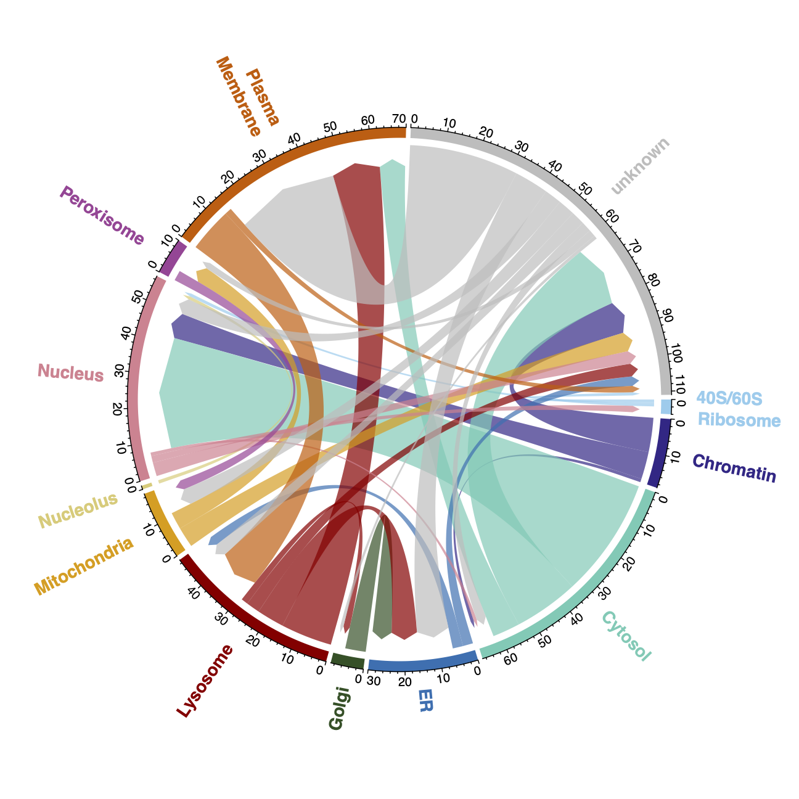
```


#### Alluvial (river) plot of protein translocations across organelles
```{r alluvialplot, message=FALSE, warning=FALSE, eval=TRUE, fig.height=9, fig.cap="Alluvial (river) plot showing the 253 protein translocations (Fig. 4C of Mulvey et al. 2021)"}
# Source code for producing river plots. Not labels optimsied in Inkscape
# https://github.com/CambridgeCentreForProteomics/thp-lopit-2021/blob/main/R/riverplot.R
source("r/riverplot.R")

library(ggalluvial)
thp_alluvial <- riverplot(unst[tl, ], lps[tl, ], 
                          cols = colscheme,
                          labels = TRUE)
thp_alluvial + ggtitle("Translocations following 12h-LPS stimulation in THP-1 cells") 
```
*Note: labels were optimised in Inkscape*

Alluvial (river) plot showing the 253 protein translocations (Figure 4C of [@Mulvey:2021]) proteins which were found to move between organelles at 12h-LPS. The number of proteins that are found to translocate to and from each subcellular compartment is denoted next to the labelled alluvial blocks

### Spatial map of translocating proteins
The t-SNE maps below also show the spatial localisation of translocating proteins. We see that translocation events appear across a number of organelles.
```{r mapTL, fig.width=14, fig.height=7, warning=FALSE, message=FALSE, fig.show='hide'}
source("r/foi.R")
par(mfrow = c(1, 2))

## Unstimulated
prettyTSNE_overlay(tsne_unst, unst, 
                   fcol = "localisation.pred", 
                   main = "Type 1, 2, 3, or 4 translocation events", orgOrder =  oo, 
                   mainCol = paste0(lighten(mycol), 30),
                   outlineCol = paste0(lighten(mycol), 30))
highlightOnPlot(object = tsne_unst, pch = 21, cex = 1.7,
                col = mycol[2],  bg = lighten(lighten("grey")),
                foi = type1, lwd = 2,
                args = list(unst))
highlightOnPlot(object = tsne_unst, pch = 24, cex = 1.7,
                col = darken(mycol[7]), bg = lighten(lighten("#f4f4c8")), 
                foi = type2, lwd = 2, 
                args = list(unst))
highlightOnPlot(object = tsne_unst, pch = 21, cex = 1.7,
                col = darken("purple"), bg = lighten(lighten("#f2a6e3")), 
                foi = type3, lwd = 2,
                args = list(unst))
highlightOnPlot(object = tsne_unst, pch = 24, cex = 1.7,
                col = "#1c1c78", bg = lighten(lighten("#5fa8cc")), 
                foi = type4, lwd = 2,
                args = list(unst))

prettyTSNE_overlay(tsne_lps, lps, fcol = "localisation.pred", 
                   main = "", orgOrder =  oo,
                   mainCol = paste0(lighten(mycol), 30), 
                   outlineCol = paste0(lighten(mycol), 30))
## 12h-LPS 
highlightOnPlot(object = tsne_lps, pch = 21, cex = 1.7,
                col = mycol[2],  bg = lighten(lighten("grey")),
                foi = type1, lwd = 2,
                args = list(lps))
highlightOnPlot(object = tsne_lps, pch = 24, cex = 1.7,
                col = darken(mycol[7]), bg = lighten(lighten("#f4f4c8")), 
                foi = type2, lwd = 2, 
                args = list(lps))
highlightOnPlot(object = tsne_lps, pch = 21, cex = 1.7,
                col = darken("purple"), bg = lighten(lighten("#f2a6e3")), 
                foi = type3, lwd = 2,
                args = list(lps))
highlightOnPlot(object = tsne_lps, pch = 24, cex = 1.7,
                col = "#1c1c78", bg = lighten(lighten("#5fa8cc")), 
                foi = type4, lwd = 2,
                args = list(lps))
plot(NULL, xaxt='n',yaxt='n',bty='n',ylab='',xlab='', xlim=0:1, ylim=0:1)
legend("topleft", legend = c("Type 1: organelle-to-organelle", 
                             "Type 2: unknown-to-organelle", 
                             "Type 3: organelle-to-unknown", 
                             "Type 4: unknown-to-unknown"), 
       col = c(mycol[2], darken(mycol[7]), darken("purple"), "#1c1c78"), 
       pt.bg = c(lighten(lighten("grey")), lighten(lighten("#f4f4c8")), 
                 lighten(lighten("#f2a6e3")), lighten(lighten("#5fa8cc"))),
       bty = "n",
       pch = c(21, 24, 21, 24), pt.cex = 2.2, cex = 1.4)
```


```{r figplottlres, echo=FALSE, fig.cap="T-SNE dimensionality reduction showing the 253 relocalising proteins from the hyperLOPIT experiments and plotted by Type 1,2,3, or 4 relocalisaton events, which are represented by grey circles, yellow triangles, pink circles and blue triangles, respectively.", fig.show='hold',fig.align='center'}
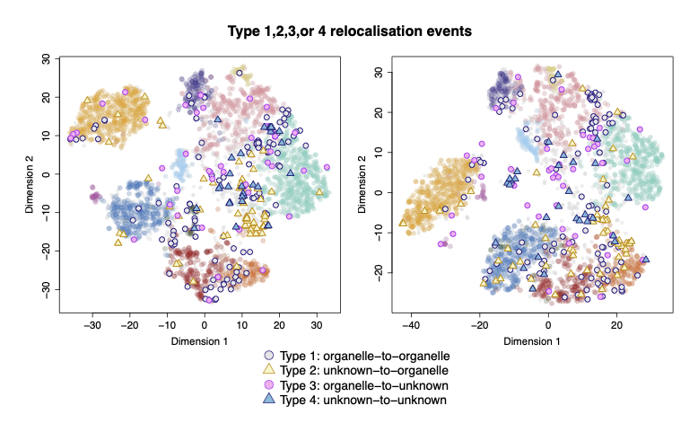
```


### Summary table of translocations between conditions

In the code chunk below we generate a summary table showing the number of translocations between subcellular niches.

```{r summaryofevents, warning=FALSE, message=FALSE}
df <- makedf(unst[tl, ], lps[tl, ],
            fcol1 = "localisation.pred",
            fcol2 = "localisation.pred",
            mrkCol1 = "markers",
            mrkCol2 = "markers")
names(df) <- c("Unstimulated", "LPS", "Number of translocations")
df <- df[!df$`Number of translocations`==0, ]
kable(df, 
      caption = "Translocations between subcellular niches following 12h-LPS stimulation",
      row.names = FALSE)
```

## A scaffold for proteins of interest
Mulvey et al (2021) show that hyperLOPIT provides a means to robustly classify unannotated proteins to distinct organelles and to investigate protein relocalisation events. Supplementary figures 2 - 5 demonstrate how these spatial maps can be used as a scaffold to overlay proteins of interest including:

- changes in protein localisation (figure \@ref(fig:figplottlres))
- protein complexes (figure \@ref(fig:fig7c))
- protein-protein interactions (figure \@ref(fig:fig7c))
- trafficking proteins (figure \@ref(fig:figSI4))
- organelle complements from other studies (figure \@ref(fig:figSI5))

We direct readers to the the manuscipt for full details of the results and a summary of our findings. In the proceeding final sections we have included the code used to generate all figures in the manuscript and supplementary information. Please open an issue in the [THP LOPIT Github repository](https://github.com/CambridgeCentreForProteomics/thp-lopit-2021/issues) to report any bugs or issues.

# Figures from the manuscipt

The following sections show all code used to generate the figures in Mulvey et al (2021). As already requested in section \@ref(start)) please clone or download the [THP LOPIT Github repository](https://github.com/CambridgeCentreForProteomics/thp-lopit-2021/) and navigate to this repo inside RStudio/R so that you can access all code which is sourced in this vignette. 

## Main Figures

### Figure 1
Figure 1 was not produced in R. The schematic workflow was generated in Inkscape.

### Figure 2
Figure 2 shows the time course of quantitative abundance changes in proteins during 24 h of LPS stimulation The volcano plots show the abundance of all 4,292 time-course proteins at 2 h, 4 h, 6 h, 12 h and 24 h of LPS stimulation.  

```{r figure2, warning=FALSE, message=FALSE, fig.height=8, eval=FALSE}
source("r/ggVolcano.R")
## https://github.com/CambridgeCentreForProteomics/thp-lopit-2021/blob/main/R/ggVolcano.R

library("ggplot2")
library("ggrepel")
library("gridExtra")

t_2 <- read.csv("csv/limma_t2.csv", row.names = 1)
t_4 <- read.csv("csv/limma_t4.csv", row.names = 1)
t_6 <- read.csv("csv/limma_t6.csv", row.names = 1)
t_12 <- read.csv("csv/limma_t12.csv", row.names = 1)
t_24 <- read.csv("csv/limma_t24.csv", row.names = 1)

p_2 <- ggVolcano(t_2, "2 hours", N = 20, lfc = 0.6, 
          p = 0.05, addLegend = FALSE,
          text.size = 12, base.text.size = 12, 
          legend.text.size = 12, geom.point.size = 2, 
          label.text.size = 4)
p_4 <- ggVolcano(t_4, "4 hours", N = 20, lfc = 0.6, 
          p = 0.01, addLegend = FALSE,
          text.size = 12, base.text.size = 12, 
          legend.text.size = 12, geom.point.size = 2, 
          label.text.size = 4)
p_6 <- ggVolcano(t_6, "6 hours", N = 20, lfc = 0.6, 
          p = 0.01, addLegend = FALSE,
          text.size = 12, base.text.size = 12, 
          legend.text.size = 12, geom.point.size = 2, 
          label.text.size = 4)
p_12 <- ggVolcano(t_12, "12 hours", N = 20, lfc = 0.6, 
          p = 0.01, addLegend = FALSE,
          text.size = 12, base.text.size = 12, 
          legend.text.size = 12, geom.point.size = 2, 
          label.text.size = 4)
p_24 <- ggVolcano(t_24, "24 hours", N = 20, lfc = 0.6, 
          p = 0.01, addLegend = FALSE,
          text.size = 12, base.text.size = 12, 
          legend.text.size = 12, geom.point.size = 2, 
          label.text.size = 4)
# grid.arrange(p_2 p_4, p_6, p_12, p_24, nrow = 3, ncol = 2)
p_2 + ggtitle("Volcano at 2h-LPS")
p_4 + ggtitle("Volcano at 4h-LPS")
p_6 + ggtitle("Volcano at 6h-LPS")
p_12 + ggtitle("Volcano at 12h-LPS")
p_24 + ggtitle("Volcano at 24h-LPS")
```

```{r fig4volrun, echo=FALSE, fig.show='hold',fig.align='center', fig.width=5, out.width=" 50%"}

```

```{r fig4volrun2, echo=FALSE, fig.show='hold',fig.align='center', out.width=" 50%"}

```

```{r fig4volrun3, echo=FALSE, fig.show='hold',fig.align='center', out.width=" 50%"}

```

```{r fig4volrun4, echo=FALSE, fig.show='hold',fig.align='center', out.width=" 50%", }

```

```{r fig4vol1run5, echo=FALSE, fig.show='hold',fig.align='center', out.width=" 50%"}

```


Quantitative values for intracellular proteomics abundance (red) as well as extracellular, cytokine secretion levels as measured by ELISA (blue) for IL1B and CXCL10 expression.

```{r figure2_part2, warning=FALSE, message=FALSE, fig.height=4, fig.width=6, eval=TRUE}
source("r/plotLineGraph.R")
# https://github.com/CambridgeCentreForProteomics/thp-lopit-2021/blob/main/R/plotLineGraph.R

library("pRoloc")
library("pRolocdata")
library("ggplot2")
library("tidyr")
library("Rmisc")
library("gridExtra")

## read in elisa data
elisa_il1b_wide <- read.csv("csv/elisa_il1b.csv")
elise_cxcl_wide <- read.csv("csv/elisa_cscl10.csv")

## convert to long tidy format for ggplot
elisa_il1b_long <- gather(elisa_il1b_wide, replicate, measurement, X1:X6, factor_key = TRUE)
elisa_cxcl10_long <- gather(elise_cxcl_wide, replicate, measurement, X1:X6, factor_key = TRUE)

p <- 
  plotLineGraph(elisa_il1b_wide, "median", 
                linecol = "#1B83E9", themeSize = 10) +
  ggtitle("Elisa data: IL-1B") + 
  theme(plot.title = element_text(hjust = 0.5))

q <- plotLineGraph(elise_cxcl_wide, "median", 
                   linecol = "#1B83E9", themeSize = 10) +
  ggtitle("Elisa data: CXCL10") + 
  theme(plot.title = element_text(hjust = 0.5))

## get quantitation data
IL1B <- "P01584"
CXCL10 <- "P02778"

## Load protein data
data("lpsTimecourse_rep1_mulvey2021")
data("lpsTimecourse_rep2_mulvey2021")
data("lpsTimecourse_rep3_mulvey2021")
x1 <- lpsTimecourse_rep1_mulvey2021
x2 <- lpsTimecourse_rep2_mulvey2021
x3 <- lpsTimecourse_rep3_mulvey2021

## convert to long tidy format for ggplot
lopit_il1b_wide <- t(rbind(exprs(x1[IL1B,]), exprs(x2[IL1B,]),exprs(x3[IL1B,])))
lopit_cxcl10_wide <- t(rbind(exprs(x1[CXCL10,]), exprs(x2[CXCL10,]),exprs(x3[CXCL10,])))
lopit_il1b_wide <- data.frame(cbind(Time = c(0, 2, 4, 6, 12, 24), lopit_il1b_wide))
lopit_cxcl10_wide <- data.frame(cbind(Time = c(0, 2, 4, 6, 12, 24), lopit_cxcl10_wide))
colnames(lopit_cxcl10_wide) <- colnames(lopit_il1b_wide) <- c("Time", "X1", "X2", "X6")
lopit_il1b_long <- gather(lopit_il1b_wide, replicate, measurement, X1:X6, factor_key = TRUE)
lopit_cxcl10_long <- gather(lopit_cxcl10_wide, replicate, measurement, X1:X6, factor_key = TRUE)

## plot quantitation profiles
r = plotLineGraph(lopit_il1b_wide, 
                  linecol = "#C50000", 
                  .ylab = "Abundance\n",
                  themeSize = 10) +
  ylim(c(1.5, 7)) +
  ggtitle("Shotgun: IL-1B") + 
  theme(plot.title = element_text(hjust = 0.5))
s = plotLineGraph(lopit_cxcl10_wide, 
                  linecol = "#C50000", 
                  .ylab = "Abundance\n",
                  themeSize = 10) +
  ylim(c(1.5, 7)) +
  ggtitle("Shotgun: CXCL10") + 
  theme(plot.title = element_text(hjust = 0.5))

grid.arrange(p, q, r, s, ncol = 2, nrow = 2)
```

Heatmap of the protein abundance for the 72 proteins significantly changed in abundance by 12h-LPS during the time course analysis.

```{r heatmap_12h, fig.width=5, fig.height=7, warning=FALSE, message=FALSE, eval=TRUE}
library("gplots")
library("plotrix")
library("scico")

## restructure the gather the data for heatmap
dat <- read.csv("csv/timecourse_t12.tsv", row.names = 1, sep = "\t")
rownames(dat) <- NULL
dat <- dat %>% 
  filter(Significance != "Not significant") %>% 
  tibble::column_to_rownames("GN") %>% 
  select(1:18) %>% as.matrix()
calcMeds <- function(df, .grepName) {
  ind <- grep(.grepName, colnames(df))
  .df <- df[, ind]
  .mean <- rowMedians(.df)
  return(.mean)
}
t0 <- calcMeds(dat, "X0.hr")
t2 <- calcMeds(dat, "X2.hr")
t4 <- calcMeds(dat, "X4.hr")
t6 <- calcMeds(dat, "X6.hr")
t12 <- calcMeds(dat, "X12.hr")
t24 <- calcMeds(dat, "X24.hr")
dat_meds <- cbind(t0, t2, t4, t6, t12, t24)
rownames(dat_meds) <- rownames(dat)
colnames(dat_meds) <- c(0, 2, 4, 6, 12, 24)

## set colour palette - use the scico package
my_palette <- scico(72, palette = "berlin")

## Plot heatmap
heatmap.2(dat_meds, density.info = "none", trace = "none", 
          col = my_palette, Colv = NA, dendrogram = "row", 
          key=TRUE, cexCol = 1, cexRow = 1, margin = c(6,8), 
          lhei=c(.8,3.5), lwid=c(0.2,0.8), offsetRow=0.3)
```


### Figure 3
Bayesian temporal clustering of the LPS time series demonstrates clusters of co-regulated proteins and GO analysis. 

```{r mdiclustering2, message=FALSE, warning=FALSE, fig.height=8, fig.width=7}
library("RColorBrewer")
source("r/plotRibbons.R")
# https://github.com/CambridgeCentreForProteomics/thp-lopit-2021/blob/main/R/plotRibbons.R

## Read in MDI clustering results
mdi_rep1 <- read.csv("csv/mdi_clustering_lpsrep1.csv")
mdi_rep2 <- read.csv("csv/mdi_clustering_lpsrep2.csv")
mdi_rep3 <- read.csv("csv/mdi_clustering_lpsrep3.csv")
mdi <- read.csv("csv/mdi_clusters_output.csv")

# get median normalised intensity
dat_mat <- list(data.matrix(mdi_rep1[, -1]), 
                data.matrix(mdi_rep2[, -1]), 
                data.matrix(mdi_rep3[, -1]))
av_mat <- apply(simplify2array(dat_mat), c(1,2), median)
rownames(av_mat) <- mdi_rep1[,1]
colnames(av_mat) <- c(0, 2, 4, 6, 12, 24)

## plot clusters of interest
ids <- c(1:6, 9:11, 13, 14, 17)
mdi_profs <- sapply(ids, function(z) 
  av_mat[mdi$Protein.Accession[which(mdi$Cluster.Number == z)], ])
names(mdi_profs) <- paste0("cluster", ids)

## pick a good palette
ribbonCol <- c(brewer.pal(n = 9, "Oranges")[-c(1:3)],
           brewer.pal(n = 9, "GnBu")[-c(1:3)])

par(mfrow = c(3,2), mar = c(6, 5, 3, 3))
for (i in 1:6) {
  ribbonPlot(mdi_profs[[i]], col = ribbonCol[i], c(0.05, .95), 
             main = paste("Cluster", ids[i]), cex.main = 1, size = 1)
}
```
```{r mdisecond, message=FALSE, warning=FALSE, fig.height=8, fig.width=7}
par(mfrow = c(3,2), mar = c(6, 5, 3, 3))
for (i in 7:12) {
  ribbonPlot(mdi_profs[[i]], col = ribbonCol[i], c(0.05, .95), 
             main = paste("Cluster", ids[i]), cex.main = 1, size = 1)
}
```

```{r addGoAnnotationForMDIsi1, fig.width=10}
source("r/GObarplot.R")
# https://github.com/CambridgeCentreForProteomics/thp-lopit-2021/blob/main/R/GObarplot.R

GObarplots(filename = "csv/david_data_gobp.csv", cols = ribbonCol, N = 30) +
  ggtitle("GO Biological Process Terms")
```

```{r addGoAnnotationForMDIsi2, fig.width=10}
GObarplots(filename = "csv/david_data_gocc.csv", cols = ribbonCol) +
  ggtitle("GO Cellular Component Terms")
```

```{r addGoAnnotationForMDIsi3, fig.width=10}
GObarplots(filename = "csv/david_data_gomf.csv", cols = ribbonCol, N = 15) +
  ggtitle("GO Molecular Function Terms")
```

### Figure 4 
Assignment of proteins to subcellular organelles using TAGM-MCMC semi-supervised classifier for spatial proteomics data. 

```{r plotit, fig.width=10, fig.height=15, warning=FALSE, message=FALSE}
source("r/prettymap.R")
# https://github.com/CambridgeCentreForProteomics/thp-lopit-2021/blob/main/R/prettymap.R

library("pRoloc")
library("pRolocdata")

## set organelle colours
mycol <- c("#88CCEE", "#332288", "#53CAB7", "#0170b4", "#204f20", "#990000",
           "#E69F00", "#DDCC77", "#E18493", "#AA4499", "#D55E00", "grey")
setStockcol(mycol)
setUnknownpch(16)

## get data
data("thpLOPIT_unstimulated_mulvey2021")
data("thpLOPIT_lps_mulvey2021")
data <- commonFeatureNames(thpLOPIT_unstimulated_mulvey2021, thpLOPIT_lps_mulvey2021)
unst <- data[[1]]
lps <- data[[2]]

## Generate the t-SNE coords (Figure 4 of [1])
set.seed(399)
tsne_unst <- plot2D(unst, method = "t-SNE", plot = FALSE)
set.seed(399)
tsne_lps <- plot2D(lps, method = "t-SNE", plot = FALSE)


## plot the data as t-SNE maps
par(mfrow = c(3, 2))        
oo = c(1:3, 10, 5, 4, 6:7, 9, 8, 11) # specify plot order

## Plot marker proteins
prettyTSNE(tsne_unst, unst, fcol = "markers", 
          main = "Subcellular markers\nunstimulated THP1-cells",
          orgOrder = oo, mainCol = mycol, outlineCol = darken(mycol))
prettyTSNE(tsne_lps, lps, fcol = "markers",
          main = "Subcellular markers\n12h-LPS stimulated THP1-cells",
          orgOrder = oo, mainCol = mycol, outlineCol = darken(mycol))

## Plot results from classification by TAGM-MCMC
prettyTSNE(tsne_unst, unst, fcol = "localisation.pred", 
          main = "Classification by TAGM-MCMC\nunstimulated THP1-cells",
          orgOrder = oo, mainCol = mycol, outlineCol = darken(mycol))
prettyTSNE(tsne_lps, lps, fcol = "localisation.pred",
          main = "Classification by TAGM-MCMC\n12h-LPS stimulated THP1-cells",
          orgOrder = oo, mainCol = mycol, outlineCol = darken(mycol))

## add a legend
myleg <- c(getMarkerClasses(unst), "Unknown")
plot(NULL, xaxt='n',yaxt='n',bty='n',ylab='',xlab='', xlim=0:1, ylim=0:1)
legend("topleft", legend = myleg, col = mycol, bty = "n",
       pch = 19, cex = 1, pt.cex = 1.6, ncol = 2)
```

**Alluvial plot of translocating proteins**

```{r alluvialplot2, message=FALSE, warning=FALSE, fig.height=8, fig.width=5}
source("r/riverplot.R")
# https://github.com/CambridgeCentreForProteomics/thp-lopit-2021/blob/main/R/riverplot.R

library("ggalluvial")
library("pRoloc")
library("pRolocdata")

## set organelle colours
mycol <- c("#88CCEE", "#332288", "#53CAB7", "#0170b4", "#204f20", "#990000",
           "#E69F00", "#DDCC77", "#E18493", "#AA4499", "#D55E00", "grey")
setStockcol(mycol)
setUnknownpch(16)

## get data
data("thpLOPIT_unstimulated_mulvey2021")
data("thpLOPIT_lps_mulvey2021")
data <- commonFeatureNames(thpLOPIT_unstimulated_mulvey2021, thpLOPIT_lps_mulvey2021)
unst <- data[[1]]
lps <- data[[2]]
fData(unst)$translocations <- fData(lps)$translocations <- NA
fData(unst)$translocations[which(fData(unst)$type1_translocation)] <- 
  fData(lps)$translocations[which(fData(lps)$type1_translocation)] <- "type1"
fData(unst)$translocations[which(fData(unst)$type2_translocation)] <- 
  fData(lps)$translocations[which(fData(lps)$type2_translocation)] <- "type2"
fData(unst)$translocations[which(fData(unst)$type3_translocation)] <- 
  fData(lps)$translocations[which(fData(lps)$type3_translocation)] <- "type3"
fData(unst)$translocations[which(fData(unst)$type4_translocation)] <- 
  fData(lps)$translocations[which(fData(lps)$type4_translocation)] <- "type4"

## generate my colour scheme
circos_cols <- c(getStockcol(), "grey")
orgs <- c(union(getMarkerClasses(unst), getMarkerClasses(lps)), "unknown")
colscheme <- setNames(circos_cols, orgs)  # check levels consistent 

## get indices of translocating proteins
tl <- !is.na(fData(unst)$translocations)

thp_alluvial <- riverplot(unst[tl, ], lps[tl, ], 
                          cols = colscheme,
                          labels = TRUE)
thp_alluvial + ggtitle("Translocations following 12h-LPS stimulation in THP-1 cells") 
```

### Figure 5

Relocalisation of RHO-GTPase trafficking molecules to the PM. Relocalisation of RHO-GTPase family members and accessory proteins were found in response to LPS, including CDC42, RAC1, RHOA, RHOC, SRGAP2, ARHGAP18, APBB1IP. 

```{r fig5, fig.width=10, fig.height=10, warning=FALSE, message=FALSE}
source("r/prettymap.R")
# https://github.com/CambridgeCentreForProteomics/thp-lopit-2021/blob/main/R/prettymap.R

library("pRoloc")
library("pRolocdata")

## set organelle colours
mycol <- c("#88CCEE", "#332288", "#53CAB7", "#0170b4", "#204f20", "#990000",
           "#E69F00", "#DDCC77", "#E18493", "#AA4499", "#D55E00", "grey")
setStockcol(mycol)
setUnknownpch(16)

## get data
data("thpLOPIT_unstimulated_mulvey2021")
data("thpLOPIT_lps_mulvey2021")
data <- commonFeatureNames(thpLOPIT_unstimulated_mulvey2021, thpLOPIT_lps_mulvey2021)
unst <- data[[1]]
lps <- data[[2]]

## Generate the t-SNE coords (Figure 4 of [1])
set.seed(399)
tsne_unst <- plot2D(unst, method = "t-SNE", plot = FALSE)
set.seed(399)
tsne_lps <- plot2D(lps, method = "t-SNE", plot = FALSE)

## ======= highlighting interesting proteins ==========
CDC42 <- "P60953"       # cytosol to PM
APBB1IP <- "Q7Z5R6"     # unknown to PM
SRGAP2C <- "O75044"     # unknown to PM
ARHGAP18 <- "Q8N392"    # unknown to PM
RHOA <- "P61586"        # unknown to PM
RAC1 <- "P63000-2"      # unknown to PM
RHOC <- "P08134"        # unknown to unknown
set1 <- c(APBB1IP, SRGAP2C, ARHGAP18, RHOA, RAC1, RHOC)
names(set1) <- c("APBB1IP", "SRGAP2C", "ARHGAP18", "RHOA", "RAC1", "RHOC")

## plot the spatial map with proteins highlighted

par(mfrow = c(2, 2))
# pdf("figures/figure5_unstim.pdf", width=7.5, height=8)
prettyTSNE_overlay(tsne_unst, unst, fcol = "localisation.pred", 
                   main = "Unstimulated THP-1 cells", orgOrder =  oo,
                   mainCol = paste0(darken(mycol), 20), 
                   outlineCol = paste0(lighten(mycol), 20))
points(tsne_unst[RHOC, , drop = FALSE], pch = 24, col = "black", cex = 2, bg = "#D7DADE")
points(tsne_unst[set1[-6], , drop = FALSE], pch = 24, col = "black", cex = 2, bg = "#D7DADE")
points(tsne_unst[CDC42, , drop = FALSE], pch = 24, col = "black", cex = 2, bg = "red3")
text(x = 24, y = -14, labels = "RHOC", font = 2, cex = 1.2)
text(x = 7, y = -16, labels = "RHOA", font = 2, cex = 1.2)
text(x = 24, y = -11, labels = "APBB1IP", font = 2, cex = 1.2)
text(x = 22, y = -17, labels = "RAC1", font = 2, cex = 1.2)
text(x = 7, y = -13, labels = "SRGAP2C", font = 2, cex = 1.2)
text(x = 8, y = -10, labels = "ARHGAP18", font = 2, cex = 1.2)
text(x = 18, y = -7, labels = "CDC42", font = 2, col = "red3", cex = 1.2)
# dev.off()

# pdf("figures/figure5_lps.pdf", width=7.5, height=8)
prettyTSNE_overlay(tsne_lps, lps, fcol = "localisation.pred", 
                   main = "12h-LPS stimulated THP-1 cells", orgOrder =  oo,
                   mainCol = paste0(lighten(mycol), 20),
                   outlineCol = paste0(lighten(mycol), 20))
points(tsne_lps[RHOC, , drop = FALSE], pch = 24, col = "black", cex = 2, bg = "#D7DADE")
points(tsne_lps[set1[-6], , drop = FALSE], pch = 24, col = "black", cex = 2, bg = "#D7DADE")
points(tsne_lps[CDC42, , drop = FALSE], pch = 24, col = "black", cex = 2, bg = "red3")
text(x = 12, y = -11.5, labels = "RHOC", font = 2, cex = 1.2)
text(x = 30, y = -16, labels = "RHOA", font = 2, cex = 1.2)
text(x = 30, y = -8, labels = "APBB1IP", font = 2, cex = 1.2)
text(x = 14, y = -21, labels = "RAC1", font = 2, cex = 1.2)
text(x = 11, y = -16.5, labels = "SRGAP2C", font = 2, cex = 1.2)
text(x = 29, y = -10, labels = "ARHGAP18", font = 2, cex = 1.2)
text(x = 28, y = -23, labels = "CDC42", font = 2, col = "red3", cex = 1.2)
# dev.off()

## add a legend
myleg <- c(getMarkerClasses(unst), "Unknown")
plot(NULL, xaxt='n',yaxt='n',bty='n',ylab='',xlab='', xlim=0:1, ylim=0:1)
legend("topleft", legend = myleg, col = mycol, bty = "n",
       pch = 19, cex = 1, pt.cex = 1.6, ncol = 2)
```


### Figure 6 
Proteins can exhibit both spatial and temporal regulation by LPS. 15 proteins were altered in abundance during the time-course of LPS stimulation and also translocated to different subcellular regions. 

```{r fig6, fig.width=10, fig.height=10, warning=FALSE, message=FALSE}
source("r/prettymap.R")
# https://github.com/CambridgeCentreForProteomics/thp-lopit-2021/blob/main/R/prettymap.R

library("pRoloc")
library("pRolocdata")

## set organelle colours
mycol <- c("#88CCEE", "#332288", "#53CAB7", "#0170b4", "#204f20", "#990000",
           "#E69F00", "#DDCC77", "#E18493", "#AA4499", "#D55E00", "grey")
setStockcol(mycol)
setUnknownpch(16)

## get data
data("thpLOPIT_unstimulated_mulvey2021")
data("thpLOPIT_lps_mulvey2021")
data <- commonFeatureNames(thpLOPIT_unstimulated_mulvey2021, thpLOPIT_lps_mulvey2021)
unst <- data[[1]]
lps <- data[[2]]

## Generate the t-SNE coords (Figure 4 of [1])
set.seed(399)
tsne_unst <- plot2D(unst, method = "t-SNE", plot = FALSE)
set.seed(399)
tsne_lps <- plot2D(lps, method = "t-SNE", plot = FALSE)

## ======= highlighting interesting proteins ==========
# CHCHD2P9 -> Q9Y6H1 -> 3279
# CKAP2 -> Q8WWK9-5 -> 2265
# TCEB3 -> Q14241 -> 1635
# SRP9 -> P49458 -> 1090
# MVP -> Q14764 -> 1659
# EIF4A1 -> P60842 -> 1242
# IFI35 -> P80217-2 -> 1358
# ACSL4 -> O60488 -> 223
# SPG21 -> Q9NZD8 -> 2974
# PLEK -> P08567 -> 531
# PALM -> O75781 -> 311
# DAB2 -> P98082 -> 1383
# CALCOCO2 -> Q13137-4 -> 1540

# CLEC11A -> Q9Y240 -> 3148
# SQSTM1 -> Q13501 -> 1580

## plot spatial map with points highlighted
par(mfrow = c(2, 2))

# pdf("figures/figure6_unstim.pdf", width=7.5, height=8)
## subset 15 points by label position top (t), bottom (b), left (l), right (r)
t <- c(3279, 2265, 1090, 1659, 1358, 223, 531)
b <- c(1635, 1242, 311, 2974)
l <- c(1383)
r <- c(1540)
set1 <- c(t, b, l, r)
set1 <- setdiff(set1, c(3148, 1580))
set2 <- c(3148, 1580)
prettyTSNE_overlay(tsne_unst, unst, fcol = "localisation.pred", 
                   main = "Unstimulated THP-1 cells", orgOrder =  oo, 
                   mainCol = paste0(lighten(mycol), 10), 
                   outlineCol = paste0(lighten(mycol), 10))
points(tsne_unst[set1, ], pch = 24, col = "black", cex = 1.4, bg = "#D7DADE")
points(tsne_unst[set2, ], pch = 24, col = "black", cex = 1.4, bg = "red3")
text(tsne_unst[b, 1], tsne_unst[b, 2], labels = fData(unst)[b, "GN"], pos = 1, font = 2)
text(tsne_unst[l, 1], tsne_unst[l, 2], labels = fData(unst)[l, "GN"], pos = 2, font = 2)
text(tsne_unst[t, 1], tsne_unst[t, 2], labels = fData(unst)[t, "GN"], pos = 3, font = 2)
text(tsne_unst[r, 1], tsne_unst[r, 2], labels = fData(unst)[r, "GN"], pos = 4, font = 2)
text(tsne_unst[3148, 1], tsne_unst[3148, 2], col = "red3", font = 2,
     labels = fData(unst)[3148, "GN"], pos = 2)
text(tsne_unst[1580, 1], tsne_unst[1580, 2], col = "red3", font = 2,
     labels = fData(unst)[1580, "GN"], pos = 1)
# dev.off()

# pdf("figures/figure6_lps.pdf", width=7.5, height=8)
t <- c(2265, 1242, 3279, 223)
b <- c(1090, 1659, 1358, 531, 1635, 311)
l <- c(1540, 2974)
r <- c(1383)
set1 <- c(t, b, l, r)
set1 <- setdiff(set1, c(3148, 1580))
set2 <- c(3148, 1580)
prettyTSNE_overlay(tsne_lps, lps, fcol = "localisation.pred", 
                   main = "LPS stimulated THP-1 cells", orgOrder =  oo, 
                   mainCol = paste0(lighten(mycol), 10), 
                   outlineCol = paste0(lighten(mycol), 10))
points(tsne_lps[set1, ], pch = 24, col = "black", cex = 1.4, bg = "#D7DADE")
points(tsne_lps[set2, ], pch = 24, col = "black", cex = 1.4, bg = "red3")
text(tsne_lps[b, 1], tsne_lps[b, 2], labels = fData(lps)[b, "GN"], pos = 1, font = 2)
text(tsne_lps[l, 1], tsne_lps[l, 2], labels = fData(lps)[l, "GN"], pos = 2, font = 2)
text(tsne_lps[t, 1], tsne_lps[t, 2], labels = fData(lps)[t, "GN"], pos = 3, font = 2)
text(tsne_lps[r, 1], tsne_lps[r, 2], labels = fData(lps)[r, "GN"], pos = 4, font = 2)
text(tsne_lps[3148, 1], tsne_lps[3148, 2], col = "red3", font = 2,
     labels = fData(lps)[3148, "GN"], pos = 1)
text(tsne_lps[1580, 1], tsne_lps[1580, 2], col = "red3", font = 2,
     labels = fData(lps)[1580, "GN"], pos = 3)
# dev.off()

## add a legend
myleg <- c(getMarkerClasses(unst), "Unknown")
plot(NULL, xaxt='n',yaxt='n',bty='n',ylab='',xlab='', xlim=0:1, ylim=0:1)
legend("topleft", legend = myleg, col = mycol, bty = "n",
       pch = 19, cex = 1, pt.cex = 1.6, ncol = 2)
```


Protein profiles for Sequestosome (Q13501) and CLEC11A (Q9Y240) proteins

```{r fig6profs, warning=FALSE, message=FALSE, fig.height=2, fig.width=6}
source("r/plotLineGraph.R")
# https://github.com/CambridgeCentreForProteomics/thp-lopit-2021/blob/main/R/plotLineGraph.R

library("pRoloc")
library("pRolocdata")
data("lpsTimecourse_rep1_mulvey2021")
data("lpsTimecourse_rep2_mulvey2021")
data("lpsTimecourse_rep3_mulvey2021")
x1 <- lpsTimecourse_rep1_mulvey2021
x2 <- lpsTimecourse_rep2_mulvey2021
x3 <- lpsTimecourse_rep3_mulvey2021

lopit_clec_wide <- t(rbind(exprs(x1["Q9Y240",]), exprs(x2["Q9Y240",]),exprs(x3["Q9Y240",])))
lopit_clec_wide <- data.frame(cbind(Time = c(0, 2, 4, 6, 12, 24), lopit_clec_wide))
colnames(lopit_clec_wide)<- c("Time", "X1", "X2", "X6")
lopit_sequ_wide <- t(rbind(exprs(x1["Q13501",]), exprs(x2["Q13501",]),exprs(x3["Q13501",])))
lopit_sequ_wide <- data.frame(cbind(Time = c(0, 2, 4, 6, 12, 24), lopit_sequ_wide))
colnames(lopit_sequ_wide)<- c("Time", "X1", "X2", "X6")

p = plotLineGraph(lopit_clec_wide, 
                  linecol = "#1B83E9", 
                  .ylab = "Abundance\n",
                  fun = "median", 
                  themeSize = 10) + 
  ggtitle("CLECL11A") + 
  theme(plot.title = element_text(hjust = 0.5))

q = plotLineGraph(lopit_sequ_wide, 
                  linecol = "#C50000", 
                  .ylab = "Abundance\n",
                  fun = "median",
                  themeSize = 10) + 
  ggtitle("Sequestosome") +
  theme(plot.title = element_text(hjust = 0.5))

grid.arrange(q, p, ncol = 2)
```

A heatmap of the relative quantitative abundance values for these 15 proteins during the time-course experiment. 

```{r heatmapfig6, fig.width=5, fig.height=5, warning=FALSE, message=FALSE}
library(pRolocdata)
library(pRoloc)
library(gplots)

prots_15 <- c("CLEC11A", "SQSTM1", "PLEK", "CHCHD2", "CKAP2", 
              "IFI35", "PALM", "SPG21", "CALCOCO2", "MVP", 
              "TCEB3", "SRP9", "EIF4A1", "DAB2", "ACSL4")

data("lpsTimecourse_mulvey2021")
ind <- match(prots_15, fData(lpsTimecourse_mulvey2021)$GN)
dat <- exprs(lpsTimecourse_mulvey2021)[ind, ]
rownames(dat) <- prots_15 

calcMeds <- function(df, .grepName) {
  ind <- grep(.grepName, colnames(df))
  .df <- df[, ind]
  .mean <- rowMedians(.df)
  return(.mean)
}

t0 <- calcMeds(dat, "X0.hr")
t2 <- calcMeds(dat, "X2.hr")
t4 <- calcMeds(dat, "X4.hr")
t6 <- calcMeds(dat, "X6.hr")
t12 <- calcMeds(dat, "X12.hr")
t24 <- calcMeds(dat, "X24.hr")
dat_meds <- cbind(t0, t2, t4, t6, t12, t24)
rownames(dat_meds) <- rownames(dat)
colnames(dat_meds) <- c(0, 2, 4, 6, 12, 24)

my_palette <- colorRampPalette(c("#1B83E9", "grey", "#C50000"))(n = 10)

heatmap.2(dat_meds, density.info = "none", trace = "none", 
          col = my_palette, Colv = NA, dendrogram = "row", 
          key=TRUE, cexCol = 1, cexRow = 1, margin = c(6,8), 
          lwid=c(.4,1), lhei = c(.18, .6), offsetRow=0.3)
```

### Figure 7 
The hyperLOPIT dataset can be used as a scaffold to overlay additional layers of spatial information. 

```{r fig7, warning=FALSE, message=FALSE, fig.width=12, fig.height=6}
source("r/prettymap.R")
# https://github.com/CambridgeCentreForProteomics/thp-lopit-2021/blob/main/R/prettymap.R

library(pRoloc)
library(pRolocdata)

## set organelle colours
mycol <- c("#88CCEE", "#332288", "#53CAB7", "#0170b4", "#204f20", "#990000",
           "#E69F00", "#DDCC77", "#E18493", "#AA4499", "#D55E00", "grey")
setStockcol(mycol)
setUnknownpch(16)

## get data
data("thpLOPIT_unstimulated_mulvey2021")
data("thpLOPIT_lps_mulvey2021")
data <- commonFeatureNames(thpLOPIT_unstimulated_mulvey2021, thpLOPIT_lps_mulvey2021)
unst <- data[[1]]
lps <- data[[2]]

## Generate the t-SNE coords (Figure 4 of [1])
set.seed(399)
tsne_unst <- plot2D(unst, method = "t-SNE", plot = FALSE)
set.seed(399)
tsne_lps <- plot2D(lps, method = "t-SNE", plot = FALSE)

## Overlay temporal clusters
cluster9 <- c("Q6WKZ4", "P10153", "O96028", "Q92766-2", "P16401", "P14635", "Q9Y2X7", "Q99661",
              "O75475", "P49715-3", "Q8N2G8", "Q9NQS7", "P46013", "O60341", "Q02252", "Q96AQ6", "Q6PL18",
              "P0C0S5", "P45973", "Q96CM8-2", "Q9BSJ8-2", "Q9BW19", "P29372", "Q9P2K3-3", "Q12912", "A0FGR8-2",
              "Q14687", "Q96T88-2", "Q14683", "Q13112", "P49454", "Q14005", "O00257", "P11388-4", "Q96JY6-5",
              "P40937", "Q9ULW0-2", "Q07065", "O95490-6", "O95067", "Q9BXS6", "Q96BZ4", "Q96C36", "O60256")


cluster11 <- c("P13073", "P42126", "P23219-5", "Q92896-2", "P50440-2", "P54819", "Q9BX68", "P35659", "P55809",
               "Q92922", "Q12874", "P09622", "Q96KQ7-2", "P51572-2", "Q15459", "P42765", "P14866", "P10809", "P56181-2",
               "Q14978-2", "P12270", "Q86UP2", "P11310-2", "P53597", "P04181", "Q9NX40", "P07954", "P13804", "Q13435", "Q9Y3B7",
               "O75251", "P30042", "P56385", "Q99729-3")

cluster17 <- c("Q9Y224", "P35637", "P09429", "P54577", "Q9UBQ7", "P27695", "P06454", "O43707", "P11586", "Q9UNN5",
               "Q9UBE0", "P18206", "P51858", "P59998-3", "P50502", "P48595", "Q9BQS8-4", "P23921", "P06733", "P09960",
               "P50452", "P04424", "Q02790", "P06737", "O14618", "P06396-2", "P49588", "Q9HB71", "P15121", "Q9Y5Z4", 
               "Q8N806", "Q6XQN6", "Q9HC38-2", "P28072", "Q14157-5", "P40925-3", "P80723", "Q9BTT0-3", "P00492", "P21399",
               "P00918", "P10124", "Q9Y617", "P32119", "Q9H7C9", "Q9Y5Y6", "P07311", "Q53EL6", "P07900-2", "P09211", "P39019",
               "Q9H4A4", "O75131", "P04406", "P19338", "O60701", "P30419", "P06744", "Q99598", "Q9NQP4", "O75874", "P35573",
               "Q9NZL9", "P31948-2", "Q13442", "P12814", "O75608", "O95834-3", "Q9NQX3-2", "P43487", "P40121", "P52888", "Q99497", 
               "Q96BW5", "P61923-4", "Q13630")
par(mfrow = c(1, 2))
prettyTSNE_overlay(tsne_lps, lps, fcol = "localisation.pred", 
                   main = "12h-LPS stimulated THP-1 cells", orgOrder =  oo, 
                   mainCol = paste0(darken(mycol), 20), 
                   outlineCol = paste0(darken(mycol), 20))

highlightOnPlot(object = tsne_lps, pch = 21, cex = 1.7,
                col = mycol[2],  bg = lighten(lighten(mycol[2])),
                foi = cluster9, lwd = 2,
                args = list(lps))
highlightOnPlot(object = tsne_lps, pch = 21, cex = 1.7,
                col = darken(mycol[7]), bg = lighten(lighten(mycol[7])), 
                foi = cluster11, lwd = 2,
                args = list(lps))
highlightOnPlot(object = tsne_lps, pch = 21, cex = 1.7,
                col = darken(mycol[3]), bg = lighten(lighten(mycol[3])), 
                foi = cluster17, lwd = 2,
                args = list(lps))

## add a legend
myleg <- c(getMarkerClasses(unst), "Unknown", c("Cluster 9", "Cluster 11", "Cluster 17"))
plot(NULL, xaxt='n',yaxt='n',bty='n',ylab='',xlab='', xlim=0:1, ylim=0:1)
legend("topleft", legend = myleg, 
       col = c(paste0(mycol[1:11], 60), "#D3D3D3", mycol[2], darken(mycol[7]), darken(mycol[3])),
       bty = "n",
       pch = 19, cex = 1, pt.cex = 1.6, ncol = 1)
```


```{r fig7ribbons, warning=FALSE, fig.width=12, fig.height=4}
library("RColorBrewer")
source("r/plotRibbons.R")
# https://github.com/CambridgeCentreForProteomics/thp-lopit-2021/blob/main/R/plotRibbons.R

## Read in MDI clustering results
mdi_rep1 <- read.csv("csv/mdi_clustering_lpsrep1.csv")
mdi_rep2 <- read.csv("csv/mdi_clustering_lpsrep2.csv")
mdi_rep3 <- read.csv("csv/mdi_clustering_lpsrep3.csv")
mdi <- read.csv("csv/mdi_clusters_output.csv")

# get median normalised intensity
dat_mat <- list(data.matrix(mdi_rep1[, -1]), 
                data.matrix(mdi_rep2[, -1]), 
                data.matrix(mdi_rep3[, -1]))
av_mat <- apply(simplify2array(dat_mat), c(1,2), median)
rownames(av_mat) <- mdi_rep1[,1]
colnames(av_mat) <- c(0, 2, 4, 6, 12, 24)

## plot clusters of interest
ids <- c(9, 11, 17)
mdi_profs <- sapply(ids, function(z) 
  av_mat[mdi$Protein.Accession[which(mdi$Cluster.Number == z)], ])
names(mdi_profs) <- paste0("cluster", ids)


## cluster 9, 11 and 17 profiles
par(mfrow = c(1, 3))
ribbonPlot(mdi_profs$cluster9, col = mycol[2], c(0.05, .95), 
            main = "Cluster 9")
ribbonPlot(mdi_profs$cluster11, col = mycol[7], c(0.05, .95), 
            main = "Cluster 11")
ribbonPlot(mdi_profs$cluster17, col = mycol[3], c(0.05, .95), 
            main = "Cluster 17")
```


```{r fig7c, message=FALSE, warning=FALSE, fig.width=10, fig.height=10}
source("r/foi.R")
source("r/prettymap.R")
# https://github.com/CambridgeCentreForProteomics/thp-lopit-2021/blob/main/R/prettymap.R
# https://github.com/CambridgeCentreForProteomics/thp-lopit-2021/blob/main/R/foi.R

library(pRoloc)
library(pRolocdata)

## set organelle colours
mycol <- c("#88CCEE", "#332288", "#53CAB7", "#0170b4", "#204f20", "#990000",
           "#E69F00", "#DDCC77", "#E18493", "#AA4499", "#D55E00", "grey")
setStockcol(mycol)
setUnknownpch(16)

## get data
data("thpLOPIT_unstimulated_mulvey2021")
data("thpLOPIT_lps_mulvey2021")
data <- commonFeatureNames(thpLOPIT_unstimulated_mulvey2021, thpLOPIT_lps_mulvey2021)
unst <- data[[1]]
lps <- data[[2]]

## Generate the t-SNE coords (Figure 4 of [1])
set.seed(399)
tsne_unst <- plot2D(unst, method = "t-SNE", plot = FALSE)
set.seed(399)
tsne_lps <- plot2D(lps, method = "t-SNE", plot = FALSE)

par(mfrow = c(2, 2))
## ========= Protein complexes =========
## =====================================
EIF3 <- c("O00303", "O75821", "O75822", "P55884-2", "P60228", "Q13347", "Q14152", "Q7L2H7", "Q99613", "Q9UBQ5", "Q9Y262")
Coatomer <- c("P61923-4", "O14579", "P35606", "P48444", "P53618", "P53621", "Q9Y678")
YWHA <- c("P27348", "P31946", "P61981", "P62258", "P63104", "Q04917")
ARP2 <- c("O15511", "P59998-3", "O15143", "O15144", "O15145", "Q92747", "Q9BPX5")
MCM <- c("P33991", "P33993", "P49736", "Q14566", "P25205-2", "P33992")
Exocyst <- c("O60645-3", "Q8TAG9", "Q96A65", "Q96KP1", "Q9UPT5", "Q9Y2D4", "O00471", "Q8IYI6")
CNOT <- c("A5YKK6", "O75175", "Q9NZN8", "Q9UIV1")
BORC <- c("Q96B45", "Q969J3", "Q96GS4")
THOC <- c("Q13769", "Q86W42", "Q8NI27", "Q96FV9", "Q86V81")
TRAPPC <- c("O43617", "P48553", "Q7Z392", "Q8IUR0", "Q8WVT3", "Q96Q05-2", "Q9Y296", "Q9Y2L5")
SF3 <- c("O75533", "Q12874", "Q13435", "Q15393", "Q15428", "Q15459", "Q9Y3B4", "Q9BWJ5")
SMC <- c("A6NHR9", "O95347", "Q14683", "Q9NTJ3", "Q9UQE7")
CCT <- c("P17987", "P40227", "P48643", "P50990", "P50991", "P78371", "P49368", "Q99832")
MRPL <- c("O75394", "P09001", "P49406", "P52815", "Q13084", "Q13405", "Q14197", "Q4U2R6", "Q5T653", "Q6P161",
          "Q6P1L8", "Q7Z7F7-2", "Q7Z7H8-2", "Q8IXM3", "Q8N5N7", "Q8N983-4", "Q96A35", "Q96DV4", "Q96EL3", "Q96GC5",
          "Q9BQ48", "Q9BQC6", "Q9BRJ2", "Q9BYC8", "Q9BYC9", "Q9BYD1", "Q9BYD2", "Q9BYD3", "Q9BYD6", "Q9BZE1", "Q9H0U6","Q9H2W6", "Q9H9J2", "Q9HD33", "Q9NQ50", "Q9NRX2", "Q9NWU5", "Q9NX20", "Q9NYK5", "Q9NZE8", "Q9P015", "Q9P0M9", "Q9Y3B7")
HMGB <- c("O15347", "P05114", "P05204", "P09429", "P26583")
EMC <- c("O43402", "Q15006", "Q5J8M3", "Q5UCC4", "Q8N766", "Q9NPA0", "Q9P0I2")
AP2 <- c("O95782", "P53680", "P63010-2")

## Unstimulated
prettyTSNE_overlay(tsne_unst, unst, fcol = "localisation.pred", 
                   main = "Unstimulated THP-1 cells:\nprotein complexes", orgOrder =  oo, 
                   mainCol = paste0((mycol), 30), 
                   outlineCol = paste0(lighten(mycol), 20))

highlightOnPlot(object = tsne_unst, pch = 21, cex = 1.2,
                col = "black", bg = "red", 
                foi = EIF3, lwd = 2,
                args = list(unst))
text(x = 15, y = 11, labels = "EIF3", font = 2, col = "red", cex = 1)
highlightOnPlot(object = tsne_unst, pch = 21, cex = 1.2,
                col = "black", bg = "cyan", 
                foi = Coatomer, lwd = 2,
                args = list(unst))
text(x = 30, y = 9, labels = "Coatomer", font = 2)
highlightOnPlot(object = tsne_unst, pch = 21, cex = 1.2,
                col = "black", bg = "yellow", 
                foi = YWHA, lwd = 2,
                args = list(unst))
text(x = 26, y = -7, labels = "YWHA", font = 2)
highlightOnPlot(object = tsne_unst, pch = 21, cex = 1.2,
                col = "black", bg = "green", 
                foi = MCM, lwd = 2,
                args = list(unst))
text(x = 27, y = 15, labels = "MCM", font = 2)
highlightOnPlot(object = tsne_unst, pch = 21, cex = 1.2,
                col = "black", bg = "darkkhaki", 
                foi = ARP2, lwd = 2,
                args = list(unst))
text(x = 7, y = 9, labels = "ARP2/3", font = 2)
highlightOnPlot(object = tsne_unst, pch = 21, cex = 1.2,
                col = "black", bg = "orange", 
                foi = Exocyst, lwd = 2,
                args = list(unst))
text(x = 10, y = -20, labels = "Exocyst", font = 2)
highlightOnPlot(object = tsne_unst, pch = 21, cex = 1.2,
                col = "black", bg = "blue", 
                foi = CNOT, lwd = 2,
                args = list(unst))
text(x = 0, y = 3, labels = "CNOT", font = 2)
highlightOnPlot(object = tsne_unst, pch = 21, cex = 1.2,
                col = "black", bg = "magenta", 
                foi = BORC, lwd = 2,
                args = list(unst))
text(x = 4, y = -32, labels = "BORC", font = 2)
highlightOnPlot(object = tsne_unst, pch = 21, cex = 1.2,
                col = "black", bg = "coral", 
                foi = THOC, lwd = 2,
                args = list(unst))
text(x = 7, y = 22, labels = "THOC", font = 2)
highlightOnPlot(object = tsne_unst, pch = 21, cex = 1.2,
                col = "black", bg = "pink", 
                foi = TRAPPC, lwd = 2,
                args = list(unst))
text(x = 10, y = -5, labels = "TRAPPC", font = 2)
highlightOnPlot(object = tsne_unst, pch = 21, cex = 1.2,
                col = "black", bg = "grey", 
                foi = SF3, lwd = 2,
                args = list(unst))
text(x = 20, y = 22, labels = "SF3", font = 2)
highlightOnPlot(object = tsne_unst, pch = 21, cex = 1.2,
                col = "black", bg = "darkgreen", 
                foi = SMC, lwd = 2,
                args = list(unst))
text(x = 0, y = 18, labels = "SMC", font = 2)
highlightOnPlot(object = tsne_unst, pch = 21, cex = 1.2,
                col = "black", bg = "purple", 
                foi = CCT, lwd = 2,
                args = list(unst))
text(x =22, y = -1, labels = "CCT", font = 2)
highlightOnPlot(object = tsne_unst, pch = 21, cex = 1.2,
                col = "black", bg = "darkorchid1", 
                foi = HMGB, lwd = 2,
                args = list(unst))
text(x = -1, y = 29, labels = "HMGB", font = 2)
highlightOnPlot(object = tsne_unst, pch = 21, cex = 1.2,
                col = "black", bg = "beige", 
                foi = AP2, lwd = 2,
                args = list(unst))
text(x = -10, y = -28, labels = "AP2", font = 2)
highlightOnPlot(object = tsne_unst, pch = 21, cex = 1.2,
                col = "black", bg = "azure4", 
                foi = EMC, lwd = 2,
                args = list(unst))
text(x = -10, y = -5, labels = "EMC", font = 2)
highlightOnPlot(object = tsne_unst, pch = 21, cex = 1.2,
                col = "black", bg = "white", 
                foi = MRPL, lwd = 2,
                args = list(unst))
text(x = -25, y = 23, labels = "MRPL", font = 2)

## LPS
prettyTSNE_overlay(tsne_lps, lps, 
                   fcol = "localisation.pred", 
                   main = "12h-LPS stimulated THP-1 cells:\nprotein complexes", 
                   orgOrder =  oo, mainCol = paste0((mycol), 30), 
                   outlineCol = paste0(lighten(mycol), 20))
highlightOnPlot(object = tsne_lps, pch = 21, cex = 1.2,
                col = "black", bg = "red", 
                foi = EIF3, lwd = 2,
                args = list(lps))
text(x = 17, y = 25, labels = "EIF3", font = 2, col = "red", cex = 1)
highlightOnPlot(object = tsne_lps, pch = 21, cex = 1.2,
                col = "black", bg = "cyan", 
                foi = Coatomer, lwd = 2,
                args = list(lps))
text(x = 10, y = 15, labels = "Coatomer", font = 2)
highlightOnPlot(object = tsne_lps, pch = 21, cex = 1.2,
                col = "black", bg = "yellow", 
                foi = YWHA, lwd = 2,
                args = list(lps))
text(x = 30, y = 6, labels = "YWHA", font = 2)
highlightOnPlot(object = tsne_lps, pch = 21, cex = 1.2,
                col = "black", bg = "green", 
                foi = MCM, lwd = 2,
                args = list(lps))
text(x = 26, y = 20, labels = "MCM", font = 2)
highlightOnPlot(object = tsne_lps, pch = 21, cex = 1.2,
                col = "black", bg = "darkkhaki", 
                foi = ARP2, lwd = 2,
                args = list(lps))
text(x = 10, y = 7, labels = "ARP2/3", font = 2)
highlightOnPlot(object = tsne_lps, pch = 21, cex = 1.2,
                col = "black", bg = "orange", 
                foi = Exocyst, lwd = 2,
                args = list(lps))
text(x = 9, y = -26, labels = "Exocyst", font = 2)
highlightOnPlot(object = tsne_lps, pch = 21, cex = 1.2,
                col = "black", bg = "blue", 
                foi = CNOT, lwd = 2,
                args = list(lps))
text(x = 0, y = 13, labels = "CNOT", font = 2)
highlightOnPlot(object = tsne_lps, pch = 21, cex = 1.2,
                col = "black", bg = "magenta", 
                foi = BORC, lwd = 2,
                args = list(lps))
text(x = 12, y = -23, labels = "BORC", font = 2)
highlightOnPlot(object = tsne_lps, pch = 21, cex = 1.2,
                col = "black", bg = "coral", 
                foi = THOC, lwd = 2,
                args = list(lps))
text(x = 0, y = 29, labels = "THOC", font = 2)
highlightOnPlot(object = tsne_lps, pch = 21, cex = 1.2,
                col = "black", bg = "pink", 
                foi = TRAPPC, lwd = 2,
                args = list(lps))
text(x = 14, y = -4, labels = "TRAPPC", font = 2)
highlightOnPlot(object = tsne_lps, pch = 21, cex = 1.2,
                col = "black", bg = "grey", 
                foi = SF3, lwd = 2,
                args = list(lps))
text(x = 5, y = 23, labels = "SF3", font = 2)
highlightOnPlot(object = tsne_lps, pch = 21, cex = 1.2,
                col = "black", bg = "darkgreen", 
                foi = SMC, lwd = 2,
                args = list(lps))
text(x = -15, y = 24, labels = "SMC", font = 2)
highlightOnPlot(object = tsne_lps, pch = 21, cex = 1.2,
                col = "black", bg = "purple", 
                foi = CCT, lwd = 2,
                args = list(lps))
text(x = 21, y = 12, labels = "CCT", font = 2)
highlightOnPlot(object = tsne_lps, pch = 21, cex = 1.2,
                col = "black", bg = "darkorchid1", 
                foi = HMGB, lwd = 2,
                args = list(lps))
text(x = -20, y = 30, labels = "HMGB", font = 2)
highlightOnPlot(object = tsne_lps, pch = 21, cex = 1.2,
                col = "black", bg = "beige", 
                foi = AP2, lwd = 2,
                args = list(lps))
text(x = -5, y = -28, labels = "AP2", font = 2)
highlightOnPlot(object = tsne_lps, pch = 21, cex = 1.2,
                col = "black", bg = "azure4", 
                foi = EMC, lwd = 2,
                args = list(lps))
text(x = -10, y = -12, labels = "EMC", font = 2)
highlightOnPlot(object = tsne_lps, pch = 21, cex = 1.2,
                col = "black", bg = "white", 
                foi = MRPL, lwd = 2,
                args = list(lps))
text(x = -20, y = 11, labels = "MRPL", font = 2)

## ======== Protein-protein interactions =======
## =============================================
CDC42andTRIP10 <- c("P60953", "Q15642")
HGSandTSG101 <- c("O14964", "Q99816")
WASH <- c("Q2M389", "Q12768")          # includes: strumpellin and swip
NLRX1andFASTKD5 <- c("Q86UT6", "Q7L8L6")
TOM1 <- c("Q13501", "O60784-2", "Q13137-4")     # includes TOM1, SQSTM1, CALCOCO2
NEMO <- c("Q9Y6K9-2", "O14920")         # includes IKBKB and IKBKG
PARP9andDTX3L <- c("Q8IXQ6-2", "Q8TDB6")
IFI35andNMI <- c("P80217-2", "Q13287")
IFI16andMNDA <- c("Q16666", "P41218")

prettyTSNE_overlay(tsne_unst, unst, 
                   fcol = "localisation.pred", 
                   main = "Unstimulated THP1-cells:\nprotein-protein interacting partners",
                   orgOrder =  oo, 
                   mainCol = paste0(mycol, 30),
                   outlineCol = paste0(lighten(mycol), 20))
highlightOnPlot(object = tsne_unst, pch = 21, cex = 1.2,
                col = "black", bg = "red", 
                foi = CDC42andTRIP10, lwd = 2,
                args = list(unst))
text(x = 22, y = -8.3, labels = "CDC42", font = 2, col = "black", cex = 1)
text(x = 22, y = -10.3, labels = "TRIP10", font = 2, col = "black", cex = 1)

highlightOnPlot(object = tsne_unst, pch = 21, cex = 1.2,
                col = "black", bg = "green", 
                foi = HGSandTSG101, lwd = 2,
                args = list(unst))
text(x = 17.5, y = -5, labels = "HGS", font = 2, col = "black", cex = 1)
text(x = 17.5, y = -3, labels = "TSG101", font = 2, col = "black", cex = 1)

highlightOnPlot(object = tsne_unst, pch = 21, cex = 1.2,
                col = "black", bg = "yellow", 
                foi = WASH, lwd = 2,
                args = list(unst))

text(x = 0, y = -6, labels = "Strumpellin", font = 2, col = "black", cex = 1)
text(x = 2, y = -8, labels = "SWIP", font = 2, col = "black", cex = 1)

highlightOnPlot(object = tsne_unst, pch = 21, cex = 1.2,
                col = "black", bg = "cadetblue", 
                foi = NLRX1andFASTKD5, lwd = 2,
                args = list(unst))
text(x = -17, y = 14, labels = "NLRX1", font = 2, col = "black", cex = 1)
text(x = -17, y = 16, labels = "FASTKD5", font = 2, col = "black", cex = 1)

highlightOnPlot(object = tsne_unst, pch = 21, cex = 1.2,
                col = "black", bg = "orchid1", 
                foi = TOM1, lwd = 2,
                args = list(unst))
text(x = 15, y = -16, labels = "TOM1", font = 2, col = "black", cex = 1)
text(x = 15, y = -18, labels = "SQSTM1", font = 2, col = "black", cex = 1)
text(x = 15, y = -20, labels = "CALCOCO2", font = 2, col = "black", cex = 1)

highlightOnPlot(object = tsne_unst, pch = 21, cex = 1.2,
                col = "black", bg = "cyan", 
                foi = NEMO, lwd = 2,
                args = list(unst))
text(x = 25, y = 2, labels = "IKBKG", font = 2, col = "black", cex = 1)
text(x = 13.4, y = 1, labels = "IKBKB", font = 2, col = "black", cex = 1)

highlightOnPlot(object = tsne_unst, pch = 21, cex = 1.2,
                col = "black", bg = "bisque3", 
                foi = PARP9andDTX3L, lwd = 2,
                args = list(unst))
text(x = -.5, y = 8.5, labels = "PARP9", font = 2, col = "black", cex = 1)
text(x = 3, y = 14.3, labels = "DTX3L", font = 2, col = "black", cex = 1)

highlightOnPlot(object = tsne_unst, pch = 21, cex = 1.2,
                col = "black", bg = "darkgreen", 
                foi = IFI35andNMI, lwd = 2,
                args = list(unst))
text(x = 17, y = 10, labels = "IFI35", font = 2, col = "black", cex = 1)
text(x = 15, y = 8, labels = "NMI", font = 2, col = "black", cex = 1)

highlightOnPlot(object = tsne_unst, pch = 21, cex = 1.2,
                col = "black", bg = "magenta", 
                foi = IFI16andMNDA, lwd = 2,
                args = list(unst))
text(x = 3, y = 26, labels = "IFI16", font = 2, col = "black", cex = 1)
text(x = 3, y = 24, labels = "MNDA", font = 2, col = "black", cex = 1)

## LPS
prettyTSNE_overlay(tsne_lps, lps, 
                   fcol = "localisation.pred", 
                   main = "12h-LPS stimulated THP1-cells:\nprotein-protein interacting partners
", 
           orgOrder =  oo, 
           mainCol = paste0(lighten(mycol), 30), 
           outlineCol = paste0(lighten(mycol), 20))

highlightOnPlot(object = tsne_lps, pch = 21, cex = 1.2,
                col = "black", bg = "red", 
                foi = CDC42andTRIP10, lwd = 2,
                args = list(lps))
text(x = 25.5, y = -22.3, labels = "CDC42", font = 2, col = "black", cex = 1)
text(x = 22.7, y = -4.7, labels = "TRIP10", font = 2, col = "black", cex = 1)

highlightOnPlot(object = tsne_lps, pch = 21, cex = 1.2,
                col = "black", bg = "green", 
                foi = HGSandTSG101, lwd = 2,
                args = list(lps))
text(x = 8, y = -6, labels = "HGS", font = 2, col = "black", cex = 1)
text(x = 10, y = -8, labels = "TSG101", font = 2, col = "black", cex = 1)

highlightOnPlot(object = tsne_lps, pch = 21, cex = 1.2,
                col = "black", bg = "yellow", 
                foi = WASH, lwd = 2,
                args = list(lps))
text(x = -7, y = -23, labels = "Strumpellin", font = 2, col = "black", cex = 1)
text(x = -7, y = -21, labels = "SWIP", font = 2, col = "black", cex = 1)

highlightOnPlot(object = tsne_lps, pch = 21, cex = 1.2,
                col = "black", bg = "cadetblue", 
                foi = NLRX1andFASTKD5, lwd = 2,
                args = list(lps))
text(x = -30, y = -5, labels = "NLRX1", font = 2, col = "black", cex = 1)
text(x = -30, y = -7, labels = "FASTKD5", font = 2, col = "black", cex = 1)

highlightOnPlot(object = tsne_lps, pch = 21, cex = 1.2,
                col = "black", bg = "orchid1", 
                foi = TOM1, lwd = 2,
                args = list(lps))
text(x = 26, y = -12, labels = "TOM1", font = 2, col = "black", cex = 1)
text(x = 25, y = -14, labels = "SQSTM1", font = 2, col = "black", cex = 1)
text(x = 25, y = -16, labels = "CALCOCO2", font = 2, col = "black", cex = 1)

highlightOnPlot(object = tsne_lps, pch = 21, cex = 1.2,
                col = "black", bg = "cyan", 
                foi = NEMO, lwd = 2,
                args = list(lps))
text(x = 22, y = 12, labels = "IKBKG", font = 2, col = "black", cex = 1)
text(x = 22, y = 10, labels = "IKBKB", font = 2, col = "black", cex = 1)


highlightOnPlot(object = tsne_lps, pch = 21, cex = 1.2,
                col = "black", bg = "bisque3", 
                foi = PARP9andDTX3L, lwd = 2,
                args = list(lps))
text(x = 1, y = 16, labels = "PARP9", font = 2, col = "black", cex = 1)
text(x = 0, y = 14, labels = "DTX3L", font = 2, col = "black", cex = 1)

highlightOnPlot(object = tsne_lps, pch = 21, cex = 1.2,
                col = "black", bg = "darkgreen", 
                foi = IFI35andNMI, lwd = 2,
                args = list(lps))
text(x = -10, y = 8, labels = "IFI35", font = 2, col = "black", cex = 1)
text(x = -10, y = 4, labels = "NMI", font = 2, col = "black", cex = 1)

highlightOnPlot(object = tsne_lps, pch = 21, cex = 1.2,
                col = "black", bg = "magenta", 
                foi = IFI16andMNDA, lwd = 2,
                args = list(lps))
text(x = -9, y = 29, labels = "IFI16", font = 2, col = "black", cex = 1)
text(x = -9, y = 27, labels = "MNDA", font = 2, col = "black", cex = 1)
```


## Supplementary Figures

### Supplementary Figure 1
```{r SIfig1venns, eval=FALSE}
library("pRolocdata")
data("lpsTimecourse_mulvey2021")
data("lpsTimecourse_rep1_mulvey2021")
data("lpsTimecourse_rep2_mulvey2021")
data("lpsTimecourse_rep3_mulvey2021")
data("thpLOPIT_lps_mulvey2021")
data("thpLOPIT_lps_rep1_mulvey2021")
data("thpLOPIT_lps_rep2_mulvey2021")
data("thpLOPIT_lps_rep3_mulvey2021")
data("thpLOPIT_unstimulated_mulvey2021")
data("thpLOPIT_unstimulated_rep1_mulvey2021")
data("thpLOPIT_unstimulated_rep2_mulvey2021")
data("thpLOPIT_unstimulated_rep3_mulvey2021")


## lps timecourse
venn.diagram(
  x = list(featureNames(lpsTimecourse_rep1_mulvey2021), 
           featureNames(lpsTimecourse_rep2_mulvey2021), 
           featureNames(lpsTimecourse_rep3_mulvey2021)),
  category.names = c("Replicate 1" , "Replicate 2 " , "Replicate 3"),
  filename = "figures/venn_TC_replicates.png",
  main = "LPS timecourse: 0-24h",
  col=c("#440154ff", '#21908dff', '#D6BA0D'),
  fill = c(alpha("#440154ff",0.3), alpha('#21908dff',0.3), alpha('#D6BA0D',0.3)),
  fontfamily = "sans",
  cat.fontfamily = "sans",
  main.fontfamily = "sans",
  cat.col = c("#440154ff", '#21908dff', '#D6BA0D'), 
  output = FALSE
)


## HL unstimulated 
venn.diagram(
  x = list(featureNames(thpLOPIT_unstimulated_rep1_mulvey2021), 
           featureNames(thpLOPIT_unstimulated_rep2_mulvey2021), 
           featureNames(thpLOPIT_unstimulated_rep3_mulvey2021)),
  category.names = c("Replicate 1" , "Replicate 2 " , "Replicate 3"),
  filename = "figures/venn_HL_unst_replicates.png",
  main = "hyperLOPIT: Untreated THP-1 cells",
  col=c("#440154ff", '#21908dff', '#D6BA0D'),
  fill = c(alpha("#440154ff",0.3), alpha('#21908dff',0.3), alpha('#D6BA0D',0.3)),
  fontfamily = "sans",
  cat.fontfamily = "sans",
  main.fontfamily = "sans",
  cat.col = c("#440154ff", '#21908dff', '#D6BA0D'), 
  output = FALSE
)

# HL LPS
venn.diagram(
  x = list(featureNames(thpLOPIT_lps_rep1_mulvey2021), 
           featureNames(thpLOPIT_lps_rep2_mulvey2021), 
           featureNames(thpLOPIT_lps_rep3_mulvey2021)),
  category.names = c("Replicate 1" , "Replicate 2 " , "Replicate 3"),
  filename = "figures/venn_HL_lps_replicates.png",
  main = "hyperLOPIT: 12h-LPS stimulated THP-1 cells",
  col=c("#440154ff", '#21908dff', '#D6BA0D'),
  fill = c(alpha("#440154ff",0.3), alpha('#21908dff',0.3), alpha('#D6BA0D',0.3)),
  fontfamily = "sans",
  cat.fontfamily = "sans",
  main.fontfamily = "sans",
  cat.col = c("#440154ff", '#21908dff', '#D6BA0D'), 
  output = FALSE
)

# HL intersect
venn.diagram(
  x = list(featureNames(thpLOPIT_unstimulated_mulvey2021), 
           featureNames(thpLOPIT_lps_mulvey2021)),
  category.names = c("Untreated" , "12h-LPS"),
  filename = "figures/venn_HL_conditions.png",
  main = "Subset for common proteins: hyperLOPIT conditions",
  col=c("#440154ff", '#21908dff'),
  fill = c(alpha("#440154ff",0.3), alpha('#21908dff',0.3)),
  fontfamily = "sans",
  cat.fontfamily = "sans",
  main.fontfamily = "sans",
  cat.col = c("#440154ff", '#21908dff'), 
  margin = 0.05,
  cat.pos = c(-140, 140),
  cat.dist = c(0.05, 0.05)
)

cmn <- commonFeatureNames(thpLOPIT_unstimulated_mulvey2021, thpLOPIT_lps_mulvey2021)

# HL intersect
venn.diagram(
  x = list(featureNames(cmn[[1]]), 
           featureNames(lpsTimecourse_mulvey2021)),
  category.names = c("hyperLOPIT" , "Timecourse"),
  filename = "figures/venn_HL_TC.png",
  main = "Subset for common proteins: hyperLOPIT and timecourse",
  col=c("#440154ff", '#21908dff'),
  fill = c(alpha("#440154ff",0.3), alpha('#21908dff',0.3)),
  fontfamily = "sans",
  cat.fontfamily = "sans",
  main.fontfamily = "sans",
  cat.col = c("#440154ff", '#21908dff'), 
  margin = 0.05,
  cat.pos = c(-140, 140),
  cat.dist = c(0.05, 0.05)
)
```

```{r SIfig1, warning=FALSE, fig.width=10, fig.height=5}
source("r/prettymap.R")
# https://github.com/CambridgeCentreForProteomics/thp-lopit-2021/blob/main/R/prettymap.R

library(pRoloc)
library(pRolocdata)
data("thpLOPIT_lps_mulvey2021")
cytokines <- readRDS("data/cytokine_msnset.rds")

## PLot cytokines
"IL1B" <- "P01584"
"CXCL10" <- "P02778"
"IL8" <- "P10145"
"TNF" <- "P01375"

mycol <- c("#88CCEE", "#332288", "#53CAB7", "#0170b4", "#204f20", "#990000",
           "#E69F00", "#DDCC77", "#E18493", "#AA4499", "#D55E00",  "grey")
oo = c(1:3, 10, 5, 4, 6:7, 9, 8, 11)   ## specify order in which to plot organelles
set.seed(399)
tsne_cytokines <- plot2D(cytokines, method = "t-SNE",plot = FALSE)
tsne_cytokines <- tsne_cytokines[, c(2, 1)]
tsne_cytokines <- tsne_cytokines*-1

## match protein ids and map to cytokine data
.ma <- match(featureNames(thpLOPIT_lps_mulvey2021), featureNames(cytokines))
fData(cytokines)$res <- "unknown"
fData(cytokines)$res[.ma] <- fData(thpLOPIT_lps_mulvey2021)$localisation.pred

par(mfrow = c(1, 2))
prettyTSNE_overlay(tsne_cytokines, 
                   cytokines, 
                   main = "Supplementary Figure 1F - cytokines", orgOrder =  oo,
                   fcol = "res", 
                   mainCol = paste0(lighten(mycol), 40),
                   outlineCol = paste0(mycol, 40))
highlightOnPlot(object = tsne_cytokines, pch = 24, cex = 2,
                col = "black", bg = "red",
                foi = IL1B, lwd = 3,
                args = list(cytokines)) 
text(20,-2.5, "IL1B", lwd = 4, cex = 1.3, font = 2)
highlightOnPlot(object = tsne_cytokines, pch = 24, cex = 2,
                col = "black", bg = "red",
                foi = IL8, lwd = 3,
                args = list(cytokines)) 
text(-10.5,-11.7, "IL8", lwd = 4, cex = 1.3, font = 2)
highlightOnPlot(object = tsne_cytokines, pch = 24, cex = 2,
                col = "black", bg = "red",
                foi = CXCL10, lwd = 3,
                args = list(cytokines)) 
text(10,-23, "CXCL10", lwd = 4, cex = 1.3, font = 2)
highlightOnPlot(object = tsne_cytokines, pch = 24, cex = 2,
                col = "black", bg = "red",
                foi = TNF, lwd = 3,
                args = list(cytokines)) 
text(0,-17, "TNF", lwd = 4, cex = 1.3, font = 2)

## add a legend
myleg <- c(getMarkerClasses(cytokines), "Unknown")
plot(NULL, xaxt='n',yaxt='n',bty='n',ylab='',xlab='', xlim=0:1, ylim=0:1)
legend("topleft", legend = myleg, col = mycol, bty = "n",
       pch = 19, cex = 1, pt.cex = 1.6, ncol = 1)
```

```{r figs1g, fig.width=7, fig.height=6, warning=FALSE, message=FALSE}
source("R/intersection.R")
## Add a label to the LPS dataset so when we combine it  
## with the unstimulated the information is not lost
.lps <- lps
.lps <- updateFvarLabels(.lps, "LPS")
cmb <- MSnbase::combine(unst, .lps)  # now combine all results

df_all <- compareDatasets(cmb, 
                          fcol1 = "localisation.pred",
                          fcol2 = "localisation.pred.LPS")
ggheatmap(df_all, title = "TAGM locations between conditions", size = 10)
```

### Supplementary Figure 2

#### Plot the proteins that move on a spatial map by translocation type

```{r SIfig2, fig.width=10, fig.height=10}
source("r/prettymap.R")
source("r/foi.R")
# https://github.com/CambridgeCentreForProteomics/thp-lopit-2021/blob/main/R/prettymap.R
# https://github.com/CambridgeCentreForProteomics/thp-lopit-2021/blob/main/R/foi.R

library(pRoloc)
library(pRolocdata)

## set organelle colours
mycol <- c("#88CCEE", "#332288", "#53CAB7", "#0170b4", "#204f20", "#990000",
           "#E69F00", "#DDCC77", "#E18493", "#AA4499", "#D55E00", "grey")
setStockcol(mycol)
setUnknownpch(16)

## get data
data("thpLOPIT_unstimulated_mulvey2021")
data("thpLOPIT_lps_mulvey2021")
data <- commonFeatureNames(thpLOPIT_unstimulated_mulvey2021, thpLOPIT_lps_mulvey2021)
unst <- data[[1]]
lps <- data[[2]]

## Generate the t-SNE coords (Figure 4 of [1])
set.seed(399)
tsne_unst <- plot2D(unst, method = "t-SNE", plot = FALSE)
set.seed(399)
tsne_lps <- plot2D(lps, method = "t-SNE", plot = FALSE)

par(mfrow = c(2, 2))

## Unstimulated
prettyTSNE_overlay(tsne_unst, unst, 
                   fcol = "localisation.pred", 
                   main = "Unstimulated THP-1 cells:\ntranslocation events", 
                   orgOrder =  oo, 
                   mainCol = paste0(lighten(mycol), 30),
                   outlineCol = paste0(lighten(mycol), 30))
highlightOnPlot(object = tsne_unst, pch = 21, cex = 1.7,
                col = mycol[2],  bg = lighten(lighten("grey")),
                foi = type1, lwd = 2,
                args = list(unst))
highlightOnPlot(object = tsne_unst, pch = 24, cex = 1.7,
                col = darken(mycol[7]), bg = lighten(lighten("#f4f4c8")), 
                foi = type2, lwd = 2, 
                args = list(unst))
highlightOnPlot(object = tsne_unst, pch = 21, cex = 1.7,
                col = darken("purple"), bg = lighten(lighten("#f2a6e3")), 
                foi = type3, lwd = 2,
                args = list(unst))
highlightOnPlot(object = tsne_unst, pch = 24, cex = 1.7,
                col = "#1c1c78", bg = lighten(lighten("#5fa8cc")), 
                foi = type4, lwd = 2,
                args = list(unst))

prettyTSNE_overlay(tsne_lps, lps, fcol = "localisation.pred", 
                   main = "12h-LPS stimulated cells:\ntranslocation events", 
                   orgOrder =  oo,
                   mainCol = paste0(lighten(mycol), 30), 
                   outlineCol = paste0(lighten(mycol), 30))
highlightOnPlot(object = tsne_lps, pch = 21, cex = 1.7,
                col = mycol[2],  bg = lighten(lighten("grey")),
                foi = type1, lwd = 2,
                args = list(lps))
highlightOnPlot(object = tsne_lps, pch = 24, cex = 1.7,
                col = darken(mycol[7]), bg = lighten(lighten("#f4f4c8")), 
                foi = type2, lwd = 2, 
                args = list(lps))
highlightOnPlot(object = tsne_lps, pch = 21, cex = 1.7,
                col = darken("purple"), bg = lighten(lighten("#f2a6e3")), 
                foi = type3, lwd = 2,
                args = list(lps))
highlightOnPlot(object = tsne_lps, pch = 24, cex = 1.7,
                col = "#1c1c78", bg = lighten(lighten("#5fa8cc")), 
                foi = type4, lwd = 2,
                args = list(lps))
plot(NULL, xaxt='n',yaxt='n',bty='n',ylab='',xlab='', xlim=0:1, ylim=0:1)
legend("topleft", legend = c("Type 1: organelle-to-organelle", 
                             "Type 2: unknown-to-organelle", 
                             "Type 3: organelle-to-unknown", 
                             "Type 4: unknown-to-unknown"), 
       col = c(mycol[2], darken(mycol[7]), darken("purple"), "#1c1c78"), 
       pt.bg = c(lighten(lighten("grey")), lighten(lighten("#f4f4c8")), 
                 lighten(lighten("#f2a6e3")), lighten(lighten("#5fa8cc"))),
       bty = "n",
       pch = c(21, 24, 21, 24), pt.cex = 1.6, cex = 1)

## add a legend
myleg <- c(getMarkerClasses(lps), "Unknown")
plot(NULL, xaxt='n',yaxt='n',bty='n',ylab='',xlab='', xlim=0:1, ylim=0:1)
legend("topleft", legend = myleg, col = mycol, bty = "n",
       pch = 19, cex = 1, pt.cex = 1.6, ncol = 1)
```

#### Generate circos plot

```{r circosplot2, eval=FALSE, message=FALSE, warning=FALSE, fig.width=6, fig.height=6}
source("R/circos.R")
# https://github.com/CambridgeCentreForProteomics/thp-lopit-2021/blob/main/R/circos.R

library("pRoloc")
library("pRolocdata")

## set organelle colours
mycol <- c("#88CCEE", "#332288", "#53CAB7", "#0170b4", "#204f20", "#990000",
           "#E69F00", "#DDCC77", "#E18493", "#AA4499", "#D55E00", "grey")
setStockcol(mycol)
setUnknownpch(16)

## get data
data("thpLOPIT_unstimulated_mulvey2021")
data("thpLOPIT_lps_mulvey2021")
data <- commonFeatureNames(thpLOPIT_unstimulated_mulvey2021, thpLOPIT_lps_mulvey2021)
unst <- data[[1]]
lps <- data[[2]]
fData(unst)$translocations <- fData(lps)$translocations <- NA
fData(unst)$translocations[which(fData(unst)$type1_translocation)] <- 
  fData(lps)$translocations[which(fData(lps)$type1_translocation)] <- "type1"
fData(unst)$translocations[which(fData(unst)$type2_translocation)] <- 
  fData(lps)$translocations[which(fData(lps)$type2_translocation)] <- "type2"
fData(unst)$translocations[which(fData(unst)$type3_translocation)] <- 
  fData(lps)$translocations[which(fData(lps)$type3_translocation)] <- "type3"
fData(unst)$translocations[which(fData(unst)$type4_translocation)] <- 
  fData(lps)$translocations[which(fData(lps)$type4_translocation)] <- "type4"

## generate my colour scheme
circos_cols <- c(getStockcol(), "grey")
orgs <- c(union(getMarkerClasses(unst), getMarkerClasses(lps)), "unknown")
colscheme <- setNames(circos_cols, orgs)  # check levels consistent 

## get indices of translocating proteins
tl <- !is.na(fData(unst)$translocations)

## set circos plot parameters
par(mar = c(5, 5, 5, 5), cex = .5, mfrow = c(1,1))
circos.clear()
circos.par(gap.degree = 4)

## plot circos
customChord(unst[tl, ], lps[tl, ], 
            cols = colscheme,  
            diffHeight  = -0.02, 
            transparency = 0.3, 
            link.sort = FALSE,
            labels = TRUE)
```
*Note: labels were optimised in Inkscape*

#### Plot spatial maps of each protein set

The R file `foi.R` contains the protein sets and their Uniprot accessions.

```{r figSIBCD, fig.width=10, fig.height=15, eval=FALSE}
source("r/prettymap.R")
source("r/foi.R")
# https://github.com/CambridgeCentreForProteomics/thp-lopit-2021/blob/main/R/prettymap.R
# https://github.com/CambridgeCentreForProteomics/thp-lopit-2021/blob/main/R/foi.R

library(pRoloc)
library(pRolocdata)

## set organelle colours
mycol <- c("#88CCEE", "#332288", "#53CAB7", "#0170b4", "#204f20", "#990000",
           "#E69F00", "#DDCC77", "#E18493", "#AA4499", "#D55E00", "grey")
setStockcol(mycol)
setUnknownpch(16)

## get data
data("thpLOPIT_unstimulated_mulvey2021")
data("thpLOPIT_lps_mulvey2021")
data <- commonFeatureNames(thpLOPIT_unstimulated_mulvey2021, thpLOPIT_lps_mulvey2021)
unst <- data[[1]]
lps <- data[[2]]

## Generate the t-SNE coords (Figure 4 of [1])
set.seed(399)
tsne_unst <- plot2D(unst, method = "t-SNE", plot = FALSE)
set.seed(399)
tsne_lps <- plot2D(lps, method = "t-SNE", plot = FALSE)

## ===========Cytosolic movers============
par(mfrow = c(3,2))
prettyTSNE_overlay(tsne_unst, unst, 
                   fcol = "localisation.pred", 
                   main = "Cytosolic translocations (67 proteins)", 
                   orgOrder =  oo, 
                   mainCol = paste0(lighten(mycol), 30), 
                   outlineCol = paste0(lighten(mycol), 30))
highlightOnPlot(object = tsne_unst, pch = 8, cex = 1.7,
                col = "black",  bg = "black",
                foi = cytosol, lwd = 2,
                args = list(unst))
prettyTSNE_overlay(tsne_lps, lps, 
                   fcol = "localisation.pred", main = "", 
                   orgOrder =  oo, 
                   mainCol = paste0(lighten(mycol), 30), 
                   outlineCol = paste0(lighten(mycol), 30))
highlightOnPlot(object = tsne_lps, pch = 8, cex = 1.7,
                col = "black",  bg = "black",
                foi = cytosol, lwd = 2,
                args = list(lps))(mfrow = c(2, 2))

## ===========Nuclear movers============
prettyTSNE_overlay(tsne_unst, unst, 
                   fcol = "localisation.pred", 
                   main = "Nuclear translocations (57 proteins)", 
                   orgOrder =  oo, 
                   mainCol = paste0(lighten(mycol), 30), 
                   outlineCol = paste0(lighten(mycol), 30))
highlightOnPlot(object = tsne_unst, pch = 8, cex = 1.7,
                col = "black",  bg = "black",
                foi = nuclear, lwd = 2,
                args = list(unst))
prettyTSNE_overlay(tsne_lps, lps, fcol = "localisation.pred", 
                   main = "", orgOrder =  oo, 
                   mainCol = paste0(lighten(mycol), 30), 
                   outlineCol = paste0(lighten(mycol), 30))
highlightOnPlot(object = tsne_lps, pch = 8, cex = 1.7,
                col = "black",  bg = "black",
                foi = nuclear, lwd = 2,
                args = list(lps))

## ===========Lysosomal movers============
prettyTSNE_overlay(tsne_unst, unst, 
                   fcol = "localisation.pred", 
                   main = "Lysosomal translocations (49 proteins)", 
                   orgOrder =  oo, 
                   mainCol = paste0(lighten(mycol), 30), 
                   outlineCol = paste0(lighten(mycol), 30))
highlightOnPlot(object = tsne_unst, pch = 8, cex = 1.7,
                col = "black",  bg = "black",
                foi = lysosome, lwd = 2,
                args = list(unst))
prettyTSNE_overlay(tsne_lps, lps, fcol = "localisation.pred", 
                   main = "", orgOrder =  oo, 
                   mainCol = paste0(lighten(mycol), 30), 
                   outlineCol = paste0(lighten(mycol), 30))
highlightOnPlot(object = tsne_lps, pch = 8, cex = 1.7,
                col = "black",  bg = "black",
                foi = lysosome, lwd = 2,
                args = list(lps))
```

```{r includefig}
knitr::include_graphics("figures/Screenshot-tls-sifig2.png")
```

#### Plot translocations on alluvial plots for each subset of proteins. 

```{r minialluvials, message=FALSE, warning=FALSE, fig.width=3, fig.height=10}
library("pRoloc")
library("pRolocdata")
library("dplyr")
library("gridExtra")
library("ggalluvial")
library("scales")
source("r/riverplot.R")
source("r/foi.R")    


## get data
data("thpLOPIT_unstimulated_mulvey2021")
data("thpLOPIT_lps_mulvey2021")
data <- commonFeatureNames(thpLOPIT_unstimulated_mulvey2021, thpLOPIT_lps_mulvey2021)
unst <- data[[1]]
lps <- data[[2]]


## set organelle colours
mycol <- c("#88CCEE", "#332288", "#53CAB7", "#0170b4", "#204f20", "#990000",
           "#E69F00", "#DDCC77", "#E18493", "#AA4499", "#D55E00", "grey")
setStockcol(mycol)
setUnknownpch(16)
orgs <- c(union(getMarkerClasses(unst), getMarkerClasses(lps)), "unknown")
colscheme <- setNames(mycol, orgs)  # check levels consistent 


## plot these nuclear translocations
thp_alluvial <- riverplot(unst[nuclear, ], lps[nuclear, ], 
                          cols = colscheme,
                          labels = TRUE)
p = thp_alluvial + ggtitle("Nuclear translocations") 

## plot these nuclear translocations
thp_alluvial <- riverplot(unst[cytosol, ], lps[cytosol, ], 
                          cols = colscheme,
                          labels = TRUE)
q = thp_alluvial + ggtitle("Cytosol translocations") 

## plot these nuclear translocations
thp_alluvial <- riverplot(unst[lysosome, ], lps[lysosome, ], 
                          cols = colscheme,
                          labels = TRUE)
r = thp_alluvial + ggtitle("Lysosme translocations") 
grid.arrange(p, q, r, nrow = 3)
```

### Supplementary Figure 3

- Shown are 37 proteins which were found to translocate between the cytosol and the nuclear clusters. 
- Shown are 9 proteins found to translocate between subnuclear compartments. 
- Shown are 70 proteins found to translocate to or from the PM. 
- Shown are three proteins known to co-localise: SQSTM1, CALCOCO2, TOM1.

```{r figSI3, fig.width=10, fig.height=18, message=FALSE, warning=FALSE}
source("r/prettymap.R")
source("r/foi.R")
# https://github.com/CambridgeCentreForProteomics/thp-lopit-2021/blob/main/R/prettymap.R
# https://github.com/CambridgeCentreForProteomics/thp-lopit-2021/blob/main/R/foi.R

library(pRoloc)
library(pRolocdata)

## set organelle colours
mycol <- c("#88CCEE", "#332288", "#53CAB7", "#0170b4", "#204f20", "#990000",
           "#E69F00", "#DDCC77", "#E18493", "#AA4499", "#D55E00", "grey")
setStockcol(mycol)
setUnknownpch(16)

## get data
data("thpLOPIT_unstimulated_mulvey2021")
data("thpLOPIT_lps_mulvey2021")
data <- commonFeatureNames(thpLOPIT_unstimulated_mulvey2021, thpLOPIT_lps_mulvey2021)
unst <- data[[1]]
lps <- data[[2]]

## Generate the t-SNE coords (Figure 4 of [1])
set.seed(399)
tsne_unst <- plot2D(unst, method = "t-SNE", plot = FALSE)
set.seed(399)
tsne_lps <- plot2D(lps, method = "t-SNE", plot = FALSE)


par(mfrow = c(4,2))
## ================ Cytosol to nucleus=====================
prettyTSNE_overlay(tsne_unst, unst, 
                   fcol = "localisation.pred", 
                   main = "Cytosol to nucleus translocations", 
                   orgOrder =  oo, 
           mainCol = paste0(lighten(mycol), 30), 
           outlineCol = paste0(lighten(mycol), 30))
highlightOnPlot(object = tsne_unst, pch = 21, cex = 1.7,
                col = "black",  bg = "grey",
                foi = nucleocyto, lwd = 2,
                args = list(unst))
highlightOnPlot(object = tsne_unst, pch = 21, cex = 1.7,
                col = "black",  bg = "red2",
                foi = EIF3, lwd = 2,
                args = list(unst))

prettyTSNE_overlay(tsne_lps, lps, 
                   fcol = "localisation.pred", 
                   main = "", 
                   orgOrder =  oo, 
           mainCol = paste0(lighten(mycol), 30), 
           outlineCol = paste0(lighten(mycol), 30))
highlightOnPlot(object = tsne_lps, pch = 21, cex = 1.7,
                col = "black",  bg = "grey",
                foi = nucleocyto, lwd = 2,
                args = list(lps))
highlightOnPlot(object = tsne_lps, pch = 21, cex = 1.7,
                col = "black",  bg = "red2",
                foi = EIF3, lwd = 2,
                args = list(lps))

## ===========Subnuclear translocations=============
prettyTSNE_overlay(tsne_unst, unst, 
                   fcol = "localisation.pred", 
                   main = "Subnuclear translocations", 
                   orgOrder =  oo, 
           mainCol = paste0(lighten(mycol), 30), 
           outlineCol = paste0(lighten(mycol), 30))
highlightOnPlot(object = tsne_unst, pch = 24, cex = 1.7,
                col = "black",  bg = "red3",
                foi = subnuc, lwd = 3,
                args = list(unst))
text(x = -5, y = 23, labels = "CTDSPL1", font = 2, col = "black", cex = 1)
text(x = -5, y = 18, labels = "TCEB3", font = 2, col = "black", cex = 1)
text(x = -5, y = 0, labels = "MAP7D3", font = 2, col = "black", cex = 1)
text(x = -10, y = 20, labels = "CKAP2", font = 2, col = "black", cex = 1)
text(x = 4, y = 21, labels = "PHF3", font = 2, col = "black", cex = 1)
text(x = 12, y = 4, labels = "PAXX", font = 2, col = "black", cex = 1)
text(x = -1, y = -2, labels = "EML4", font = 2, col = "black", cex = 1)
text(x = 5, y = 19, labels = "SEPT11", font = 2, col = "black", cex = 1)
text(x = 10, y = 28, labels = "RRP15", font = 2, col = "black", cex = 1)

prettyTSNE_overlay(tsne_lps, lps, 
                   fcol = "localisation.pred", 
                   main = "", orgOrder =  oo, 
           mainCol = paste0(lighten(mycol), 30), 
           outlineCol = paste0(lighten(mycol), 30))
highlightOnPlot(object = tsne_lps, pch = 24, cex = 1.7,
                col = "black",  bg = "red3",
                foi = subnuc, lwd = 3,
                args = list(lps))
text(x = -22, y = 23, labels = "CTDSPL1", font = 2, col = "black", cex = 1)
text(x = -21, y = 21, labels = "TCEB3", font = 2, col = "black", cex = 1)
text(x = 3, y = 7, labels = "MAP7D3", font = 2, col = "black", cex = 1)
text(x = -18, y = 25, labels = "CKAP2", font = 2, col = "black", cex = 1)
text(x = -6, y = 26, labels = "PHF3", font = 2, col = "black", cex = 1)
text(x = 0, y = 14, labels = "EML4", font = 2, col = "black", cex = 1)
text(x = -10, y = 19, labels = "SEPT11", font = 2, col = "black", cex = 1)
text(x = -4, y = 28, labels = "RRP15", font = 2, col = "black", cex = 1)

## ===========PM translocations=============
prettyTSNE_overlay(tsne_unst, unst, 
                   fcol = "localisation.pred", 
                   main = "Plasma membrane translocations", 
                   orgOrder =  oo, 
           mainCol = paste0(lighten(mycol), 30), 
           outlineCol = paste0(lighten(mycol), 30))
highlightOnPlot(object = tsne_unst, pch = 21, cex = 1.7,
                col = "black",  bg = "grey",
                foi = PM, lwd = 2,
                args = list(unst))
prettyTSNE_overlay(tsne_lps, lps, fcol = "localisation.pred", 
                   main = "", orgOrder =  oo, 
           mainCol = paste0(lighten(mycol), 30), 
           outlineCol = paste0(lighten(mycol), 30))
highlightOnPlot(object = tsne_lps, pch = 21, cex = 1.7,
                col = "black",  bg = "grey",
                foi = PM, lwd = 2,
                args = list(lps))

## ===========Autophagy translocations=============
prettyTSNE_overlay(tsne_unst, unst, 
                   fcol = "localisation.pred", 
                   main = "Autophagy machinery", 
                   orgOrder =  oo, 
           mainCol = paste0(lighten(mycol), 30), 
           outlineCol = paste0(lighten(mycol), 30))
highlightOnPlot(object = tsne_unst, pch = 24, cex = 2,
                col = "black",  bg = "red3",
                foi = autophagy, lwd = 3,
                args = list(unst))
text(x = 22, y = -11, labels = "SQSTM1", font = 2, col = "black", cex = 1)
text(x = 22, y = -15, labels = "CALCOCO2", font = 2, col = "black", cex = 1)
text(x = 22, y = -13, labels = "TOM1", font = 2, col = "black", cex = 1)

prettyTSNE_overlay(tsne_lps, lps, 
                   fcol = "localisation.pred", 
                   main = "", orgOrder =  oo, 
           mainCol = paste0(lighten(mycol), 30), 
           outlineCol = paste0(lighten(mycol), 30))
highlightOnPlot(object = tsne_lps, pch = 24, cex = 2,
                col = "black",  bg = "red3",
                foi = autophagy, lwd = 3,
                args = list(lps))
text(x = 20, y = -14, labels = "SQSTM1", font = 2, col = "black", cex = 1)
text(x = 20, y = -18, labels = "CALCOCO2", font = 2, col = "black", cex = 1)
text(x = 20, y = -16, labels = "TOM1", font = 2, col = "black", cex = 1)
```

### Supplementary Figure 4

T-SNE plots of translocating proteins involved in trafficking. (A) Shown are 8 trafficking proteins which were found to translocate following LPS stimulation. (B) Shown are 12 RAB GTPase trafficking proteins which were found to translocate following LPS stimulation. (C) 11 members of the ESCRT complex

```{r figSI4, fig.width=10, fig.height=15}
source("r/prettymap.R")
source("r/foi.R")
# https://github.com/CambridgeCentreForProteomics/thp-lopit-2021/blob/main/R/prettymap.R
# https://github.com/CambridgeCentreForProteomics/thp-lopit-2021/blob/main/R/foi.R

library(pRoloc)
library(pRolocdata)

## set organelle colours
mycol <- c("#88CCEE", "#332288", "#53CAB7", "#0170b4", "#204f20", "#990000",
           "#E69F00", "#DDCC77", "#E18493", "#AA4499", "#D55E00", "grey")
setStockcol(mycol)
setUnknownpch(16)

## get data
data("thpLOPIT_unstimulated_mulvey2021")
data("thpLOPIT_lps_mulvey2021")
data <- commonFeatureNames(thpLOPIT_unstimulated_mulvey2021, thpLOPIT_lps_mulvey2021)
unst <- data[[1]]
lps <- data[[2]]

## Generate the t-SNE coords (Figure 4 of [1])
set.seed(399)
tsne_unst <- plot2D(unst, method = "t-SNE", plot = FALSE)
set.seed(399)
tsne_lps <- plot2D(lps, method = "t-SNE", plot = FALSE)

## ==================== Trafficking proteins===================
par(mfrow = c(3,2))
prettyTSNE_overlay(tsne_unst, unst, fcol = "localisation.pred",  orgOrder =  oo, 
           mainCol = paste0(lighten(mycol), 40), 
           outlineCol = paste0((mycol), 40),
           cex = 2, main = "(A) Trafficking proteins")
highlightOnPlot(object = tsne_unst, pch = 21, cex = 2.2,
                col = "black",  bg = "gray",
                foi = traff, lwd = 2.4,
                args = list(unst))
text(x = 11, y = -16, labels = "CHMP2B", font = 2, col = "black", cex = 1)
text(x = -13, y = -23, labels = "SV2A", font = 2, col = "black", cex = 1)
text(x = 12, y = -2, labels = "TRAPPC3", font = 2, col = "black", cex = 1)
text(x = 7, y = -4, labels = "AP1G1", font = 2, col = "black", cex = 1)
text(x = 12, y = -6, labels = "strumpellin", font = 2, col = "black", cex = 1)
text(x = 16, y = -4, labels = "IST1", font = 2, col = "black", cex = 1)
text(x = 10, y = -18, labels = "SYTL4", font = 2, col = "black", cex = 1)
text(x = 6, y = -35, labels = "SCAMP2", font = 2, col = "black", cex = 1)

prettyTSNE_overlay(tsne_lps, lps, fcol = "localisation.pred",  orgOrder =  oo, 
           mainCol = paste0(lighten(mycol), 40), 
           outlineCol = paste0((mycol), 40),
           cex = 2, main = "")
highlightOnPlot(object = tsne_lps, pch = 21, cex = 2.2,
                col = "black",  bg = "gray",
                foi = traff, lwd = 2.4,
                args = list(lps))
text(x = 14, y = -16, labels = "CHMP2B", font = 2, col = "black", cex = 1)
text(x = 13, y = -14, labels = "SV2A", font = 2, col = "black", cex = 1)
text(x = 16, y = -8, labels = "TRAPPC3", font = 2, col = "black", cex = 1)
text(x = 3, y = -2, labels = "AP1G1", font = 2, col = "black", cex = 1)
text(x = -18, y = -19, labels = "strumpellin", font = 2, col = "black", cex = 1)
text(x = -5, y = -25, labels = "IST1", font = 2, col = "black", cex = 1)
text(x = 0, y = -13, labels = "SYTL4", font = 2, col = "black", cex = 1)
text(x = 5, y = -19, labels = "SCAMP2", font = 2, col = "black", cex = 1)

## ===================RABs========================
prettyTSNE_overlay(tsne_unst, unst, fcol = "localisation.pred",  orgOrder =  oo, 
           mainCol = paste0(lighten(mycol), 40), 
           outlineCol = paste0((mycol), 40),
           cex = 2, main = "(B) RAB GTPase translocating proteins")
highlightOnPlot(object = tsne_unst, pch = 21, cex = 2.2,
                col = "black",  bg = "gray",
                foi = RABs, lwd = 2.4,
                args = list(unst))
text(x = 10, y = -30, labels = "RAB23", font = 2, col = "black", cex = 1)
text(x = 3, y = -13, labels = "RAB6B", font = 2, col = "black", cex = 1)
text(x = -9, y = -14, labels = "RAB9A", font = 2, col = "black", cex = 1)
text(x = -17, y = -18, labels = "RAB31", font = 2, col = "black", cex = 1)
text(x = -2, y = -18, labels = "RAB7A", font = 2, col = "black", cex = 1)
text(x = -3, y = -20, labels = "RAB8A", font = 2, col = "black", cex = 1)
text(x = -3, y = -22, labels = "RAB1C", font = 2, col = "black", cex = 1)
text(x = -5, y = -10, labels = "RAB5A", font = 2, col = "black", cex = 1)
text(x = 10, y = -6, labels = "RAB4A", font = 2, col = "black", cex = 1)
text(x = 15, y = -4, labels = "RAB4B", font = 2, col = "black", cex = 1)
text(x = 15, y = -2, labels = "RAB14", font = 2, col = "black", cex = 1)
text(x = 15, y = -0, labels = "RAB32", font = 2, col = "black", cex = 1)

prettyTSNE_overlay(tsne_lps, lps, fcol = "localisation.pred",  orgOrder =  oo, 
           mainCol = paste0(lighten(mycol), 40), 
           outlineCol = paste0((mycol), 40),
           cex = 2, main = "")
highlightOnPlot(object = tsne_lps, pch = 21, cex = 2.2,
                col = "black",  bg = "gray",
                foi = RABs, lwd = 2.4,
                args = list(lps))
text(x = 21, y = -20, labels = "RAB23", font = 2, col = "black", cex = 1)
text(x = 20, y = -11, labels = "RAB6B", font = 2, col = "black", cex = 1)
text(x = 10, y = -2, labels = "RAB9A", font = 2, col = "black", cex = 1)
text(x = 2, y = -20, labels = "RAB31", font = 2, col = "black", cex = 1)
text(x = 2, y = -22, labels = "RAB7A", font = 2, col = "black", cex = 1)
text(x = 3, y = -15, labels = "RAB8A", font = 2, col = "black", cex = 1)
text(x = -8, y = -13, labels = "RAB1C", font = 2, col = "black", cex = 1)
text(x = 6, y = -18, labels = "RAB5A", font = 2, col = "black", cex = 1)
text(x = 0, y = -26, labels = "RAB4A", font = 2, col = "black", cex = 1)
text(x = -8, y = -19, labels = "RAB4B", font = 2, col = "black", cex = 1)
text(x = 0, y = -28, labels = "RAB14", font = 2, col = "black", cex = 1)
text(x = -18, y = -23, labels = "RAB32", font = 2, col = "black", cex = 1)

## ====================ESCRT complex===================================
prettyTSNE_overlay(tsne_unst, unst, fcol = "localisation.pred",  orgOrder =  oo, 
           mainCol = paste0(lighten(mycol), 40), 
           outlineCol = paste0((mycol), 20),
           cex = 2, main = "(C) ESCRT complex proteins")
highlightOnPlot(object = tsne_unst, pch = 21, cex = 2.2,
                col = "black",  bg = "gray",
                foi = ESCRT, lwd = 2.4,
                args = list(unst))
text(x = 17.3, y = 1.5, labels = "CHMP4A", font = 2, col = "black", cex = 1)
text(x = 25.5, y = -3, labels = "VTA1", font = 2, col = "black", cex = 1)
text(x = 27, y = -9, labels = "CHMP4B", font = 2, col = "black", cex = 1)
text(x = 26.3, y = -11, labels = "CHMP5", font = 2, col = "black", cex = 1)
text(x = 6, y = -5, labels = "IST1", font = 2, col = "black", cex = 1)
text(x = 6, y = -7, labels = "CHMP2A", font = 2, col = "black", cex = 1)
text(x = 6, y = -9, labels = "VPS4A", font = 2, col = "black", cex = 1)
text(x = -9, y = -12, labels = "SPAST", font = 2, col = "black", cex = 1)
text(x = -7, y = -15, labels = "CHMP1A", font = 2, col = "black", cex = 1)
text(x = -7, y = -17, labels = "CHMP1B", font = 2, col = "black", cex = 1)
text(x = 5, y = -18.5, labels = "CHMP2B", font = 2, col = "black", cex = 1)

prettyTSNE_overlay(tsne_lps, lps, fcol = "localisation.pred",  orgOrder =  oo, 
           mainCol = paste0(lighten(mycol), 40), 
           outlineCol = paste0((mycol), 20),
           cex = 2, main = "")
highlightOnPlot(object = tsne_lps, pch = 21, cex = 2.2,
                col = "black",  bg = "gray",
                foi = ESCRT, lwd = 2.4,
                args = list(lps))
text(x = 10, y = 0, labels = "CHMP4A", font = 2, col = "black", cex = 1)
text(x = 18, y = 1.5, labels = "VTA1", font = 2, col = "black", cex = 1)
text(x = 20, y = -5.5, labels = "CHMP4B", font = 2, col = "black", cex = 1)
text(x = 19.3, y = -7.5, labels = "CHMP5", font = 2, col = "black", cex = 1)
text(x = 0.6, y = -27, labels = "IST1", font = 2, col = "black", cex = 1)
text(x = -2, y = -10, labels = "CHMP2A", font = 2, col = "black", cex = 1)
text(x = -2, y = -12, labels = "VPS4A", font = 2, col = "black", cex = 1)
text(x = -2, y = -14, labels = "SPAST", font = 2, col = "black", cex = 1)
text(x = -2, y = -16, labels = "CHMP1A", font = 2, col = "black", cex = 1)
text(x = -2, y = -18, labels = "CHMP1B", font = 2, col = "black", cex = 1)
text(x = -2, y = -20, labels = "CHMP2B", font = 2, col = "black", cex = 1)
```

### Supplementary Figure 5

The hyperLOPIT plots can be used as a scaffold to overlay proteins of interest, such as those identified by other subcellular proteomic studies. Shown are organellar proteins identified in four different studies, which have been overlaid onto the hyperLOPIT plots to validate their subcellular localisations. (A) Secretome proteome (Meissner et al., 2013), (B) cell surface proteome (Kalxdorf et al., 2017), (C) the RNA binding proteome (Liepelt et al., 2016) and (D) mitochondrial and lysosomal proteome (Fu et al., 2020).

```{r figSI5, fig.width=12, fig.height=21}
source("r/prettymap.R")
source("r/foi.R")
# https://github.com/CambridgeCentreForProteomics/thp-lopit-2021/blob/main/R/prettymap.R
# https://github.com/CambridgeCentreForProteomics/thp-lopit-2021/blob/main/R/foi.R

library(pRoloc)
library(pRolocdata)

## set organelle colours
mycol <- c("#88CCEE", "#332288", "#53CAB7", "#0170b4", "#204f20", "#990000",
           "#E69F00", "#DDCC77", "#E18493", "#AA4499", "#D55E00", "grey")
setStockcol(mycol)
setUnknownpch(16)

## get data
data("thpLOPIT_unstimulated_mulvey2021")
data("thpLOPIT_lps_mulvey2021")
data <- commonFeatureNames(thpLOPIT_unstimulated_mulvey2021, thpLOPIT_lps_mulvey2021)
unst <- data[[1]]
lps <- data[[2]]

## Generate the t-SNE coords (Figure 4 of [1])
set.seed(399)
tsne_unst <- plot2D(unst, method = "t-SNE", plot = FALSE)
set.seed(399)
tsne_lps <- plot2D(lps, method = "t-SNE", plot = FALSE)

par(mfrow = c(4, 2))
prettyTSNE_overlay(tsne_unst, unst, fcol = "localisation.pred",  orgOrder =  oo, 
           mainCol = paste0(lighten(mycol), 80), 
           outlineCol = paste0((mycol), 80),
           cex = 2, main = "Secretome proteome (Meissner et al. 2013)")
highlightOnPlot(object = tsne_unst, pch = 21, cex = 1.7,
                col = "black",  bg = "gray",
                foi = secretome, lwd = 2,
                args = list(unst))
prettyTSNE_overlay(tsne_lps, lps, fcol = "localisation.pred",  orgOrder =  oo, 
           mainCol = paste0(lighten(mycol), 80), 
           outlineCol = paste0((mycol), 80),
           cex = 2, main = "")
highlightOnPlot(object = tsne_lps, pch = 21, cex = 1.7,
                col = "black",  bg = "gray",
                foi = secretome, lwd = 2,
                args = list(lps))

prettyTSNE_overlay(tsne_unst, unst, fcol = "localisation.pred",  orgOrder =  oo, 
           mainCol = paste0(lighten(mycol), 80), 
           outlineCol = paste0((mycol), 80),
           cex = 2, main = "Cell surface proteome (Kalxdorf et al 2017)")
highlightOnPlot(object = tsne_unst, pch = 21, cex = 1.7,
                col = "black",  bg = "gray",
                foi = cell_surface, lwd = 2,
                args = list(unst))
prettyTSNE_overlay(tsne_lps, lps, fcol = "localisation.pred",  orgOrder =  oo, 
           mainCol = paste0(lighten(mycol), 80), 
           outlineCol = paste0((mycol), 80),
           cex = 2, main = "")
highlightOnPlot(object = tsne_lps, pch = 21, cex = 1.7,
                col = "black",  bg = "gray",
                foi = cell_surface, lwd = 2,
                args = list(lps))

prettyTSNE_overlay(tsne_unst, unst, fcol = "localisation.pred",  orgOrder =  oo, 
           mainCol = paste0(lighten(mycol), 80), 
           outlineCol = paste0((mycol), 80),
           cex = 2, main = "The RNA binding proteome (Liepelt et al 2016)")
highlightOnPlot(object = tsne_unst, pch = 21, cex = 1.7,
                col = "black",  bg = "gray",
                foi = RNAbp, lwd = 2,
                args = list(unst))
prettyTSNE_overlay(tsne_lps, lps, fcol = "localisation.pred",  orgOrder =  oo, 
           mainCol = paste0(lighten(mycol), 80), 
           outlineCol = paste0((mycol), 80),
           cex = 2, main = "")
highlightOnPlot(object = tsne_lps, pch = 21, cex = 1.7,
                col = "black",  bg = "gray",
                foi = RNAbp, lwd = 2,
                args = list(lps))

prettyTSNE_overlay(tsne_unst, unst, fcol = "localisation.pred",  orgOrder =  oo, 
           mainCol = paste0(lighten(mycol), 80), 
           outlineCol = paste0((mycol), 80),
           cex = 2, main = "The mitochondrial and lysosomal proteome (Fu et al 2020)")
highlightOnPlot(object = tsne_unst, pch = 21, cex = 1.7,
                col = "black",  bg = "gray",
                foi = mito_lyso, lwd = 2,
                args = list(unst))
highlightOnPlot(object = tsne_unst, pch = 21, cex = 1.7,
                col = "black",  bg = "gray",
                foi = mito, lwd = 2,
                args = list(unst))
prettyTSNE_overlay(tsne_lps, lps, fcol = "localisation.pred",  orgOrder =  oo, 
           mainCol = paste0(lighten(mycol), 80), 
           outlineCol = paste0((mycol), 80),
           cex = 2, main = "")
highlightOnPlot(object = tsne_lps, pch = 21, cex = 1.7,
                col = "black",  bg = "gray",
                foi = mito_lyso, lwd = 2,
                args = list(lps))
highlightOnPlot(object = tsne_lps, pch = 21, cex = 1.7,
                col = "black",  bg = "gray",
                foi = mito, lwd = 2,
                args = list(lps))
```


# Source code 
Most of the analysis in this repo uses functions from the [pRoloc](https://bioconductor.org/packages/release/bioc/html/pRoloc.html) and [MSnbase](https://bioconductor.org/packages/release/bioc/html/MSnbase.html) open-source open-development [Bioconductor](https://bioconductor.org) packages. Specific code for the generation of some of the figures and analyses can be found in the [R](https://github.com/CambridgeCentreForProteomics/thp-lopit-2021/tree/main/R) directory of [this Github repo](https://github.com/CambridgeCentreForProteomics/thp-lopit-2021).

# SessionInfo
R session info for this repo
```{r sessInfo}
sessionInfo()
```

# References

