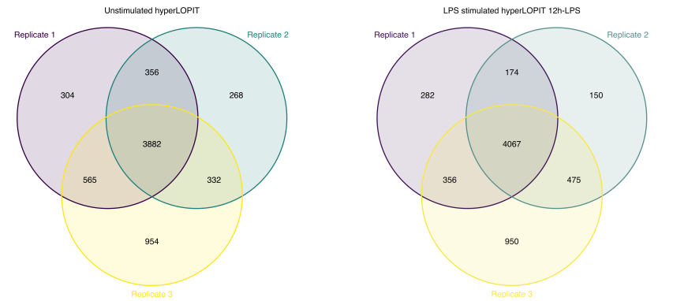
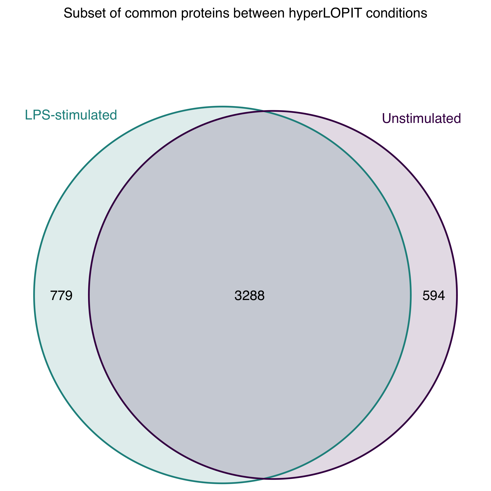
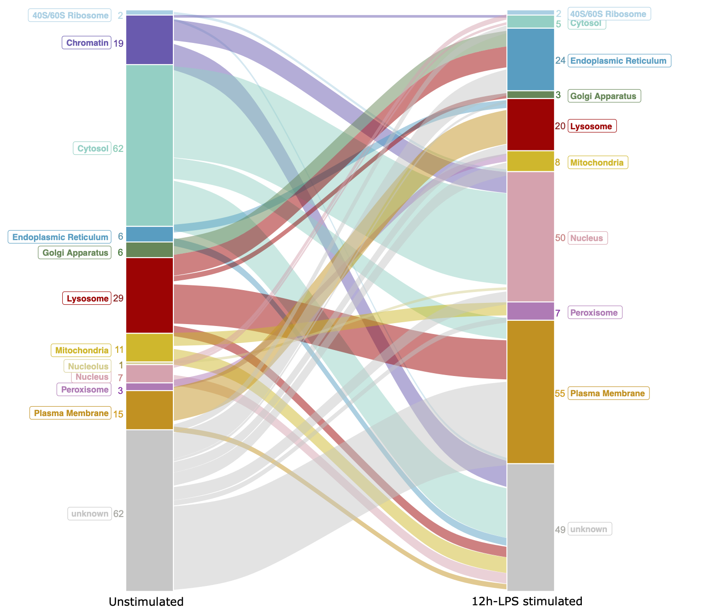

<style>
.book .book-body .page-inner section.normal h1 {
  font-size: 12px;
}

.book .book-body .page-inner section.normal h2, 
.book .book-body .page-inner section.normal h3, 
.book .book-body .page-inner section.normal h4 {
  font-size: 14px;
}

.book .book-body .page-inner section.normal table  td {
   font-size: 12px;
}
.book .book-body .page-inner section.normal pre>code.r {
  font-size: 10px;
}
.book .book-body .page-inner section.normal pre {
  font-size: 10px
}

ul li.title {
  visibility: hidden;
}
ul li.title:before {
  visibility: visible;
  content: "Spatial & Temporal Proteomics Vignette";
}
</style>

# Abstract
This vignette contains the pipeline used for the computational analysis reported in the paper "Spatiotemporal proteomic profiling of the pro-inflammatory response to lipopolysaccharide in the THP-1 human leukemia cell line" by Mulvey, Breckels et al [1].

# The data
All raw mass spectrometry proteomics data from this study have been deposited to the [ProteomeXchange](http://proteomecentral.proteomexchange.org/cgi/GetDataset) Consortium via the PRIDE partner repository [2], with the dataset identifier PXD023509. The peptide and protein level datasets are also freely and openly available as part of the [Bioconductor pRolocdata package](https://bioconductor.org/packages/release/data/experiment/html/pRolocdata.html) (≥v1.27.3) [3] and are also available in the supplementary information as disseminated with the accompanying manuscript [1].

All analysis in the manuscript is done in the R programming language, unless otherwise stated, using the suite of mass spectrometry spatial proteomics packages [`MSnbase`](https://www.bioconductor.org/packages/release/bioc/html/MSnbase.html), [`pRoloc`](https://www.bioconductor.org/packages/release/bioc/html/pRoloc.html), [`pRolocGUI`](https://www.bioconductor.org/packages/release/bioc/html/pRolocGUI.html) and [`pRolocdata`](https://bioconductor.org/packages/release/data/experiment/html/pRolocdata.html).

## Accessing the data in R
The `pRolocdata` package is a R [Bioconductor](http://bioconductor.org/) [experiment package](http://bioconductor.org/packages/release/BiocViews.html#___ExperimentData) that collects mass spectrometry-based spatial/organelle and protein-complex datasets from published experiments. Each data is stored in a container called a `MSnSet` instance (see the [`MSnbase`](http://www.bioconductor.org/packages/release/bioc/html/MSnbase.html) for details) which allows users to work seamlessly with the R [`pRoloc`](http://bioconductor.org/packages/release/data/experiment/html/pRolocdata.html) and [`pRolocGUI`](http://bioconductor.org/packages/devel/bioc/html/pRolocGUI.html) software for spatial proteomics data analysis and visualisation. 

The first step is to install the `pRoloc` package from Bioconductor and the `devtools` package to access `pRolocdata` on Github
```{r getpkgs, eval=FALSE}
if (!requireNamespace("BiocManager", quietly = TRUE))
    install.packages("BiocManager")
BiocManager::install("pRoloc")
BiocManager::install("devtools")

## we also use the knitr and VennDiagram, ggplot2 packages in this 
## vignette so please  install if you do not have them 
BiocManager::install(c("knitr", "VennDiagram", "ggplot2", "dplyr", "kableExtra", 
                       "coda", "reshape2", "circlize", "ggalluvial"))
```

Note: We can install the `pRolocdata` package from Bioconductor using the same method e.g. `BiocManager::install("pRolocdata")`  however we require version >=1.29.1 which is not yet available on Bioconductor until the next stable release ([Thursday 20th May](http://www.bioconductor.org/developers/release-schedule/)). In the meantime we can access it via Github using the R package `devtools` using the below commands.

```{r devtools_install, eval=FALSE}
library("devtools")
install_github("https://github.com/lgatto/pRolocdata")
```

Now we can load the packages by calling `library` function in R
```{r loadpkgs, eval=TRUE, warning=FALSE, message=FALSE}
library("pRoloc")
library("pRolocdata")
```

and subsequently we can now access all the datasets in `pRolocdata`. To list all available datasets we use the `data` function. 

```{r loadthp}
data(package = "pRolocdata")
```

We see there are 27 datasets (including the PSM and protein level data) associated with the manuscript [1], 20 from the hyperLOPIT data anlysis and 7 from the LPS timecourse [1]. For more information on these datasets, we can type

```{r helpdata}
?thpLOPIT_lps_mulvey2021
?lpsTimecourse_mulvey2021
```


Each dataset can be loaded using the `data` function. For example, to load the final protein level LOPIT datasets for the unstimulated and 12 hour LPS stimulated datasets,

```{r loadadataset, results = "hide"}
data("thpLOPIT_unstimulated_mulvey2021")
thpLOPIT_unstimulated_mulvey2021

data("thpLOPIT_lps_mulvey2021")
thpLOPIT_lps_mulvey2021
```

In the next section we introduce the data, experimental design and brief overview of the experimental protocol before walking users through the downstream analysis.

# Spatial proteomics data analysis

## The hyperLOPIT workflow
Using the hyperLOPIT proteomics platform [4, 5] we obtained spatial maps that capture the steady-state distribution of thousands of proteins in the THP-1 human leukaemia cell line. Experiments were conducted in triplicate and the samples were analysed and collected when cells were (1) unstimulated and then (2) at 12 hours following stimulation with LPS. 

The hyperLOPIT method combines biochemical cell fractionation with multiplexed high-resolution mass-spectrometry [4, 5], the full protocol and experimental design can be found in [1]. Briefly, TMT labelling was conducted as described in [5] and 20 fractions including the cytosol-enriched fraction were labelled per gradient, by combining two TMT 10-plex experiments in an interleaved labelling design to capture as much subcellular diversity as possible. The experimental design for each dataset is stored in the `pData` slot of each dataset.

To access the full experimental design use the `pData` function

```{r showpdata}
## TMT experiment data for the unstimulated hyperLOPIT data
pData(thpLOPIT_unstimulated_mulvey2021)

## TMT labelling scheme for the LPS hyperLOPIT data
pData(thpLOPIT_lps_mulvey2021)
```

As described in [1] and [5] the data was processed with Proteome Discoverer v2.1 (Thermo Fisher Scientific) and Mascot server v2.3.02 (Matrix Science) using the SwissProt sequence database for Homo sapiens (www.uniprot.org in November 2016) and the cRAP database (common Repository for Adventitious Proteins, https://www.thegpm.org/crap). Standard filtering of the raw data was conducted as per [1] and [5] to remove contaminants and low abundant PSMs. A maximum of two missing values per TMT experiment was allowed and the data was directly exported from Proteome Discoverer at the PSM level for downstream analysis in R.

The experiments were done in triplicate for each condition and each replicate contains 2 x TMT 10-plex sets (which we denote as "set 1" and "set 2"). Thus, in total we conducted a total of 12 experiments, 6 per condition wherein we had 2 sets per replicate containing a total of 20 fractions/channels per replicate. One TMT channel was removed (TMT tag 126 in replicate 2, set 2 in the unstimulated) due to erroneous labelling of insoluble material during the sample preparation for this specific tag. The “Average Reporter S/N” value was recalculated for the nine remaining channels in the corresponding 10plex set and PSMs with a value less than 9.0 were discarded (please see Data Processing in the Supplementary Information of [1]).

## PSM level data processing

### Missing values assessment
The 12 PSM level datasets were imported into R and missing values were carefully assessed. 

Load the PSM level unstimulated data,
```{r psmdata}
## Unstimulated data
data("psms_thpLOPIT_unstim_rep1_set1")
data("psms_thpLOPIT_unstim_rep1_set2")

data("psms_thpLOPIT_unstim_rep2_set1")
data("psms_thpLOPIT_unstim_rep2_set2")

data("psms_thpLOPIT_unstim_rep3_set1")
data("psms_thpLOPIT_unstim_rep3_set2")
```

Load the PSM level 12h-LPS stimulated data,
```{r psmstimulated}
## 12h post LPS-stimulated
data("psms_thpLOPIT_lps_rep1_set1")
data("psms_thpLOPIT_lps_rep1_set2")

data("psms_thpLOPIT_lps_rep2_set1")
data("psms_thpLOPIT_lps_rep2_set2")

data("psms_thpLOPIT_lps_rep3_set1")
data("psms_thpLOPIT_lps_rep3_set2")
```

For ease of coding we create a list of `MSnSets` for each condition
```{r list}
psms <- MSnSetList(
  list(
    psms_thpLOPIT_unstim_rep1_set1,
    psms_thpLOPIT_unstim_rep1_set2,
    psms_thpLOPIT_unstim_rep2_set1,
    psms_thpLOPIT_unstim_rep2_set2,
    psms_thpLOPIT_unstim_rep3_set1,
    psms_thpLOPIT_unstim_rep3_set2,
    psms_thpLOPIT_lps_rep1_set1,
    psms_thpLOPIT_lps_rep1_set2,
    psms_thpLOPIT_lps_rep2_set1,
    psms_thpLOPIT_lps_rep2_set2,
    psms_thpLOPIT_lps_rep3_set1,
    psms_thpLOPIT_lps_rep3_set2
  )
)

## add list names for each dataset
.nams <- paste0("Rep", rep(1:3, each = 2), "_set", rep(1:2, 3))
names(psms) <- c(paste0(.nams, "_unstim"), paste0(.nams, "_lps"))
```

We can view the number of PSMs per experiment,
```{r count_psms}
sapply(psms, nrow)
```

If we examine the corresponding protein group of each PSM with a missing value, we find that there are other PSMs available for quantitation for the majority of proteins. There are still several hundred cases where we only have 1 PSM for a given protein group, so we would lose several hundred proteins per replicate if we were to just remove these PSMs. We assess the missing values across all experiments using the `naPlot` function to see if there is a trend in where missing values occur. 

Generate `naPlots`,

```{r naplots, eval=FALSE}
for (i in seq(psms)) {
  par(las = 2, oma = c(10, 1, 1, 1))
  naplot(psms[[i]], col = "black", las = 2, reorderColumns = FALSE, 
         main = names(psms)[i], cex.axis = 2)
}
```


*Figure 2. Heatmaps showing missing value distributions per set and replciate*

The above `naPlots` show that missing values tend to accumulate at the end of the gradient, and more specifically in the first few fractions of the gradient of each experiment, which classically reflect the gradient distribution e.g. PSMs that are often highly mitochondrial have a huge signal in the heavy channels but little elsewhere in the gradient and thus can result in missing values in the other channels. It is also common to find biologically relevant missing values such as those resulting from the absence of the low abundance of ions. As values do not appear to be missing at random we use a left-censored deterministic minimal value approach, `MinDet` in `MSnbase`.

```{r mindet, warning=FALSE, message=FALSE}
psms.imputed <- lapply(psms, function(z) impute(z, method = "MinDet"))
```

PSMs were quality controlled post-imputation and then combined to protein level by calculating the median of all PSM intensities corresponding to the leading Uniprot Accession number for each protein group.

### Normalise

Following the standard [pRoloc workflow](https://f1000research.com/articles/5-2926) [6] PSMs are scaled into the same intensity interval by dividing each intensity by the `sum` of the intensities for that quantitative feature. This transformation of the data assures cancellation of the effect of the absolute intensities of the quantitative features along the rows, and focuses subsequent analyses on the relative profiles along the sub-cellular channels. This is important for spatial proteomic experiments are proteins that co-localise in a cell are known to exhibit similar quantitative profiles across the gradient fractions employed [8].

```{r norm}
psms.imputed.norm <- lapply(psms.imputed, function(z) normalise(z,  "sum"))
```

### Aggregate to protein level

We use all available PSMs for quantification and aggregate PSMs to proteins using the `combineFeatures` function in `MSnbase` by calculating the median of all PSM intensities corresponding to the leading Uniprot Accession number for each protein group.

```{r aggregate}
prots <- lapply(psms.imputed.norm, function(z) 
  combineFeatures(z, method = "median",
                  groupBy = fData(z)[, "Master.Protein.Accessions"]))

## become combining all protein sets we tidy up the feature labels of the dataset
ll <- paste0(rep(c("unst", "lps"), 1, each = 6), ".r",
             rep(1:3, 1, each = 2), ".s", 1:2)
for (i in seq(prots)) {
  prots@x[[i]] <- updateFvarLabels(prots[[i]], label = ll[i], sep = "_")
}

## combine TMT sets and examine each replicate for each condition
unst_r1 <- filterNA(MSnbase::combine(prots[[1]], prots[[2]]))
unst_r2 <- filterNA(MSnbase::combine(prots[[3]], prots[[4]]))
unst_r3 <- filterNA(MSnbase::combine(prots[[5]], prots[[6]]))
lps_r1 <- filterNA(MSnbase::combine(prots[[7]], prots[[8]]))
lps_r2 <- filterNA(MSnbase::combine(prots[[9]], prots[[10]]))
lps_r3 <- filterNA(MSnbase::combine(prots[[11]], prots[[12]]))


tot_prots <- data.frame("Unstimulated" = c(`Replicate 1` = nrow(unst_r1), 
                                           `Replicate 2` = nrow(unst_r2), 
                                           `Replicate 3`= nrow(unst_r3)),
                        "LPS" = c(`Replicate 1` = nrow(lps_r1), 
                                                 `Replicate 2` = nrow(lps_r2), 
                                                 `Replicate 3` = nrow(lps_r3)))
           
                            
```

```{r kableoutput, warning=FALSE, message=FALSE}
library("knitr")
library("kableExtra")
kable(tot_prots, caption = "Number of quantified proteins per replicate per condition") %>%
  kable_minimal()
```

## Protein level data processing
As shown in the above section we quantify between ~4800-5800 proteins per replicate. The below Venn diagrams show the overlap between replicates within conditions. We find 3882 proteins common in the unstimulated hyperLOPIT experiment and 4067 in the 12h-LPS stimulated hyperLOPIT experiment.

```{r venns, warning=FALSE, message=FALSE, eval=FALSE}
## Load R packages required for genetrating Venn diagrams
library("VennDiagram")
library("scales")
library("ggplot2")

venn.diagram(
  x = list(featureNames(unst_r1), featureNames(unst_r2), featureNames(unst_r3)),
  category.names = c("Replicate 1" , "Replicate 2 " , "Replicate 3"),
  filename = "venn_unst_replicates.png",
  main = "Unstimulated hyperLOPIT",
  col=c("#440154ff", '#21908dff', '#fde725ff'),
  fill = c(alpha("#440154ff",0.3), alpha('#21908dff',0.3), alpha('#fde725ff',0.3)),
  fontfamily = "sans",
  cat.fontfamily = "sans",
  main.fontfamily = "sans",
  cat.col = c("#440154ff", '#21908dff', '#fde725ff'), 
  output = FALSE
)

venn.diagram(
  x = list(featureNames(lps_r1), featureNames(lps_r2), featureNames(lps_r3)),
  category.names = c("Replicate 1" , "Replicate 2 " , "Replicate 3"),
  filename = "venn_lps_replicates.png",
  main = "LPS stimulated hyperLOPIT 12h-LPS",
  col=c("#440154ff", '#21908dff', '#fde725ff'),
  fill = c(alpha("#440154ff",0.3), alpha('#21908dff',0.3), alpha('#fde725ff',0.3)),
  fontfamily = "sans",
  cat.fontfamily = "sans",
  main.fontfamily = "sans",
  cat.col = c("#440154ff", '#21908dff', '#fde725ff')
)
```

```{r venn1, echo=FALSE, fig.cap="Figure 3. Overlap of protein groups identified between replicated experiments", out.height = '80px', fig.show='hold',fig.align='center'}

```

*(Venn diagrams as per supplementary figure 1 of [1])*

## Dataset concatenation
We use the `combine` function in `MSnbase` to perform data fusion (concatenation) within each condition to maximise subcellular resolution and thus the reliability in protein classification [as per the pRoloc pipeline [5, 6] and in [7]]. Trotter et al. [7] have shown a significant improvement in classifier accuracy when combining replicated experiments in spatial proteomics. Specifically, we concatenate all gradient fractions across replicated experiments to give better discrimination between subcellular niches (as shown in [7]) which gives users the opportunity to resolve niches that may not have been discovered when examining replicates alone. 

We note (as explained in [5, 6]) that direct comparisons of individual TMT channels in replicated experiments do not provide an adequate, goal-driven assessment of different experiments due to the nature of the gradient fraction collection, where quantitative channels do not correspond to identical selected fractions along the gradient. 

Concatenate replicates for each condition,
```{r combineall}
## combine replicates for each condition
unst_full <- filterNA(MSnbase::combine(unst_r1, unst_r2))
unst_full <- filterNA(MSnbase::combine(unst_full, unst_r3)) 

lps_full <- filterNA(MSnbase::combine(lps_r1, lps_r2))
lps_full <- filterNA(MSnbase::combine(lps_full, lps_r3)) 
```
```{r vennintersect, eval=FALSE}
venn.diagram(
  x = list(featureNames(unst_full), featureNames(lps_full)),
  category.names = c("Unstimulated" , "LPS-stimulated"),
  filename = "venn_hyperLOPIT.png",
  main = "Subset of common proteins between hyperLOPIT conditions",
  col=c("#440154ff", '#21908dff'),
  fill = c(alpha("#440154ff",0.3), alpha('#21908dff',0.3)),
  fontfamily = "sans",
  cat.fontfamily = "sans",
  main.fontfamily = "sans",
  cat.col = c("#440154ff", '#21908dff'),
  margin = 0.05,
  cat.pos = c(-140, 140),
  cat.dist = c(0.05, 0.05)
)
```

```{r venn2, echo=FALSE, out.width = '300px', fig.align='center'}

```
*Figure 4. Overlap of protein groups identified in both conditions*

We find 3288 proteins common all 12 experiments. In the next code chunk we subset our data to keep only proteins common between all experiments. 

### Final hyperLOPIT datasets for downstream analysis
Subset for common proteins in all replicates and all conditions,
```{r commonall, eval=TRUE}
## keep only those in common between conditions
cmn <- intersect(featureNames(unst_full), featureNames(lps_full))
lps <- lps_full[cmn, ]
unst <- unst_full[cmn, ]
```

### Adding marker proteins
A list of 783 annotated, unambiguous resident organelle marker proteins from 11 subcellular niches: mitochondria, ER, Golgi apparatus, lysosome, peroxisome, PM, nucleus, nucleolus, chromatin, ribosome and cytosol, were curated from [The Uniprot database](https://www.uniprot.org), [Gene Ontology](https://www.ebi.ac.uk/QuickGO/) and from careful mining of the literature. Only proteins known to localise to a single location were included as markers.

We use the `addMarkers` function in `pRoloc` to annotate our two datasets from this list of markers (found in the `csv` directory of this repository). The marker list can also be extracted from `pRolocdata` by using the `getMarkers` function with any of the THP datasets.

Adding markers,
```{r addmarkers, eval=TRUE}
lps <- addMarkers(lps, markers = "csv/markers_2019.28.01.csv")
unst <- addMarkers(unst, markers = "csv/markers_2019.28.01.csv")
```

### Visualising the data
We use t-Distributed Stochastic Neighbor Embedding (t-SNE) to project our 60 dimension data into two-dimensions to visualise organelle separation. 

In the below code chunk we plot the data and highlight the subcellular markers on each dataset (Figure 4 of [1]). Each point represents one protein. Markers are highlighted by different colours as denoted by the key and proteins for the subcellular location is unknown or undefined are grey.

```{r plotit, fig.width=10, fig.height=5, warning=FALSE, message=FALSE}
source("r/prettymap.R")
## set organelle colours
mycol <- c("#88CCEE", "#332288", "#53CAB7", "#0170b4", "#204f20", "#990000",
           "#E69F00", "#DDCC77", "#E18493", "#AA4499", "#D55E00")
setStockcol(mycol)
setUnknownpch(16)


## Generate the t-SNE coords (Figure 4 of [1])
set.seed(399)
tsne_unst <- plot2D(unst, method = "t-SNE", plot = FALSE)
set.seed(399)
tsne_lps <- plot2D(lps, method = "t-SNE", plot = FALSE)


## plot the data as t-SNE maps
par(mfrow = c(1, 2))        
oo = c(1:3, 10, 5, 4, 6:7, 9, 8, 11)
myleg <- c(getMarkerClasses(unst), "Unknown")

prettyTSNE(tsne_unst, unst, fcol = "markers", 
          main = "Subcellular markers\nunstimulated THP1-cells",
          orgOrder = oo, mainCol = mycol, oulineCol = darken(mycol))
prettyTSNE(tsne_lps, lps, 
          main = "Subcellular markers\n12h-LPS stimulated THP1-cells",
          orgOrder = oo, mainCol = mycol, oulineCol = darken(mycol))

## add a legend
plot(NULL, xaxt='n',yaxt='n',bty='n',ylab='',xlab='', xlim=0:1, ylim=0:1)
legend("topleft", legend = myleg, col = mycol, bty = "n",
       pch = 19, cex = 1.2, pt.cex = 1.6)
```
*Figure 5. t-SNE plots of the (concatenated) LOPIT datasets for each condition (Figure 4 of [1])*


## Classification using a Bayesian framework 
Proteins are assigned to one of the 11 subcellular marker classes using TAGM-MCMC [9]. TAGM-MCMC is a semi-supervised Bayesian generative classifier based on a T-Augmented Gaussian Mixture model that uses Bayesian computation performed using Markov-chain Monte Carlo. It is one of the many supervised machine learning methods available in the `pRoloc` package, but currently the only Bayesian method that is available in the package for the prediction of subcellular location for spatial proteomics data. 

The advantage of using TAGM, and Bayesian methods in general, over classic supervised machine learning approaches is the ability for the algorithm to quantify the localisation uncertainty. The TAGM classifier models each annotated subcellular class using a Gaussian distribution and thus the full dataset can be modelled as a mixture of Gaussians. As described in [9] an outlier component probability is also included in this model which is mathematically described as a multivariate student’s t-distribution which gives extra information regarding the 

Full details of the TAGM Bayesian methodology and mathematics are found in [9] and a detailed Bioconductor workflow for Bayesian analysis of spatial proteomoics data can be found in [10]. We follow this workflow for the analysis used here. 

### Training
Following Crook et al [10] we take the concatenated datasets for each conditions and run the TAGM-MCMC workflow. A collapsed Gibbs sampler was run in parallel for 9 chains to sample from the posterior distributions of localisation probabilites, with each chain run for 25,000 iterations and the Gelman-Rubin’s diagnostic was used to assess the convergence of the 9 Markov-Chains and the 3 best chains were kept and pooled for data processing for each condition.

In the code chunk below we show how to run the `tagmMcmcTrain` function to generate the samples from the posterior distributions of each dataset (note: we do not run this dynamically as running is computationally intensive. We suggest you use a cluster or HPC if you have one available and scale according to the cores and `numChains` used)

```{r tagm, eval=FALSE}
## Load the coda library for calculating the Gelman  diagnostics
library("coda")

## Train TAGM-MCMC
p_lps <- tagmMcmcTrain(object = lps,
                       numIter = 25000,
                       burnin = 5000,
                       thin = 10,
                       numChains = 9)

p_unst <- tagmMcmcTrain(object = unst,
                        numIter = 25000,
                        burnin = 5000,
                        thin = 10,
                        numChains = 9)

## All chains look good and all oscillate around an average of 490 outliers
out_unst <- mcmc_get_outliers(p_unst)
out_lps <- mcmc_get_outliers(p_lps)

## Calculate Gelman's Diagnostic
gelman.diag(out_unst)   
gelman.diag(out_lps)

# check all pairs as per the f1000 vignette [10]
gelman.diag(out_unst[1:2])
gelman.diag(out_unst[1:3]) # etc...
```

Following the TAGM workflow [10] we examine the chains for convergence and indeed find all chains look good and oscillate around and average of 490 outliers. We calculate the Gelman and Rubin  Diagnostic [11] for a more rigorous and unbiased analysis of convergence. This statistic is often referred to as R̂ or the potential scale reduction factor and Geman and Rubin suggest that chains with a R̂ < 1.2 are likely to have converged. We find all to be < 1.2. We pick the 5 best chains for each dataset which yields the lowest upper confidence interval (as per [10]). These are then passed to `mcmc_pool_chains` and `tagmMcmcProcess` where the the summary slot of the `MCMCParams` object is populated with basic summaries of the `MCMCChains`, such as allocations and localisation probabilities. 

```{r populate, eval=FALSE}
mcmc_unst_pooled <- mcmc_pool_chains(mcmc_unst)
mcmc_lps_pooled <- mcmc_pool_chains(mcmc_lps)

mcmc_unst_pooled <- tagmMcmcProcess(mcmc_unst_pooled)
mcmc_lps_pooled <- tagmMcmcProcess(mcmc_lps_pooled)

summary(mcmc_unst_pooled@summary@posteriorEstimates)
summary(mcmc_unst_pooled@summary@tagm.joint)

summary(mcmc_lps_pooled@summary@posteriorEstimates)
summary(mcmc_lps_pooled@summary@tagm.joint)

mcmc_lps <- mcmc_lps_pooled
mcmc_unst <- mcmc_unst_pooled
```

### Prediction
Finally, we use the `tagmMcmcPredict` function to obtain the full probability distribution over all proteins. 

```{r predict, eval=FALSE}
unst <- tagmMcmcPredict(unst, params = mcmc_unst_pooled, probJoint = TRUE)
lps <- tagmMcmcPredict(lps, params = mcmc_lps_pooled, probJoint = TRUE)
```

The TAGM results are appended to the `fData` slot of the datasets. As the above chunk is not run dynamically here we can load the results from the `pRolocdata` package (and they can also be found in Supplementary Table XXX of [1]). We load the datasets called `thpLOPIT_unstimulated_mulvey2021` and `thpLOPIT_lps_mulvey2021` which contain all machine learning results from [1]. As per the above the analysis this was conducted on proteins common in all experiments.

```{r seeresults, fig.width=10, fig.height=5, warning=FALSE, message=FALSE}
## Load the data from pRolocdata
data("thpLOPIT_unstimulated_mulvey2021")
data("thpLOPIT_lps_mulvey2021")

## We subset for proteins common in all experiments
cmn <- intersect(featureNames(thpLOPIT_unstimulated_mulvey2021),
                 featureNames(thpLOPIT_lps_mulvey2021))
unst <- thpLOPIT_unstimulated_mulvey2021[cmn, ]
lps <- thpLOPIT_lps_mulvey2021[cmn, ]


## Generate the t-SNE coords 
set.seed(399)
tsne_unst <- plot2D(unst, method = "t-SNE", plot = FALSE)
set.seed(399)
tsne_lps <- plot2D(lps, method = "t-SNE", plot = FALSE)

## plot TAGM assignments
par(mfrow = c(1, 2))
mycol <- paste0(getStockcol())
oo <- c(1:3, 10, 5, 4, 6:7, 9, 8, 11)
myleg <- c(getMarkerClasses(unst), "Unknown")

prettyTSNE(tsne_unst, unst, fcol = "tagm.mcmc.allocation", 
          main = "TAGM-MCMC allocation\nunstimulated THP1-cells",
          orgOrder = oo, mainCol = mycol, oulineCol = darken(mycol))
prettyTSNE(tsne_lps, lps, fcol = "tagm.mcmc.allocation",
          main = "TAGM-MCMC allocation\n12h-LPS stimulated THP1-cells",
          orgOrder = oo, mainCol = mycol, oulineCol = darken(mycol))

plot(NULL, xaxt='n',yaxt='n',bty='n',ylab='',xlab='', xlim=0:1, ylim=0:1)
legend("topleft", legend = myleg, col = mycol, bty = "n",
       pch = 19, cex = 1.2, pt.cex = 1.6)
```
*Figure 6. t-SNE plots of the TAGM output on the (concatenated) LOPIT datasets for each condition*

The results from the TAGM-MCMC method are appended to the `fData` of the `MSnSet` e.g. see `fData(thpLOPIT_unstimulated_mulvey2021)$tagm.mcmc.allocation` and `fvarLabels(thpLOPIT_unstimulated_mulvey2021)` to see all available slots.

Relevent to this analysis we examine the following output slots
- `tagm.mcmc.allocation`:  the TAGM-MCMC predictions for the most probable protein sub-cellular allocation.
- `tagm.mcmc.probability`: the *mean* posterior probability for the protein sub-cellular allocations
- `tagm.mcmc.outlier`: the posterior probability for the protein to belong to the outlier component.
- `tagm.mcmc.probability.lowerquantile` and `tagm.mcmc.probability.upperquantile` are the lower and upper boundaries to the equi-tailed 95% credible interval of tagm.mcmc.probability.


### Thresholding
As with all supervised learning algorithms the classifier is only able to predict a location to one of the classes that are found in the training set. Our training set contained 11 subcellular niches, as described above. It is common practice in supervised machine learning to set a specific score cutoff/threshold on which to define new assignments/allocations, below which classifications are left unassigned/unknown if we do not expect all examples (proteins) to fall into one of the categories in the discrete training set. Indeed, we do not expect the whole subcellular diversity to be represented by the 11 niches used here, we expect there to be many more, many of which will be multiply localised within the cell. It is important to allow for the possibility of proteins to fall reside in multiple locations (see [6, 9, 10] for more details).

One advantage of using a Bayesian framework is the outputs of the classifier are probabilities. This not only allows us to look at the distribution of probabilities over all subcellular classes but also allows us to extract a probability score threshold from the product of the posterior and outlier probabilities, on which we can define new assignments, we call this our localisation probability. 

          localisation probability = posterior probability * outlier probability  

The localisation probability is calculated for all proteins in each dataset and appended to the `fData` slot of each dataset.

```{r calclocprob}
fData(unst)$localisation.prob <- fData(unst)$tagm.mcmc.probability * (1 - fData(unst)$tagm.mcmc.outlier)
fData(lps)$localisation.prob <- fData(lps)$tagm.mcmc.probability * (1 - fData(lps)$tagm.mcmc.outlier)
```

As described in the methods of [1] and as demonstrated in the code chunk below, we take a conservative approach, only assign proteins to a subcellular niche if the posterior probability was greater than 0.99 and if the outlier probability was very small < 1e-6, else proteins were left unassigned and labelled as proteins of “unknown location” in the data. 

Our assignment threshold which we apply to the localisation probability is therefore 0.99 * 1e-6 = 0.99. We use the `getPredictions` function on the calculated `localisation.prob` to extract these newly assigned proteins.

```{r extractlocs}
## localisation probability = posterior probability * outlier probability
fData(unst)$localisation.prob <- fData(unst)$tagm.mcmc.probability * (1 - fData(unst)$tagm.mcmc.outlier)
fData(lps)$localisation.prob <- fData(lps)$tagm.mcmc.probability * (1 - fData(lps)$tagm.mcmc.outlier)

## Threshold = (posterior > 0.99) * 1 - (outlier < 1e-6)
t_loc <- 0.99 * (1 - 1e-6)
unst <- getPredictions(unst, 
                       fcol = "tagm.mcmc.allocation", 
                       scol = "localisation.prob", 
                       t = t_loc)
lps <- getPredictions(lps, 
                      fcol = "tagm.mcmc.allocation", 
                      scol = "localisation.prob", 
                      t = t_loc)
```

We can visualise these assignments on a t-SNE plot and also plot the quantitation profiles for each subcellular class.

```{r plotres, fig.width=10, fig.height=5}
## plot TAGM assignments
par(mfrow = c(1, 2))
mycol <- paste0(getStockcol())
oo = c(1:3, 10, 5, 4, 6:7, 9, 8, 11)
myleg <- c(getMarkerClasses(unst), "Unknown")

prettyTSNE(tsne_unst, unst, fcol = "tagm.mcmc.allocation.pred", 
          main = "TAGM-MCMC final assignment\nunstimulated THP1-cells",
          orgOrder = oo, mainCol = mycol, oulineCol = darken(mycol))
prettyTSNE(tsne_lps, lps, fcol = "tagm.mcmc.allocation.pred",
          main = "TAGM-MCMC final assignment\n12h-LPS stimulated THP1-cells",
          orgOrder = oo, mainCol = mycol, oulineCol = darken(mycol))

plot(NULL, xaxt='n',yaxt='n',bty='n',ylab='',xlab='', xlim=0:1, ylim=0:1)
legend("topleft", legend = myleg, col = mycol, bty = "n",
       pch = 19, cex = 1.2, pt.cex = 1.6)
```
*Figure 7. t-SNE plots showing the final subcellular assignments of the (concatenated) LOPIT datasets for each condition (Figure 4 of [1])*

Not including the 783 marker proteins, after classification and thresholding we find 1717 and 1713 proteins to localise to one of the 11 subcellular niches in the data for the unstimulated and 12h-LPS stimulated datasets respectively.

```{r plotdist, fig.width=10, fig.height=16, eval=FALSE}
## Unstimulated protein profiles
par(mfrow = c(4, 3))
cl <- getMarkerClasses(unst)
for (i in seq(cl)) {
  par(mar = c(8, 4, 8, 2), las = 2)
  plotDist(unst[ fData(unst)$markers == getMarkerClasses(unst)[i], ], 
           pcol = paste0(getStockcol()[i], 90), xlab = "", ylim = c(0, .9))
  title(main = cl[i])
}
```
<center>**Class-specific protein (unstimulated THP1-cell experiments)**</center>
```{r plotdist_run, fig.width=10, fig.height=16, echo=FALSE}
## Unstimulated protein profiles
par(mfrow = c(4, 3))
cl <- getMarkerClasses(unst)
for (i in seq(cl)) {
  par(mar = c(8, 4, 9, 2), las = 2)
  plotDist(unst[ fData(unst)$markers == getMarkerClasses(unst)[i], ], 
           pcol = paste0(getStockcol()[i], 90), xlab = "", ylim = c(0, .9))
  title(main = cl[i])
}
```
*Figure 8. Protein quantitation profiles for proteins in the unstimulated experiments grouped by subcellular localisation*
```{r plotdist2, fig.width=10, fig.height=16, eval=FALSE}
## LPS protein profiles
par(mfrow = c(4, 3))
cl <- getMarkerClasses(lps)
for (i in seq(cl)) {
  par(mar = c(8, 4, 8, 2), las = 2)
  plotDist(lps[ fData(lps)$markers == getMarkerClasses(lps)[i], ], 
           pcol = paste0(getStockcol()[i], 90), xlab = "", ylim = c(0, .9))
  title(main = cl[i])
}
```
<center>**Class-specific protein profiles (12h-LPS stimulated THP1-cell experiments)**</center>
```{r plotdist2_run, fig.width=10, fig.height=16, echo=FALSE}
## LPS protein profiles
par(mfrow = c(4, 3))
cl <- getMarkerClasses(lps)
for (i in seq(cl)) {
  par(mar = c(8, 4, 8, 2), las = 2)
  plotDist(lps[ fData(lps)$markers == getMarkerClasses(lps)[i], ], 
           pcol = paste0(getStockcol()[i], 90), xlab = "", ylim = c(0, .9))
  title(main = cl[i])
}
```
*Figure 9. Protein quantitation profiles for proteins in the 12h-LPS stimulated experiments grouped by subcellular localisation*

### Overlap in protein locations
The code chunk below shows a summary of of the protein residency in each condition for the 3288 proteins common in all experiments.

```{r tableOfLocs}
loc_unst <- getMarkers(unst, "tagm.mcmc.allocation.pred")
loc_lps <- getMarkers(lps, "tagm.mcmc.allocation.pred")
kable(rbind("Unstimulated" = table(loc_unst), "LPS" = table(loc_lps)))
```

The heatmap below shows the sub-cellular distribution of proteins between the two conditions including the 783 annotated marker proteins (Figure 4A, Supplementary Table 7). Using TAGM a additional 1,717 proteins in the unstimulated dataset and 1,713 proteins in the LPS dataset were classified to distinct subcellular regions with high confidence (Figure 4B). The remaining proteins that did not meet the classifier threshold were left unassigned and labelled as “unknown”. As already mentioned above we do not expect all proteins to localise to one main discrete location, many proteins are known to "moonlight" and live in mixed locations. There was however a high degree of correlation between unstimulated and stimulated datasets, with 75% of the identified proteome sharing the same organelle localisation in both conditions.

```{r overlapAssignments, fig.width=14, fig.height=10, warning=FALSE, message=FALSE}
source("R/intersection.R")
## Add a label to the LPS dataset so when we combine it  
## with the unstimulated the information is not lost
.lps <- lps
.lps <- updateFvarLabels(.lps, "LPS")
cmb <- MSnbase::combine(unst, .lps)  # now combine all results

df_all <- compareDatasets(cmb, 
                          fcol1 = "localisation.pred",
                          fcol2 = "localisation.pred.LPS")
ggheatmap(df_all, title = "TAGM locations between conditions")
```
*Figure 10. Heatmap showing the distribution and overlap in organelle assignments between the TAGM classifications in the unstimulated data and classifications in the LPS-stimulated data (Figure S1,G of [1])*

## Translocations
One of the main aims of the THP-1 study in [1] was to use the hyperLOPIT technology to investigate the (spatial) changes in protein localisation between the unstimulated and 12h-LPS stimulated conditions. In this section we look at how the assigned location of proteins differ between the two conditions. We examine their assigned location from TAGM and also the difference between their joint posterior probability distributions.

Re-localisations i.e. proteins that do not localise to the same subcellular niche in both conditions, were extracted and categorised as one of four different translocation events: 

1. Type 1: organelle-to-organelle - cases where proteins are assigned to different subcellular classes in each condition i.e. those that move from one discrete location to another.
2. Type 2: unknown-to-organelle - cases where proteins in the unstimulated data are labelled as "unknown" but are localised to one of the 11 organelle classes in the 12h-LPS stimulated data.
3. Type 3: organelle-to-unknown - cases where proteins are assigned a location to one of the 11 organelle classes in the unstimulated data but in the 12h-LPS data are labelled as "unknown".
4. Type 4: unknown-to-unknown - dynamic proteins that were not assigned a subcellular niche. These are proteins which have a difference in their joint probability distribution equal to 1 (as calculated by the natural L2 distance, also known as the Euclidean norm).

The L2 distance is denoted by
$$
d_{_{L2}norm}(x, y) = \sqrt {\sum_{i = 1}^{n}{(x_i - y_i)^2}}
$$
where *x* and *y* are the posterior probabilities for for the unstimulated and 12h-LPS stimulated respectively, for each *i*th class.

As already mentioned, proteins labelled as "unknown" location, describe proteins that did not meet the classifier threshold to be assigned to one of the 11 discrete organelle categories, as defined in our marker set. We not only wish to examine proteins that move between discrete locations (which we call type 1 translocations above) but we also wish to examine cases where in one condition the protein has been given a discrete location, and in another condition it has been described as "unknown", and therefore not belonging to one of the 11 subcellular classes. It is important to note that in terms of machine learning, the term "unknown" is not a class in the training set, it is simply as term we use in our pipeline to describe proteins that we can say as not confidently assigned to one of the 11 classes. 

These cases are still of great interest as although we may not know where the protein exactly resides in this snapshot of time we do know it is not classed to the same location in the other condition. Unknown cases encompass a number of scenarios for example, a protein having a mixed population and moonlighting between organelles, or it be that the protein localised to a subcellular niche that does not appear in our training data. Whichever reason what we are interested in is not only a change in localion but the size of the probability change, as this implies a change in localisation regardless of organelle residency. 

As an extra measure of stringency we enforce that in cases 2-4 any protein considered as "unknown" must also have a high outlier probability (as per the below code chunk `out = 1e-3`) and thus is clearly not a member of any of the 11 classes.

For every protein the natural L2 distance (Euclidean norm) was calculated between the TAGM joint posterior probability distributions and translocation events were further filtered and ranked based on this distance to give a succinct subset of translocations for further analysis and data mining.  

In the below code chunk we call the function `getTranslocations` which extracts the localisations of every protein in each condition then assigns a translocation type as described above and then calculates the L2 distance between the posterior probability distributions. This information is appended to the `fData` slot of our `MSnSet` along with all the other machine learning results.

```{r getmovers}
source("R/getmovers.R")
extract_movers <- getTranslocations(unst, lps, 
                                    fcol = "tagm.mcmc.allocation.pred", 
                                    out = 1e-3)
unst <- extract_movers[[1]]
lps <- extract_movers[[2]]

getMarkers(unst, "translocations")
```

In summary classed by translocation events we find -
- 112 type 1
- 62 type 2 
- 49 type 3 
- 30 type 4 
proteins that move following 12 hour stimulation with LPS. 

In the next section we can further examine and plot these events using alluvial and circos plots.


### Visualisation of translocations
The following code chunks use functions from the `circlize` and `ggalluvial` packages (full source code in this repo and at the end of this vignette) to generate `circos` and `alluvial` plots respectively. These plots summarise the flow of proteins between organelle locations and the two conditions.

#### Circos plot of protein translocations across organelles
```{r circosplot, message=FALSE, warning=FALSE, eval=TRUE, fig.show='hide'}
source("R/circos.R")

## generate my colour scheme
circos_cols <- c(getStockcol(), "grey")
orgs <- c(union(getMarkerClasses(unst), getMarkerClasses(lps)), "unknown")
(colscheme <- setNames(circos_cols, orgs))  # check levels consistent 

## get indices of translocating proteins
tl <- !is.na(fData(unst)$translocations)

## set circos plot parameters
par(mar = c(2, 2, 2, 2), cex = .5)
circos.clear()
circos.par(gap.degree = 4)

## plot circos
customChord(unst[tl, ], lps[tl, ], 
            cols = colscheme,  
            diffHeight  = -0.02, 
            transparency = 0.3, 
            link.sort = FALSE,
            labels = TRUE)
```
*Note: labels were optimised in Inkscape*
{width=75%}

#### Alluvial (river) plot of protein translocations across organelles
```{r alluvialplot, message=FALSE, warning=FALSE, eval=TRUE, fig.show='hide'}
source("r/riverplot.R")
library(ggalluvial)
thp_alluvial <- riverplot(unst[tl, ], lps[tl, ], 
                          cols = colscheme,
                          labels = TRUE)
thp_alluvial + ggtitle("Translocations following 12h-LPS stimulation in THP-1 cells") 
```
*Note: labels were optimised in Inkscape*

{width=75%}

Alluvial (river) plot showing the 253 protein translocations (Fig. 4C of [1]) proteins which were found to move between organelles at 12h-LPS. The number of proteins that are found to translocate to and from each subcellular compartment is denoted next to the labelled alluvial blocks

### Spatial map of translocating proteins
The t-SNE maps below also show the visual localisation of translocating proteins.
```{r mapTL, fig.width=14, fig.height=7, warning=FALSE, message=FALSE, fig.show='hide'}
source("r/foi.R")
par(mfrow = c(1, 2))

## Unstimulated
prettyTSNE_overlay(tsne_unst, unst, 
                   fcol = "localisation.pred", 
                   main = "Type 1, 2, 3, or 4 translocation events", orgOrder =  oo, 
                   mainCol = paste0(lighten(mycol), 30),
                   oulineCol = paste0(lighten(mycol), 30))
highlightOnPlot(object = tsne_unst, pch = 21, cex = 1.7,
                col = mycol[2],  bg = lighten(lighten("grey")),
                foi = type1, lwd = 2,
                args = list(unst))
highlightOnPlot(object = tsne_unst, pch = 24, cex = 1.7,
                col = darken(mycol[7]), bg = lighten(lighten("#f4f4c8")), 
                foi = type2, lwd = 2, 
                args = list(unst))
highlightOnPlot(object = tsne_unst, pch = 21, cex = 1.7,
                col = darken("purple"), bg = lighten(lighten("#f2a6e3")), 
                foi = type3, lwd = 2,
                args = list(unst))
highlightOnPlot(object = tsne_unst, pch = 24, cex = 1.7,
                col = "#1c1c78", bg = lighten(lighten("#5fa8cc")), 
                foi = type4, lwd = 2,
                args = list(unst))

prettyTSNE_overlay(tsne_lps, lps, fcol = "localisation.pred", 
                   main = "", orgOrder =  oo,
                   mainCol = paste0(lighten(mycol), 30), 
                   oulineCol = paste0(lighten(mycol), 30))
## 12h-LPS 
highlightOnPlot(object = tsne_lps, pch = 21, cex = 1.7,
                col = mycol[2],  bg = lighten(lighten("grey")),
                foi = type1, lwd = 2,
                args = list(lps))
highlightOnPlot(object = tsne_lps, pch = 24, cex = 1.7,
                col = darken(mycol[7]), bg = lighten(lighten("#f4f4c8")), 
                foi = type2, lwd = 2, 
                args = list(lps))
highlightOnPlot(object = tsne_lps, pch = 21, cex = 1.7,
                col = darken("purple"), bg = lighten(lighten("#f2a6e3")), 
                foi = type3, lwd = 2,
                args = list(lps))
highlightOnPlot(object = tsne_lps, pch = 24, cex = 1.7,
                col = "#1c1c78", bg = lighten(lighten("#5fa8cc")), 
                foi = type4, lwd = 2,
                args = list(lps))
plot(NULL, xaxt='n',yaxt='n',bty='n',ylab='',xlab='', xlim=0:1, ylim=0:1)
legend("topleft", legend = c("Type 1: organelle-to-organelle", 
                             "Type 2: unknown-to-organelle", 
                             "Type 3: organelle-to-unknown", 
                             "Type 4: unknown-to-unknown"), 
       col = c(mycol[2], darken(mycol[7]), darken("purple"), "#1c1c78"), 
       pt.bg = c(lighten(lighten("grey")), lighten(lighten("#f4f4c8")), 
                 lighten(lighten("#f2a6e3")), lighten(lighten("#5fa8cc"))),
       bty = "n",
       pch = c(21, 24, 21, 24), pt.cex = 2.2, cex = 1.4)
```

{width=75%}


### Summary table of translocations between conditions
```{r summaryofevents}
df <- makedf(unst[tl, ], lps[tl, ],
            fcol1 = "localisation.pred",
            fcol2 = "localisation.pred",
            mrkCol1 = "markers",
            mrkCol2 = "markers")
df <- df[!df$`Number of translocations`==0, ]
names(df) <- c("Unstimulated", "LPS", "Number of translocations")
kable(df)
```

## A scaffold for proteins of interest
Mulvey et al (2021) show that hyperLOPIT provides a means to robustly classify unannotated proteins to distinct organelles and to investigate protein relocalisation events. The following spatial maps as generated in [1] highlight interesting findings from the THP-1 hyperLOPIT dataset.


ADD MINI CIRCOS OR RIVER PLOTS FOR ALL OF THESE SPATIAL MAPS?

### Relocalisa+on of RHO-GTPase trafficking molecules to the PM
Fig 5

### Examples of proteins that exhibit both spatial and temporal regulation
Fig 6

### Bayesian temporal clustering analysis
Fig 7

### Cytokine proteins 
Supp Fig S1

#### Cytosol translocations
#### Nuclear translocations
#### Lysosomal translocations
Supp Fig S2

#### Nucleo-cytoplasmic translocation events 
#### Plasma membrane translocation events
Supp Fig S3

#### Trafficking proteins
Supp Fig S4

#### Secretome proteome (Meissner et al., 2013)
#### Cell surface proteome (Kalxdorf et al., 2017)
#### The RNA binding proteome (Liepelt et al., 2016)
#### Mitochondrial and lysosomal proteome (Fu et al., 2020)
Supp Fig S5

# Temporal proteomics analysis

# Source code 

# References
[1] Mulvey, C.M., Breckels, L.M., et al.

[2] Perez-Riverol, Y. et al. The PRIDE database and related tools and resources in 2019: improving support for quantification data. Nucleic Acids Res 47, D442-D450, [doi:10.1093/nar/gky1106](doi:10.1093/nar/gky1106) (2019).

[3] Gatto, L., Breckels, L. M., Wieczorek, S., Burger, T. & Lilley, K. S. Mass-spectrometry-based spatial proteomics data analysis using pRoloc and pRolocdata. Bioinformatics 30, 1322-1324, [doi:10.1093/bioinformatics/btu013](doi:10.1093/bioinformatics/btu013) (2014)

[4] Christoforou, A. et al. A draft map of the mouse pluripotent stem cell spatial proteome. Nat Commun 7, 8992, doi:10.1038/ncomms9992 (2016).

[5] Mulvey, C. M. et al. Using hyperLOPIT to perform high-resolution mapping of the spatial proteome. Nat Protoc 12, 1110-1135, doi:10.1038/nprot.2017.026 (2017).

[6] f1000 workflow

[7] Trotter

[8] De Duve

[9] TAGM

[10] https://f1000research.com/articles/8-446 TAGM workflow

[11] Gelman, A and Rubin, DB (1992) Inference from iterative simulation using multiple sequences, Statistical Science, 7, 457-511.

